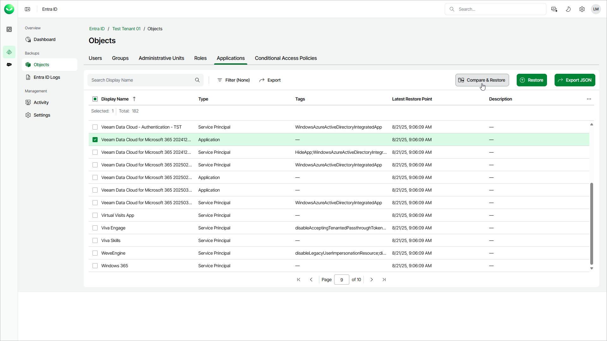

# Step 1. Launch Compare and Restore Fields Wizard

To launch the restore wizard, do the following:

1. On the Entra ID page, click the name of the tenant you want to manage.
2. Select Objects.
3. Make sure that the Applications tab is selected.
4. Select an application or a service principal whose properties you want to restore.

|  |
| --- |
| Tip |
| To find an application or a service principal by its display name, you can use the search field. |

1. Click Compare & Restore.

