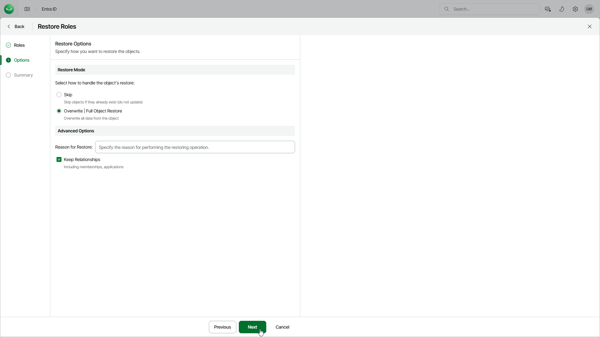

# Step 3. Specify Restore Options

At the Options step of the wizard, configure the restore options, such as how to restore roles, their relationships and other:

1. In the Restore mode section, specify whether to overwrite roles or skip restore of the already existing roles.

* When you select the Skip option, Veeam Data Cloud will not overwrite or update objects that already exists.
* When you select the Overwrite option, Veeam Data Cloud updates fields present in the backup. If a field in the backup is empty, it will be restored as empty. However, Veeam Data Cloud does not update read-only fields (the ID, creation date and so on) and fields that are not present in the backup. For details, see [Supported Entra ID Item Properties](entra_id_properties.md).

1. In the Advanced options section, configure the following:

* In the Reason for Restore field, enter a reason for restoring roles. This information will be saved to the session history, and you will be able to reference it later.

* To restore relationships of roles within the current tenant, click Keep Relationships. Veeam Data Cloud will restore the following relationships: groups and users with the role assigned. Note that Veeam Data Cloud restores only relationships — if a role or group does not exist, it will not be restored.

If you have selected the Overwrite option, Veeam Data Cloud will restore the relationships from the backup and will remove the relationships not present in the backup.

