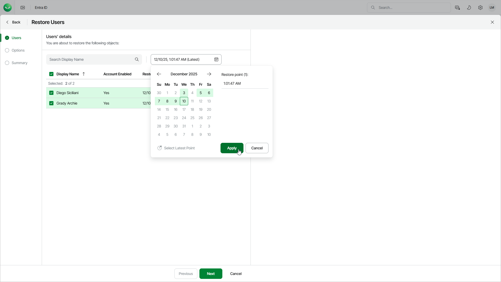

# Step 2. Select Restore Points

At the Users step of the wizard, select restore points to be used for restore.

By default, Veeam Data Cloud uses the most recent valid restore point for each object. However, you can restore an object to an earlier state and select different restore points for different objects.

To select a restore point:

1. Select the objects for which you want to change the restore point.
2. Click Choose Date.
3. In the calendar, select the required date, then choose the necessary restore point.

If you select one object, Veeam Data Cloud shows the restore points available for this object. If you select multiple objects, Veeam Data Cloud shows all available restore points.

1. Click Apply.

After you select a restore point, Veeam Data Cloud verifies its availability for each object.

