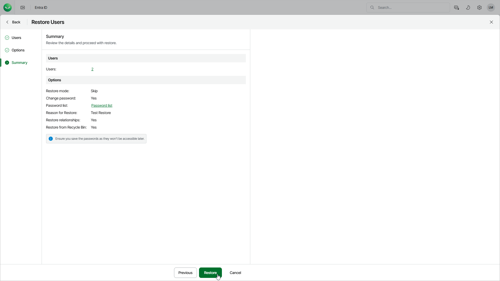

# Step 4. Finish Working with Wizard

At the Summary step of the wizard, review the summary information and click Restore.

To export new passwords of users to the CSV file, click Password list. Veeam Data Cloud exports only the passwords specified in the [Set unique temporary passwords](entra_id_restore_user_options.md#psswd) window.

After you finish the wizard, you will confirm the objects to restore and Veeam Data Cloud will start the restore session. You can check the restore session state in the Activity section. For details, see [Viewing Backup and Restore Sessions](entra_id_activity.md).

You will receive an email notification once the restore is completed successfully or fails.

