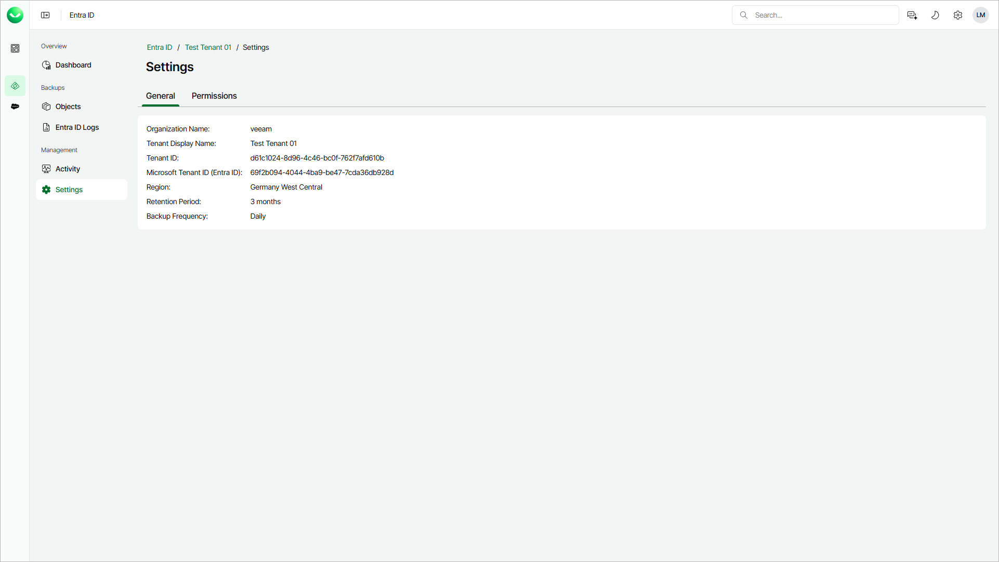
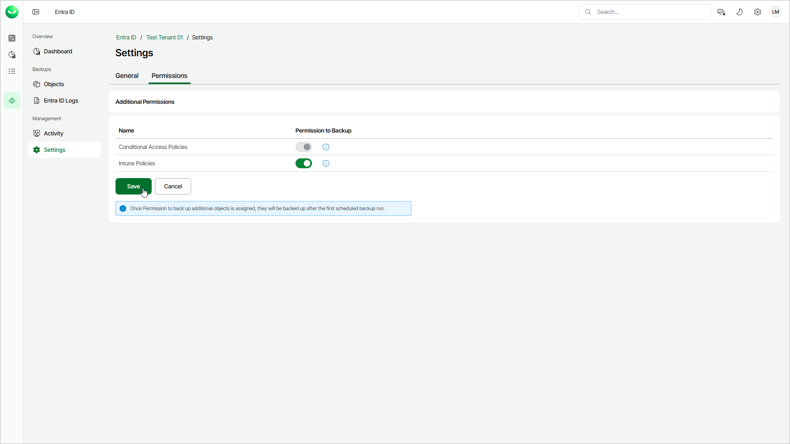
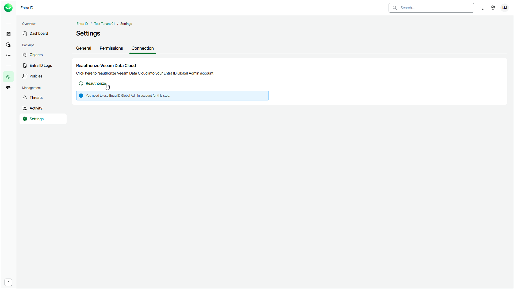

# Settings

The Veeam Data Cloud portal enables you to review general settings of the tenant and to include Conditional Access and Microsoft Intune policies in your Entra ID backup.

Viewing General Settings

To view the general settings of the tenant:

1. On the Entra ID page, click the name of the tenant you want to manage.
2. Select Settings.
3. Make sure that the General tab is selected.

Enabling Backup of Additional Objects

You can include Entra ID Conditional Access policies and Microsoft Intune policies in the backup. If you allow Veeam Data Cloud to back up these objects, Veeam Data Cloud will automatically assign required permissions to the Microsoft Entra service principal that enables Veeam Data Cloud to back up and restore your Entra ID objects and logs. For details on required permissions, see [Permissions](entra_id_permissions.md).

|  |
| --- |
| Note |
| The restore and compare of additional objects are available only if you enable the backup of those objects first and Veeam Data Cloud completes an Entra ID backup with this option enabled. For details, see [Entra ID Conditional Access Policies Restore](entra_id_cap_restore.md), [Microsoft Intune Policies Restore](entra_id_intune_restore.md), [Comparing Entra ID Organization Contact Properties](entra_id_contacts_compare.md) and [Comparing Entra ID Device Properties](entra_id_devices_compare.md). |

To enable backup of additional objects, do the following:

1. On the Entra ID page, click the name of the tenant you want to manage.
2. Select Settings.
3. Select the Permissions tab.
4. Set the toggle next to the object type you want to back up to On.
5. Click Save to apply the changes.

Disabling Backup of Additional Objects

To disable the backup of additional objects, contact [Veeam Customer Support](https://my.veeam.com/my-cases).

Reauthorizing Veeam Data Cloud

You can reauthorize Veeam Data Cloud access to the Microsoft Entra ID tenant, if the Veeam Data Cloud for Microsoft Entra ID service principal has been deleted and authorization is revoked. Veeam Data Cloud verifies the service principal status every time you open the Connection tab on the Settings page and displays the current connection status before you proceed.

If the service principal is present and the connection is intact, Veeam Data Cloud displays a confirmation message and the Reauthorize button is inactive. Reauthorization is required only when the connection status indicates a problem.

|  |
| --- |
| Note |
| If the service principal exists and has been deactivated in your Microsoft Entra ID environment, Veeam Data Cloud will prompt you to activate it manually in the Microsoft Entra ID admin center. |

To reauthorize Veeam Data Cloud for the Entra ID tenant:

1. On the Entra ID page, click the name of the tenant you want to manage.
2. Select Settings.
3. Select the Connection tab.
4. Click Reauthorize.

1. On the Sign in to your account page, log in with a Microsoft 365 account that has Global Administrator privileges.
2. Review the requested permissions and click Accept to grant Veeam Data Cloud access to your Entra ID tenant. For details on required permissions, see [Permissions](entra_id_permissions.md).

After authorization, Veeam Data Cloud updates the Microsoft Entra ID service principal in the tenant.

