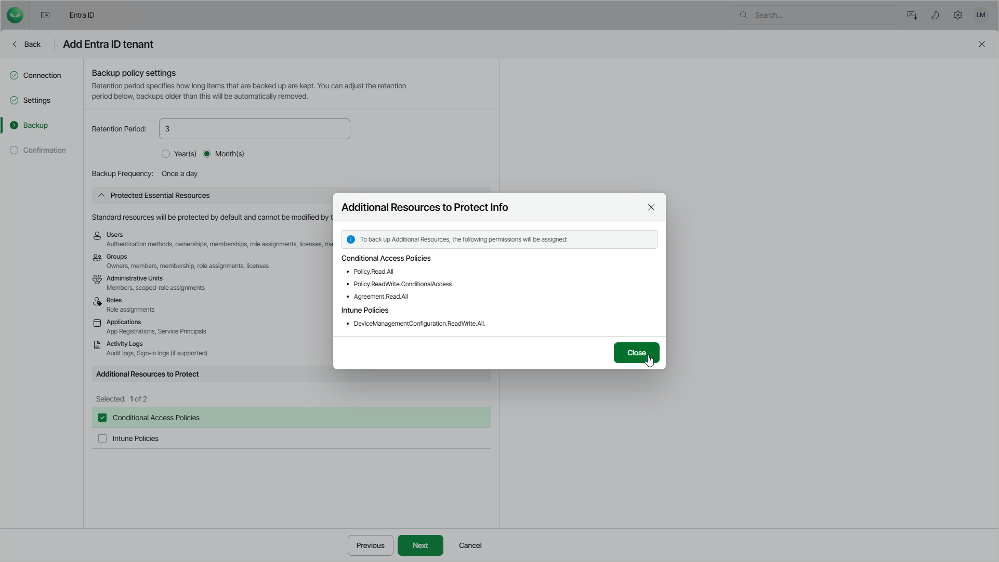

# Step 4. Specify Backup Policy Settings

At the Backup step of the wizard, specify the following:

1. In the Retention Period field, specify a retention period for which Veeam Data Cloud will keep backups before they are deleted. The maximum value is 99 for both months and years.
2. In the Additional Resources to Protect section, you can allow Veeam Data Cloud to back up the following Entra ID objects:

* To allow Veeam Data Cloud to back up Conditional Access policies, select Conditional Access Policies.
* To allow Veeam Data Cloud to back up Microsoft Intune policies, select Intune Policies.
* To allow Veeam Data Cloud to back up Entra ID organization contacts, select Organizations Contacts.

You can also enable these options later. For details, see [Settings](entra_id_settings.md#enabligcap).

If you allow Veeam Data Cloud to back up addtional Entra ID resources, Veeam Data Cloud will automatically assign required permissions to the Microsoft Entra service principal that allows Veeam Data Cloud to back up and restore your Entra ID objects and logs. For details on required permissions, see [Permissions](entra_id_permissions.md).

