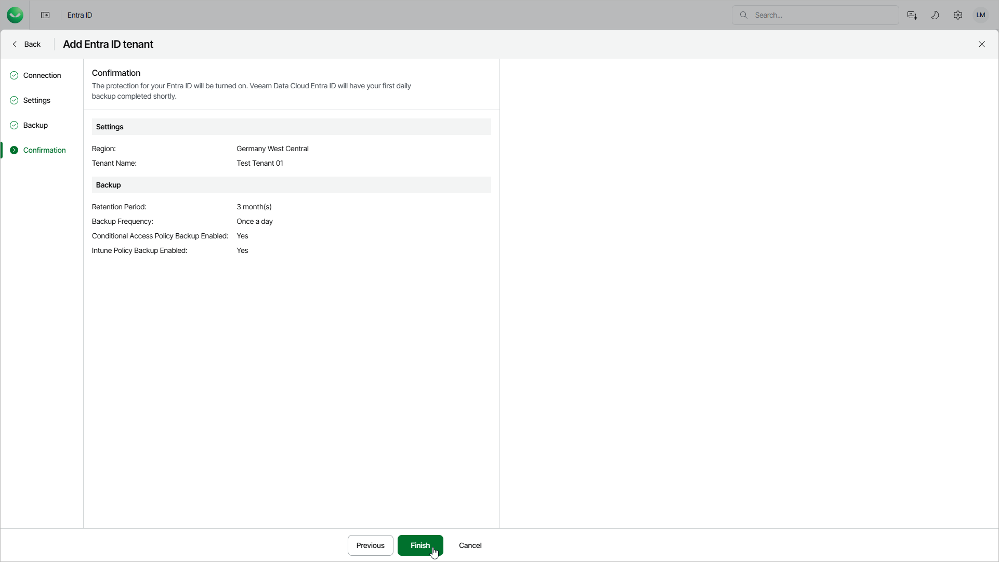

# Step 5. Finish Working with Wizard

At the Confirmation step of the wizard, review the details of configured settings and click Finish to start provisioning the new tenant. After the infrastructure for your tenant is ready, Veeam Data Cloud will create the initial backup of your Microsoft Entra ID tenant. You will receive an email notification once the initial backup of Entra ID objects and Entra ID log is completed.

|  |
| --- |
| Note |
| Veeam Data Cloud sends email notifications about successful backup completion only for the initial backups. Later, Veeam Data Cloud sends email notifications only if a backup fails. |

