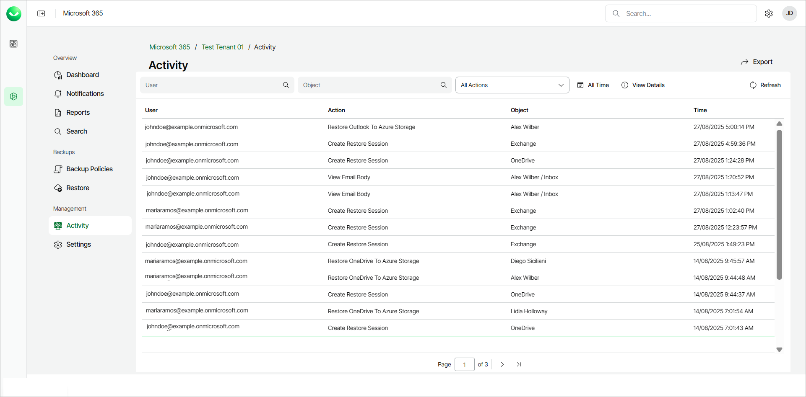

# Activity

This is a full overview of Veeam Data Cloud for Microsoft 365 user activity. For each action, you can also view a detailed action log.

In this section you can:

* Filter the table by typing the name of a User or Object (Outlook, OneDrive, SharePoint, and so on). You can also filter by selecting the date from the calendar and selecting an action from the drop-down list.
* Click on a table row and then click View Details to view further details about the user activity.
* Click Refresh to refresh the view with the latest information.
* Click Export to download a .CSV file with user activity information. In the Export user activities pop-up window, select the month to export and click Ok. The file is downloaded to your Downloads folder.

