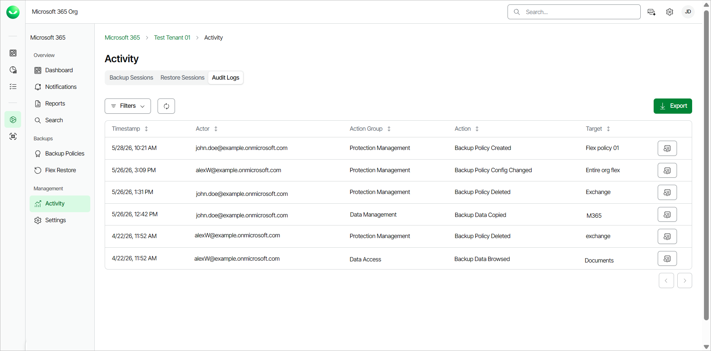
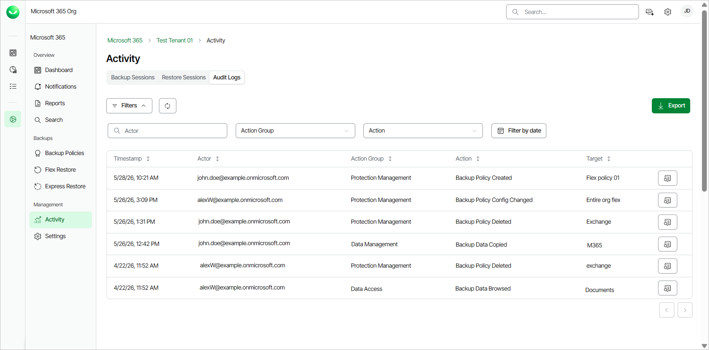
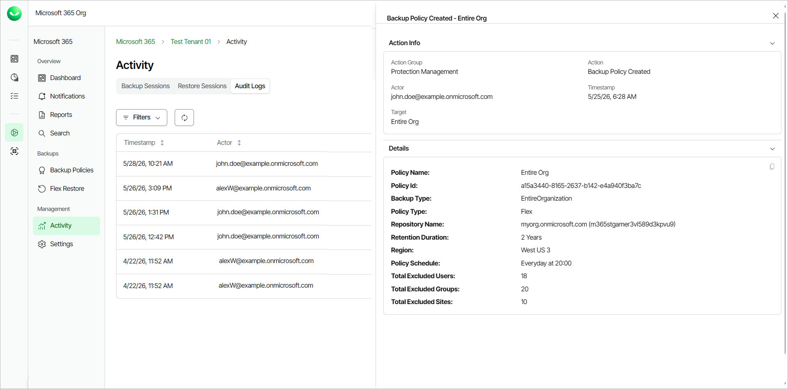

# Viewing Audit Logs

Veeam Data Cloud records all events about data access, data protection and protection management, and creates an audit log. In the Activity page, you can review a list of all the audit log events within your Veeam Data Cloud for Microsoft 365 organization.

Only users with the OrganizationAdmin or M365:Administrator roles or a custom role with the View Activity Logs, View Protection Management Activity and View Data Access Activity permissions can view the Audit Logs tab in the Activity page of their tenant. For more information about roles, see [Roles](users_roles.md).

To view the list of audit log events, do the following:

1. On the Microsoft 365 page, click the name of the tenant you want to manage.
2. Select Activity.
3. Go to the Audit Logs tab.

In the Audit Logs tab, in the audit logs list, Veeam Data Cloud displays the following information:

Viewing Audit Logs

| Property | Description |
| Timestamp | The date and time the Actor triggered the audit action. |
| Actor | The email address of the user that triggered the audit action. If the property value is System, Veeam Data Cloud triggered the action. |
| Action Group | The group where the action belongs. The available action groups are: Data Access, Data Management, Protection Management. |
| Action | The action triggered by the user. For example, backup policy creation, backup data restored and so on. |
| Target | The object that is affected by the action. For example, backup data, a backup policy and so on. |

|  |
| --- |
| tip |
| You can click Export to download a .CSV file with the audit logs activity information of the past 90 days. Select the date range of activity you want to export and click Submit. The file is downloaded to your Downloads folder. |

Filtering Data

You can search for specific audit logs and apply filters to locate audit actions or filter by date. To apply a filter on the audit logs list, in the Audit Logs tab, click Filters. Then, you can do the following actions:

* To search for specific audit logs, in the Actor search field, specify the full email address of the user who triggered the audit action.

* To filter by action group, from the Action Group drop-down list, select one or more of the following options:

* Data Access
* Data Management
* Protection Management

* To filter by action, from the Action drop-down list, select one or more of the following actions:

* Backup Data Browsed
* Backup Data Searched
* Backup Data Copied
* Backup Data Downloaded
* Backup Data Exported
* Backup Data Restored
* Backup Policy Created
* Backup Policy Config Changed
* Backup Policy Enabled
* Backup Policy Disabled
* Backup Policy Deleted
* Backup Policy Started
* Backup Policy Stopped

* To filter by a specific date, click Filter by date. Select a date range and click Apply.
* To remove the filters and view all audit logs, click Clear Filters.

Viewing Details

To view the detailed information of an audit log, click View Details next to the audit log. Veeam Data Cloud displays the information in the audit log action window. The information that Veeam Data Cloud displays depends on the action and backup policy type.

