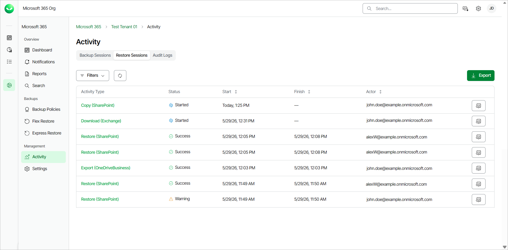
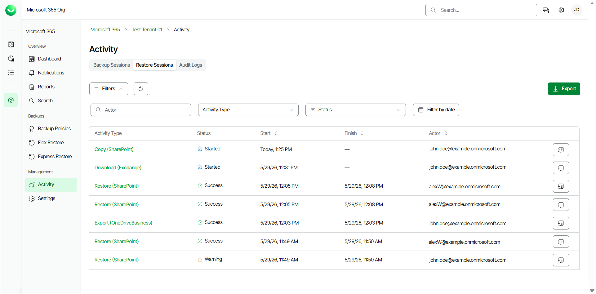
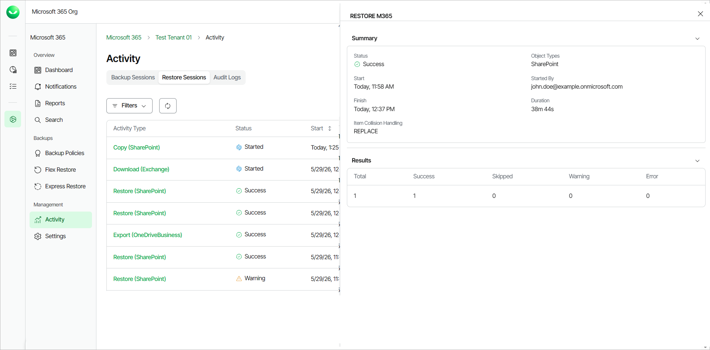

# Viewing Restore Sessions

You can view all Flex and Express restore sessions and their details in the Activity page.

Only users with the OrganizationAdmin or M365:Administrator roles or a custom role with the View Activity Logs and View Restore Activity permissions can view the Restore Sessions tab in the Activity page of their tenant. For more information about roles, see [Roles](users_roles.md).

To view the list of restore sessions, do the following:

1. On the Microsoft 365 page, click the name of the tenant you want to manage.
2. Select Activity.
3. Go to the Restore Sessions tab.

In the Restore Sessions tab, in the restore sessions list, Veeam Data Cloud displays the following information for each restore session:

Viewing Restore Sessions

| Property | Description |
| Activity Type | Veeam Data Cloud displays the type of the restore activity and the restored object type in the Restore Type (object type) format.  The available restore types are: Restore, Copy, Download, Export.  The available object types are: Exchange, OneDriveBusiness, SharePoint, Teams.  For example, for a restore session of a SharePoint site, Veeam Data Cloud will display the following activity type: Restore (SharePoint). |
| Status | The status of the restore session. |
| Start | The date and time the restore session was started. |
| Finish | The date and time the restore session was completed. |
| Actor | The email address of the user that triggered the restore session. |

|  |
| --- |
| tip |
| You can click Export to download a .CSV file with the restore sessions activity information of the past 90 days. Select the date range of activity you want to export and click Submit. The file is downloaded to your Downloads folder. |

Filtering Data

You can search for specific restore sessions and apply filters to locate sessions with warnings or filter by date. To apply a filter on the restore sessions list, in the Restore Sessions tab, click Filters. Then, you can do the following actions:

* To search for specific restore sessions, in the Actor search field, specify the full email address of the user who initiated the restore session.
* To filter based on the activity type, select an option from the Activity Type drop-down list. The available types are the following: Copy, Download, Export, Restore.
* To filter by status, select one of the statuses from the Status drop-down list. The available statuses are the following: Success, Warning, Failed, Aborted, Started, Queued.
* To filter by a specific date, click Filter by date. Select a date range and click Apply.
* To remove the filters and view all restore sessions, click Clear Filters.

Viewing Details

To view the detailed information of a restore session, click View Details next to the restore session. In the Restore M365 window, Veeam Data Cloud displays the following information:

* In the Summary section, you can view the following details:

* Status. The status of the restore session.
* Object Types. The type of the object of the restore session.
* Start. The date and time the restore session was started.
* Started By. The email address of the user that initiated the restore session.
* Finish. The date and time the restore session was completed.
* Duration. The duration of the restore session.
* Item Collision Handling. The restore behavior when Veeam Data Cloud detects an item-level collision. The available behaviors are the following:

* SKIP. Veeam Data Cloud performs no action.
* REPLACE. Veeam Data Cloud replaces the current item data with data from the backup.
* DUPLICATE. Veeam Data Cloud creates a new item.

* In the Results section, you can view the following details about the items included in the restore session:

* Total. The total number of items within the restore session.
* Success. The number of successfully restored items.
* Skipped. The number of skipped items.
* Warning. The number of items where the restore completed with warning messages.
* Error. The number of items where the restore failed.

