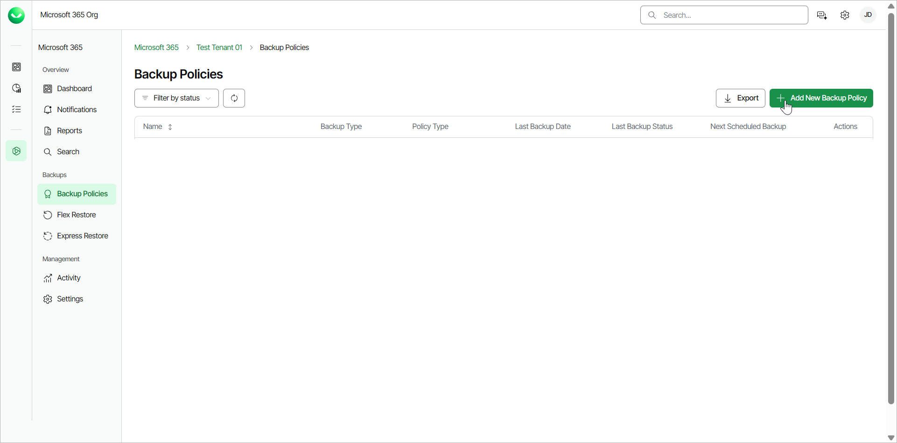
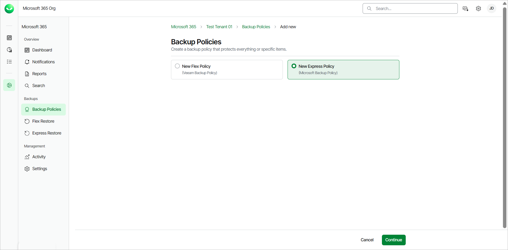
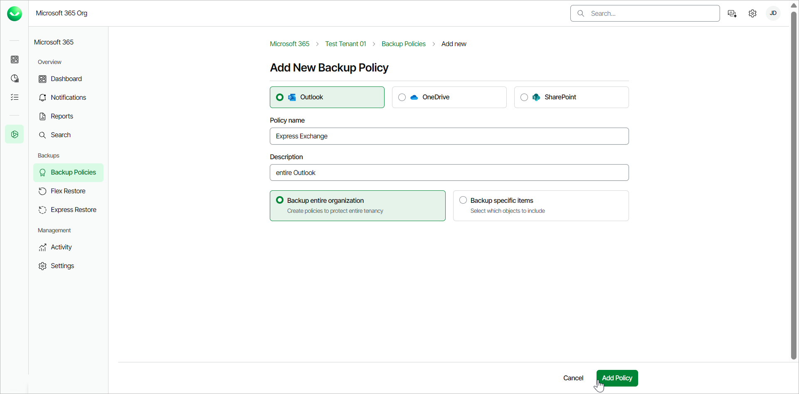
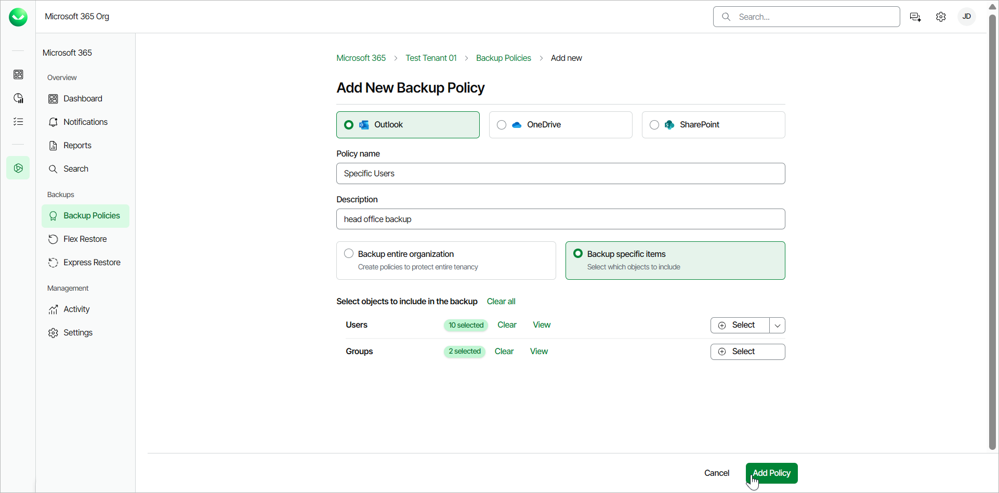

# Creating Express Backup Policies

To create Express backup policies, your customer organization must have a subscription with the Express, Premium, or Premium Plus plan and you must [activate and enable the Express backup service](m365_settings_enable_express_backup.md).

Consider the following:

* Veeam Data Cloud for Microsoft 365 supports the following types of Express backup policies:

* Specific items backup policy
* Entire organization backup policy

* You can only create one entire organization backup policy for each application (Outlook, OneDrive or SharePoint).
* You can create multiple specific items backup policies for each application (Outlook, OneDrive or SharePoint). Each specific object can only be protected with a single backup policy.
* Before you start creating backup policies, check [Considerations and Limitations](m365_considerations_limitations.md#backup).
* The schedule for Express backup policies depends on the protected Microsoft 365 service. For more information, see [Retention Period](m365_security.md#rpo).
* For Outlook backup policies, you can back up user mailboxes and shared mailboxes. Discovery search mailboxes, public folder mailboxes, remote mailboxes and resource mailboxes are not supported. Veeam Data Cloud will display the following warning when you add an unsupported mailbox to a backup policy: Mailbox cannot be added to policy since the recipient type is not supported.

To create new Express backup policies, do the following:

1. On the Microsoft 365 page, click the name of the tenant you want to manage.
2. Select Backup Policies.
3. On the Backup Policies page, click Add New Backup Policy.

1. Select the New Express Policy option and click Continue.

1. Select the application whose items you want to back up: Outlook, OneDrive or SharePoint.

Keep in mind that there can only be one Express entire organization backup policy for each application type. If the backup policy already exists when you try to create a new one, Veeam Data Cloud for Microsoft 365 will offer you to edit the existing backup policy. Veeam Data Cloud will display the following message: You already have a policy for Exchange/OneDrive/SharePoint. Click Next below to edit it. You can then proceed with editing the existing backup policy.

If the existing backup policy is disabled when you try to create a new one, Veeam Data Cloud for Microsoft 365 will instruct you to enable the existing backup policy. Veeam Data Cloud will display the following message: Your Exchange/OneDrive/SharePoint backup policy is currently disabled. You will need to enable it before you can edit it. Once you enable the backup policy, you can proceed with editing it. To learn more, see [Editing Express Backup Policies](m365_backup_edit_express.md).

1. On the Add New Backup Policy page, in the Policy name field, specify a name for the new backup policy.
2. [Optional] In the Description field, provide a description for future reference.
3. Select one of the following options:

* If you want to back up your entire tenancy, select Backup entire organization and click Add Policy.

If you back up the entire organization, when the backup policy session starts, Veeam Data Cloud checks the entire content of the organization, and the list of items to back up is automatically updated. For example, if some users were added or deleted from the organization between backup policy runs, the backup policy reflects those changes.

* If you want to select which items to add to the backup, select Backup specific items and do the following:

* For Outlook and OneDrive, click Select next to Users or Groups and select specific objects to back up.

For Users, you can also click Upload a CSV file to upload a .CSV or text file with one email address per line.

* For SharePoint, click Select next to SharePoint Sites and select specific objects to back up.

You can also click Upload a CSV file to upload a .CSV file with one SharePoint site URL per line.

* Click Add Policy.

