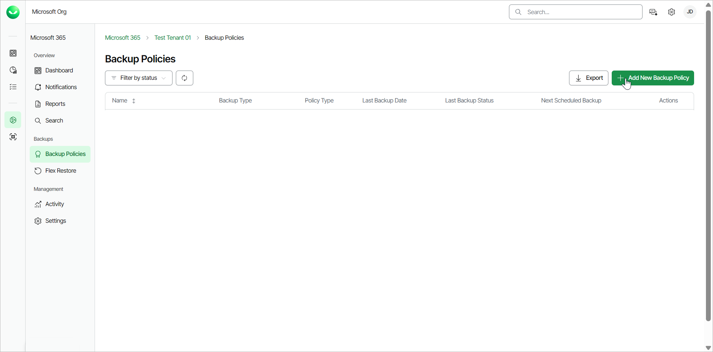
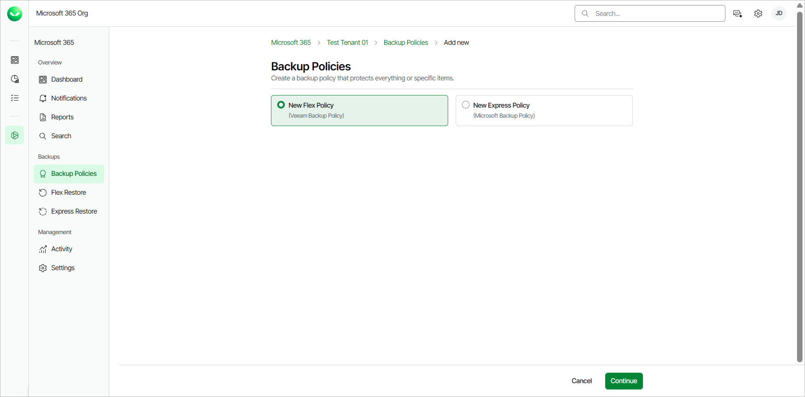
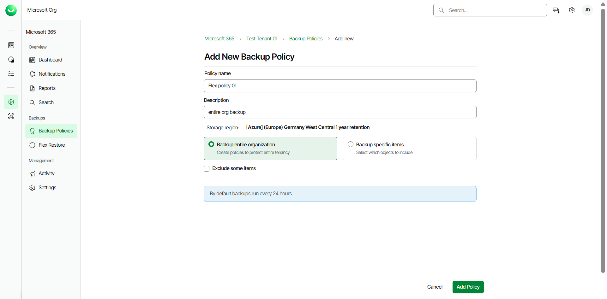
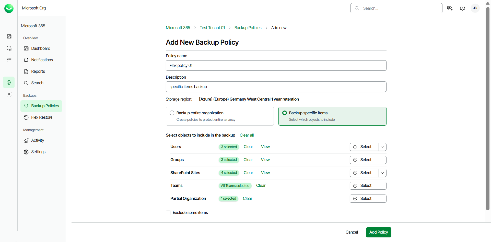
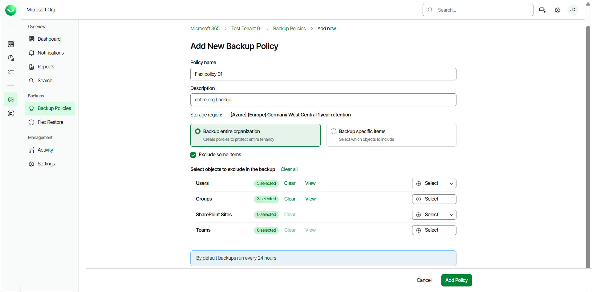

# Creating Flex Backup Policies

You can create new backup policies in Veeam Data Cloud for Microsoft 365.

Before you start creating backup policies, check [Considerations and Limitations](m365_considerations_limitations.md#backup).

To create a new Flex backup policy, do the following:

1. On the Microsoft 365 page click the name of the tenant you want to manage.
2. Select Backup Policies.
3. On the Backup Policies page, click Add New Backup Policy.

1. Select the New Flex Policy option and click Continue.

1. On the Add New Backup Policy page, in the Policy name field, specify a name for the new backup policy.
2. [Optional] In the Description field, provide a description for future reference.
3. From the Storage region drop-down list, select the backup repository where you want to store the backup data.

If this is the first backup policy for the tenant, Veeam Data Cloud does not display the Storage region drop-down list. The backup repository is provisioned in the storage region you selected when you added the Microsoft 365 tenant to Veeam Data Cloud after you successfully create the backup policy.

1. Select one of the following options:

* Select Back up entire organization to back up all objects within your Microsoft organization. When the backup policy session starts, Veeam Data Cloud will back up the entire content of the organization, and the list of items to back up will be automatically updated. For example, if some mailboxes were added or deleted from the organization between backup policy runs, the backup policy will reflect those changes.

* Select Back up specific items to back up specific objects within your Microsoft organization. In the Select objects to include in the backup section, do the following:

* Click Select next to Users and select users to back up. For each selected user, you can select check boxes to include their Mailbox, Archive Mailbox, OneDrive and Personal Site in the backup.

You can also click Upload a CSV file to upload a .CSV or text file with one email address per line.

* Click Select next to Groups and select groups to back up. For each group member, you can select check boxes to include their Mailbox, Archive Mailbox, OneDrive and Personal Site in the backup. For each group mailbox, you can select check boxes to include the group Mailbox and Site in the backup.

Use dynamic Entra ID groups if you want the groups to be automatically updated between backup policy runs. Otherwise, you must manually add and delete users from the groups.

* Click Select next to SharePoint Sites and select sites to back up. If you select the root SharePoint site, the list of sites to back up will be automatically updated when the backup policy session starts. For example, if some subsites were added or deleted between backup policy runs, the backup policy will reflect those changes.

You can also click Upload a CSV file to upload a .CSV file with one SharePoint site URL per line.

* Click Select next to Teams and select teams to back up. You can select whether to back up team posts if you enabled [team posts backup](m365_enable_team_chats_backup.md).
* Click Select next to Partial Organization and select from the following processing options: Mailboxes, Archive Mailboxes, OneDrive, Sites, Teams, Teams Posts (if [enabled](m365_enable_team_chats_backup.md)). When a partial organization backup policy session starts, Veeam Data Cloud will check the entire content of the partial organization and the list of items to back up will be automatically updated. For example, if some mailboxes were added or deleted from the partial organization between backup policy runs, the backup policy will reflect those changes.

1. If you want to exclude specific objects from the backup policy, select the Exclude some items check box. Then click Select next to Users, Groups, SharePoint Sites or Teams and select specific objects to exclude.

For Users, you can also click Upload a CSV file to upload a .CSV or text file with one email address per line.

For SharePoint Sites, you can also click Upload a CSV file to upload a .CSV file with one SharePoint site URL per line.

1. Click Add Policy.

|  |
| --- |
| NOTE |
| Consider the following:   * For SharePoint Online, OneDrive and Teams items, Veeam Data Cloud backs up the latest version of the item by default. To back up all versions, go to Settings > Backup Options and select All versions. For more information, see [Managing Backup Options](m365_settings_manage_backup_options.md). * By default, backup policies run every 24 hours and generate restore points. For more information, see [Retention Period](m365_security.md#rpo). |

|  |
| --- |
| TIP |
| During your initial full backup, Microsoft may be throttling your traffic due to the high load of Microsoft Exchange data. To mitigate this, you can temporarily disable Microsoft Exchange throttling in the Microsoft 365 admin center. For detailed instructions on how to disable Microsoft throttling, see [this Veeam KB article](https://www.veeam.com/kb4198). |

