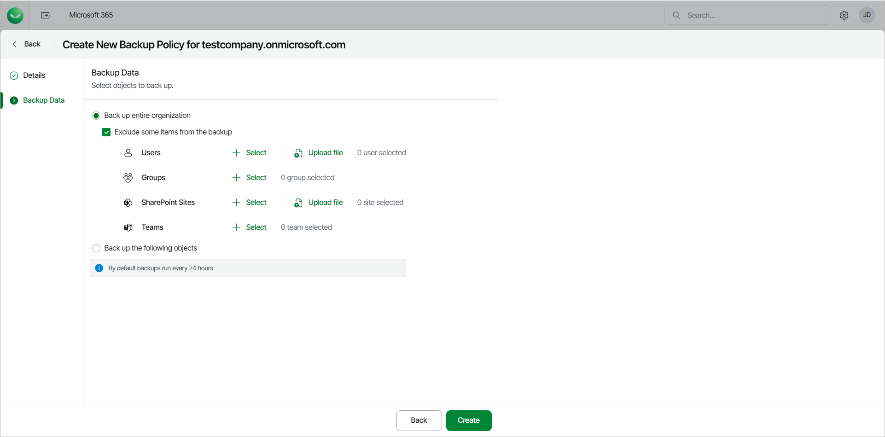
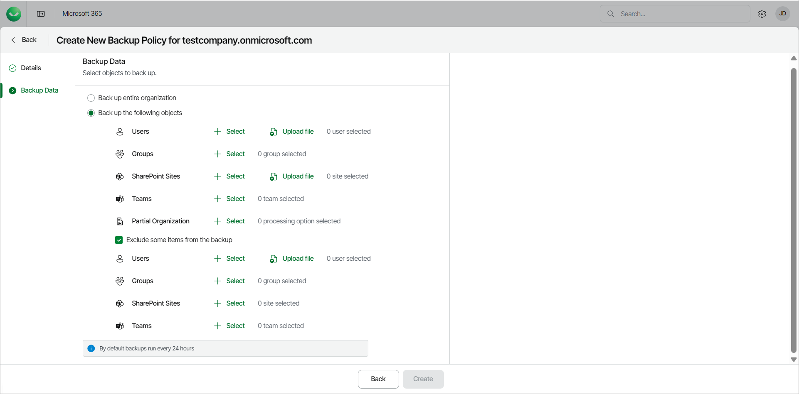

# Step 3. Configure Backup Data

At the Backup Data step of the wizard, select objects to back up.

* Select Back up entire organization to back up all objects within your Microsoft organization. When the backup policy runs, it will back up the entire content of the organization and the list of items to back up will be automatically updated. For example, if some mailboxes were added or deleted from the organization between backup policy runs, the backup policy will reflect those changes.

If you want to exclude specific objects from the backup policy, select the Exclude some items from the backup check box. Then click Select next to Users, Groups, SharePoint Sites or Teams and choose specific objects to exclude.

For Users, you can also click Upload file to upload a CSV or text file with one email address per line.

For SharePoint Sites, you can also click Upload file to upload a CSV file with one SharePoint URL per line.

* Select Back up the following objects to back up specific objects within your Microsoft organization. Then do the following:

* Click Select next to Users and choose users to back up. You can also use the Upload file button to upload a CSV or text file with one email address per line.
* Click Select next to Groups and choose groups to back up.

Use dynamic Entra ID groups if you want the groups to be automatically updated between backup policy runs. Otherwise, you must manually add and delete users from the groups.

* Click Select next to SharePoint Sites and choose sites to back up. If you select the root SharePoint site, the list of sites to back up will be automatically updated when the backup policy runs. For example, if some subsites were added or deleted between backup policy runs, the backup policy will reflect those changes.
* Click Select next to Teams and choose teams to back up.
* Click Select next to Partial Organization and choose from the following processing options: Mailbox, Archive Mailbox, One Drive, Sites, Teams, Teams Chats (if [enabled](m365_enable_team_chats_backup.md)). When a partial organization backup policy runs, it will check the entire content of the partial organization and the list of items to back up will be automatically updated. For example, if some mailboxes were added or deleted from the partial organization between backup policy runs, the backup policy will reflect those changes.

If you want to exclude specific objects from the backup policy, select the Exclude some items from the backup check box. Then click Select next to Users, Groups, SharePoint Sites or Teams and choose specific objects to exclude.

For Users, you can also use the Upload file button to upload a CSV or text file with one email address per line.

For SharePoint Sites, you can also click Upload file to upload a CSV file with one SharePoint URL per line.

|  |
| --- |
| NOTE |
| By default, backup policies run every 24 hours and generate restore points. For more information, see [Retention Period](m365_security.md#rpo). |

