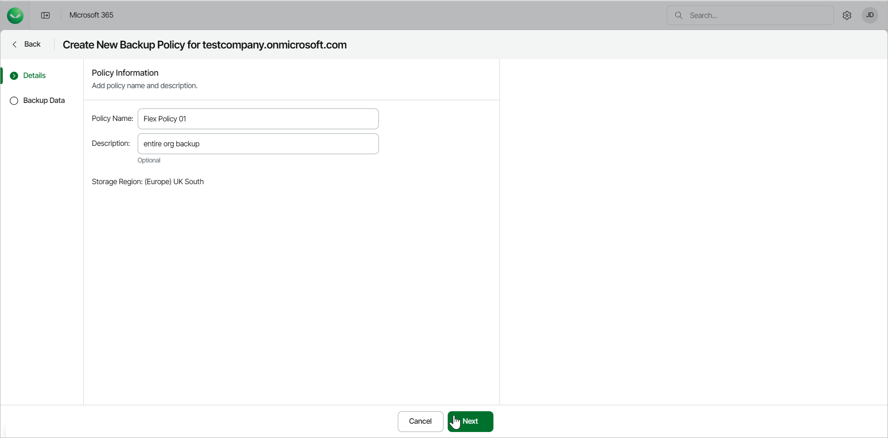

# Step 2. Configure Policy Information

At the Details step of the wizard, specify a name and description for the backup policy.

1. In the Policy Name field, specify a name for the new backup policy.
2. In the Description field, provide a description for future reference.
3. Click Next to continue.

