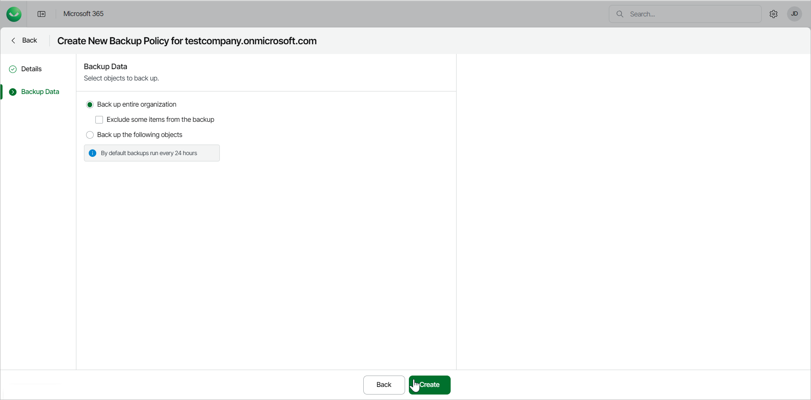

# Step 4. Finish Working with Wizard

After you select what objects to back up, click Create to create the new backup policy.

|  |
| --- |
| NOTE |
| By default, backup policies run every 24 hours and generate restore points. For more information, see [Retention Period](m365_security.md#rpo). |

