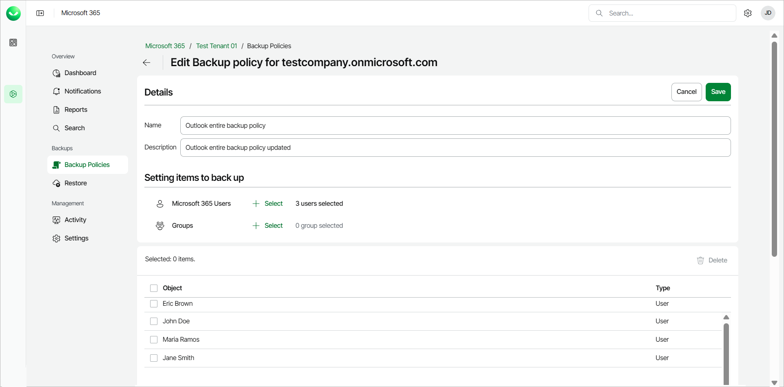
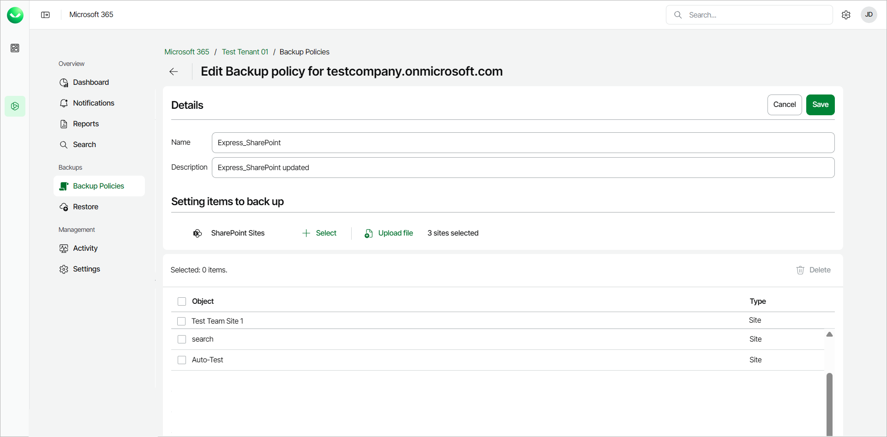
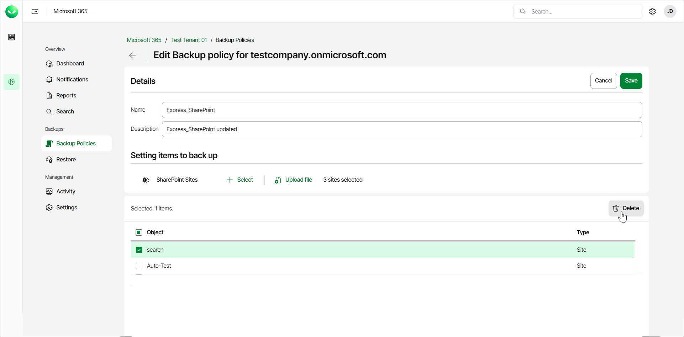

# Editing Express Backup Policies

You can add and remove users and objects to and from backup policies created in Veeam Data Cloud for Microsoft 365. To use Express backup policies, your customer organization must have a subscription with the Express or Premium Veeam Data Cloud for Microsoft 365 plan. Note that subscriptions with the Express or Premium Veeam Data Cloud for Microsoft 365 plan are not available for service providers and their customers at the moment.

Consider the following:

Veeam Data Cloud for Microsoft 365 supports the following types of Express backup policies:

* Entire Organization backup policy
* Selected Items backup policy

If you back up the entire organization, when the backup policy runs, it checks the entire content of the organization and the list of items to back up are automatically updated. For example, if some users were added or deleted from the organization between backup policy runs, the backup policy reflects those changes. For this reason, you cannot edit items in an entire organization backup policy. You can only edit the name and description of the backup policy. If you want to be able to add or remove items, you must delete the entire organization backup policy and create a selected items backup policy.

In contrast, a selected items backup policy only backs up the items you specify. New items are not automatically added between backup policy runs. You need to keep track of what you want to back up and edit the list of objects added to such policies. You can also edit the name and description of the backup policy.

To edit an Express backup policy, do the following:

1. On the Microsoft 365 page, click the name of the tenant you want to manage.

1. Select Backup Policies.
2. On the Backup Policies page, in the list of your backup policies, select the policy you want to edit and click Edit.

1. Edit the name and the description of the backup policy.
2. For selected items backup policy, follow instructions to add or remove objects within your backup policies:

* [Adding Objects to Express Backup Policies](#edit_outlook)
* [Removing Objects from Express Backup Policies](#edit_remove)

Adding Objects to Express Backup Policy

To add objects to an express backup policy, take the following steps:

1. In the Setting items to back up section, do the following:

1. [For Outlook and OneDrive express backup policies] Click Select next to Microsoft 365 Users or Groups and choose objects to be backed up.

1. [For SharePoint express backup policies] Click Select next to SharePoint Sites and choose objects to be backed up. If you select a root SharePoint site, the list of sites to back up will be automatically updated when the backup policy runs. For example, if some subsites were added between backup policy runs, the backup policy will reflect those changes.

You can also click Upload file to upload a CSV file with one SharePoint URL per line.

1. Click Save to complete the operation.

Removing Objects from Express Backup Policies

To remove objects from an express backup policy, take the following steps:

1. In the Setting items to back up section, select check boxes next to objects to specify what to remove from the backup.
2. Click Delete to complete the operation.

