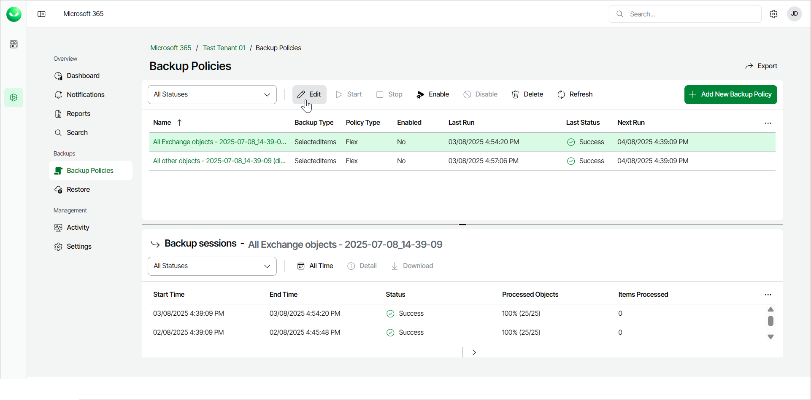
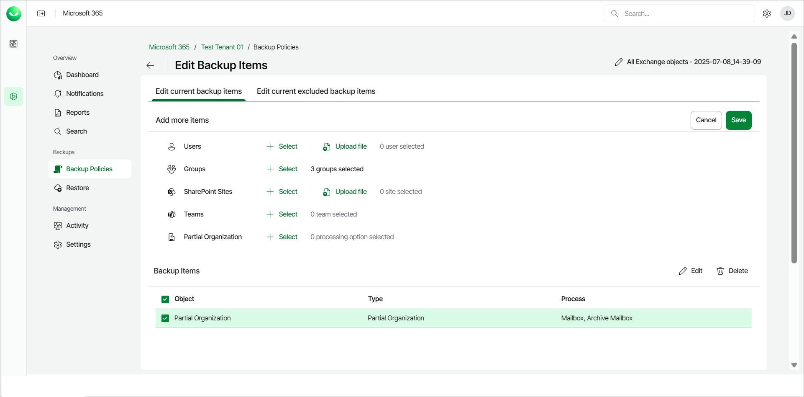
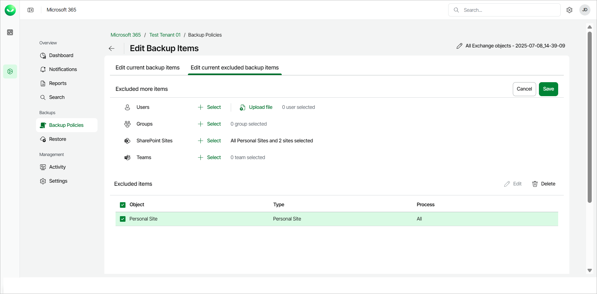

# Editing Flex Backup Policies

Variable License Model

Users of the Variable License Model can add and remove users and objects to and from backup policies created in Veeam Data Cloud for Microsoft 365.

Keep in mind that backup policy editing with the Fixed License Model is different. To learn more, see [Fixed License Model](#FixedLicense).

To edit a Flex backup policy, do the following:

1. On the Microsoft 365 page, click the name of the tenant you want to manage.
2. Select Backup Policies.
3. On the Backup Policies page, in the list of your backup policies, select the policy you want to edit and click Edit.

1. To rename the backup policy, do the following:

1. Click the pen icon and edit the name of the backup policy.

1. Click Ok to complete the operation.

1. [For Selected items backup policies] In the Edit current backup items tab, specify what objects you want to include in the backup policy.

* To add objects to the backup policy, do the following:

1. In the Add more items section, click Select next to Users, Groups, SharePoint Sites, Teams or Partial Organization and choose specific objects to back up.

For Users, you can also click Upload file to upload a text file with one email address per line.

For SharePoint Sites, you can also click Upload file to upload a CSV file with one SharePoint URL per line.

1. Click Save to complete the operation.

* To remove objects from the backup policy, do the following:

1. In the Backup Items section, Veeam Data Cloud for Microsoft 365 lists items that are part of the backup policy. Select check boxes next to names of objects that you want to remove from the backup.

1. Click Delete to complete the operation.

1. In the Edit current excluded backup items tab, select objects to be excluded from the backup policy.

* To exclude objects from the backup policy, do the following:

1. In the Exclude more items section, click Select next to Users, Groups, SharePoint Sites or Teams and choose specific objects to exclude.

For Users, you can also click Upload file to upload a text file with one email address per line.

For SharePoint Sites, you can also click Upload file to upload a CSV file with one SharePoint URL per line.

1. Click Save to complete the operation.

* To remove objects from exclusion from the backup policy, do the following:

1. In the Excluded items section, Veeam Data Cloud for Microsoft 365 lists items that are excluded from the backup policy. Select check boxes next to names of objects that you want to remove from exclusion.
2. Click Delete to complete the operation.

Fixed License Model

|  |
| --- |
| IMPORTANT |
| The Fixed License Model has been deprecated. Any existing users will be moved to the Variable License Model, which provides additional functionality. No features will be lost in this transition. |

Users of the Fixed License Model can add and remove users and objects to and from backup policies created in Veeam Data Cloud for Microsoft 365.

Keep in mind that backup policy editing with the Variable License Model is different. To learn more, see [Variable License Model](#VarLicense).

To edit a Flex backup policy, do the following:

1. On the Microsoft 365 page, click the name of the tenant you want to manage.
2. Select Backup Policies.
3. On the Backup Policies page, in the list of your backup policies, select the policy you want to edit and click Edit.

1. Follow instructions to add or remove objects within your backup policies:

* [Adding Objects to Backup Policy](#add_object)
* [Removing Groups and Users from Backup Policy](#remove_object)

Adding Objects to Backup Policy

To add objects to a backup policy, take the following steps:

1. To add Microsoft 365 users, do the following:

1. In the Microsoft 365 Users and Groups tab of the Manage Backup Items page, click Add User.
2. In the User selection window, select check boxes next to user names to specify users to be backed up.
3. For each user that you selected, in the Mailbox, Archive Mailbox, OneDrive, and Personal Site columns, select what objects you want to back up.
4. Click OK to confirm your selection.

1. To add Microsoft 365 groups, do the following:

1. In the Microsoft 365 Users and Groups tab of the Manage Backup Items page, click Add Group.
2. In the Select Groups window, select the group you want to add.

Veeam Data Cloud searches within the cache to optimize performance. Use Search Microsoft 365 directly (slower but includes newly created Groups) to search for objects recently added through the Microsoft 365 admin center.

1. In the User selection window, select check boxes next to user names to specify users to be backed up.

1. For each user that you selected, in the Mailbox, Archive Mailbox, OneDrive, and Personal Site columns, select what objects you want to back up.

1. Click OK to confirm your selection.

1. Click Next.

1. To add SharePoint sites, do the following:

1. In the Sharepoint Sites and Teams tab, click Sharepoint Sites.

1. In the Site selection window, use the search bar or the list of SharePoint sites to find specific sites. Select check boxes next to names of the sites that you want to back up. If you select a root SharePoint site, the list of sites to back up will be automatically updated when the backup policy runs. For example, if some subsites were added or deleted between backup policy runs, the backup policy will reflect those changes.

1. Click OK to confirm your selection.

1. To add teams, do the following:

1. In the Sharepoint Sites and Teams tab, click Teams.

1. In the Team selection window, use the search bar or the list of teams to find specific Microsoft 365 teams. Select check boxes next to names of teams that you want to back up.

Veeam Data Cloud searches within the cache to optimize performance. Use Search Microsoft 365 directly (slower but includes newly created Groups) to search for objects recently added through the Microsoft 365 admin center.

1. Click OK to confirm your selection.

1. Click Start backup to finish the operation.

Removing Groups and Users from Backup Policy

To remove Microsoft 365 users from a backup policy, do the following:

1. Navigate to the Microsoft 365 Users and Groups tab.
2. In the Microsoft 365 Users window, select check boxes next to user names of users that you want to remove from the backup policy.
3. Click Delete to complete the operation.

To remove Microsoft 365 groups from a backup policy, do the following:

1. Navigate to the Microsoft 365 Users and Groups tab.
2. In the Microsoft 365 Groups window, click the bin icon on the right to remove a group from the backup.
3. Click Delete to complete the operation.

