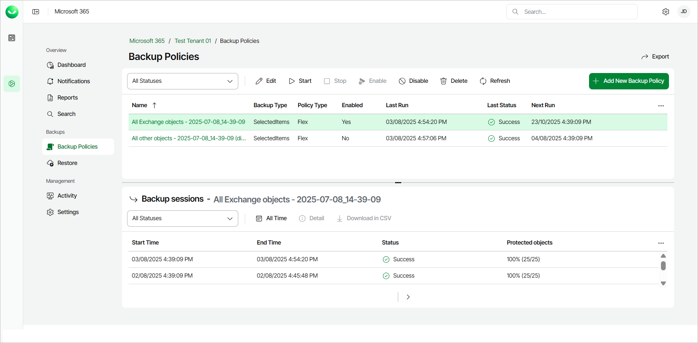

# Managing Backup Policies

Veeam Data Cloud for Microsoft 365 allows you to manage backup policies.

To manage a backup policy, do the following:

1. On the Microsoft 365 page, click the name of the tenant you want to manage.
2. Select Backup Policies.
3. In the list of backup policies, select the policy you want to manage and do one of the following:

* Click Edit to rename the backup policy and add or remove backed-up objects from the backup policy. For details, see [Editing Flex Backup Policies](m365_backup_edit_flex.md) and [Editing Express Backup Policies](m365_backup_edit_express.md).
* Click Start to run a backup policy session.
* Click Stop to stop a backup policy session that is already running.
* Click Enable to allow the backup policy to run upon schedule again.
* Click Disable to prevent the backup policy from running upon schedule. In the displayed window, click Disable to disable the backup policy.
* Click Delete to delete the backup policy. In the displayed window, click Delete to confirm the deletion of the backup policy.

If you delete a backup policy, you will not delete the data associated with it. Backed-up data deletion only occurs when the restore point goes beyond the retention period you have set for your Veeam Data Cloud for Microsoft 365 plan. For more information, see [Backup Retention](m365_data_backup.md#retention).

|  |
| --- |
| TIP |
| You can view and download backup session logs in the Backup sessions section. For more information, see [Viewing Backup Logs](m365_backup_view_logs.md). |

