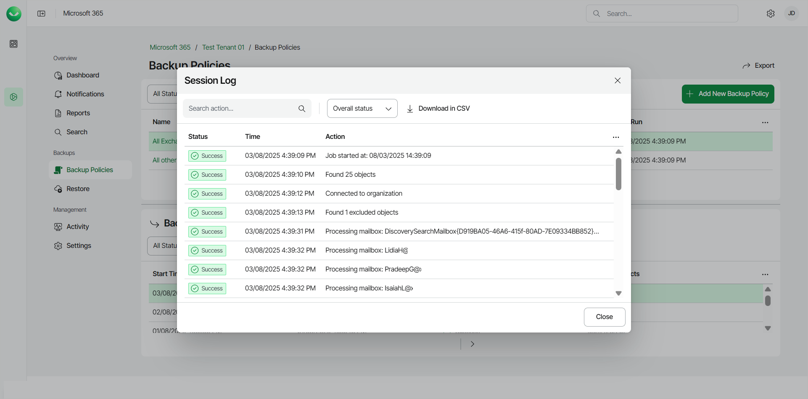
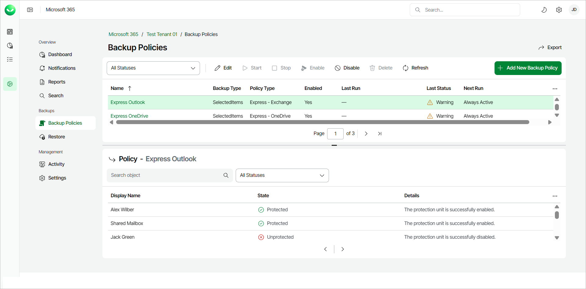

# Viewing Backup Logs

Veeam Data Cloud for Microsoft 365 allows you to view and download backup logs with information about your Flex backup policies status, log messages and timestamps. For Express backup policies, you can view details of the protection status of objects within the backup policy.

Flex Backup Policy Logs

To view backup logs of Flex backup policies, do the following:

1. On the Microsoft 365 page, click the name of the tenant you want to manage.
2. Select Backup Policies.
3. If you have more than one Flex backup policy, click the name of the policy under the Name field on the table.

Veeam Data Cloud for Microsoft 365 will display the list of backup sessions in the Backup sessions section of the Backup Policies page. Backup sessions will be listed in descending order from the most recent to the oldest.

1. Select the backup session whose logs you want to view and click Detail.

|  |
| --- |
| Tip |
| You can also download session logs to your computer. To do this, select the backup session and click Download in CSV. Veeam Data Cloud for Microsoft 365 will export the logs to a .CSV file.  A downloaded .CSV file contains 10,000 log records. If the backup session contains a large number of log records, Veeam Data Cloud for Microsoft 365 will split the data into multiple .CSV files, with each file containing 10,000 log records. In the .CSV file, you can filter the Status column to only view specific logs. For example, filter to the Warning status to only view log records with warning messages. |

1. In Session Log, you can select which statuses you want to see by clicking on the Overall status drop-down menu. You can select to see Running, Success, Warning, or Error messages only.

You can also filter session log records based on the text of a session log message. To do this, in the search field, enter the text you want to find in the session log.

If the backup session contains more than 200 log records, click Load More Logs to view the next 200 log records.

1. If you want to create a local copy of the logs, you can export the logs to a .CSV file. To do this, click Download in CSV.

Flex Backup Session Status

In the Backup sessions section, you can filter the backup sessions list of a Flex backup policy by date and status.

The available backup session statuses are the following:

* Success. The backup session was completed successfully.
* Partial Success / Warning. The backup session was completed successfully, but with warning messages.

* Some of the warning messages are there to provide information and can be safely ignored.

For example, see [OneDrive: OneDrive Was Not Found](m365_troubleshoot_onedrive_owner.md).

* Some of the warning messages may be related to other sources, such as Microsoft 365.

For example, this is a warning message related to Microsoft:

Processing site <Name> (<SharePoint Address>) finished with warning: Failed to backup item: <Item that could not be backed up>, Item may have a virus reported by the virus scanner plug-in.

Microsoft has its own virus scanner for files that are uploaded to SharePoint, OneDrive and Teams and has determined that the file in question contains a virus. To learn more about the Microsoft virus scanner, see this [Microsoft article](https://learn.microsoft.com/en-us/defender-office-365/anti-malware-protection-for-spo-odfb-teams-about?view=o365-worldwide).

* Some of the warning messages may require actions from your side.

For example, see [Outlook: Failed to Find Group Owner](m365_troubleshoot_outlook_group.md).

You can view the warning messages in the backup session logs.

* Failed. The backup session failed due to errors.

You can view the errors in the backup session logs.

* Stopped. The backup session was stopped.
* Running. The backup session is currently running.
* Disconnected. The backup session was disconnected due to a network issue, configuration error or service disruption.
* Not Configured. The backup session was not configured or set up properly (undefined backup targets, missing resources and so on).
* Queued. The backup session is currently queued.
* Retry. The backup session was completed with warnings or errors and is running again.
* Error. The backup session run into errors.

You can view the errors in the backup session logs.

Express Backup Policy Logs

To view the protection status of objects within Express backup policies, do the following:

1. On the Microsoft 365 page, click the name of the tenant you want to manage.
2. Select Backup Policies.
3. Click the name of the Express backup policy you want to view.
4. In the Policy section, Veeam Data Cloud for Microsoft 365 will display a list of the objects within the backup policy. For each object, you can see the following details:

* Display Name.

* For Outlook, the name of the Microsoft 365 account.
* For OneDrive, the name of the OneDrive for Business account.
* For SharePoint, the title of the SharePoint site.

* [For SharePoint policies] Url. The Url of the SharePoint site.
* State. The protection status of the object within this backup policy run. For details, see [Express Policy Protection Status](#prostatus).
* Details. Details about the protection status of the object.

|  |
| --- |
| tip |
| You can search for objects within the policy to view their protection status. To do this, in the search field, enter a keyword that matches the Display Name of the object you want to find. |

Express Policy Protection Status

In the Policy section, from the All Statuses drop-down list, you can filter the objects list of an Express backup policy by status.

The available protection statuses are the following:

* Selected for protection. The item you requested for protection does not have a protection unit yet created on the Microsoft side.
* Unprotected. The protection unit is successfully disabled.
* Disabling protection. Disabling protection of the unit was requested.
* Protected. The protection unit is successfully enabled.
* Pending protection. Protection of the unit was requested.
* Pending removal. A request to remove the protected unit from the policy was made.
* Pending offboarding. A request to offboard the protection unit.
* Offboarded. The protection unit is successfully offboarded.
* Canceling offboarding. A request to cancel protection unit offboarding.

|  |
| --- |
| note |
| If you need further details on Express backup policies, such as access to warning or error logs, [submit a support case](https://my.veeam.com/my-cases). Enhancements to improve Express backup policy logs are planned for future releases. |

