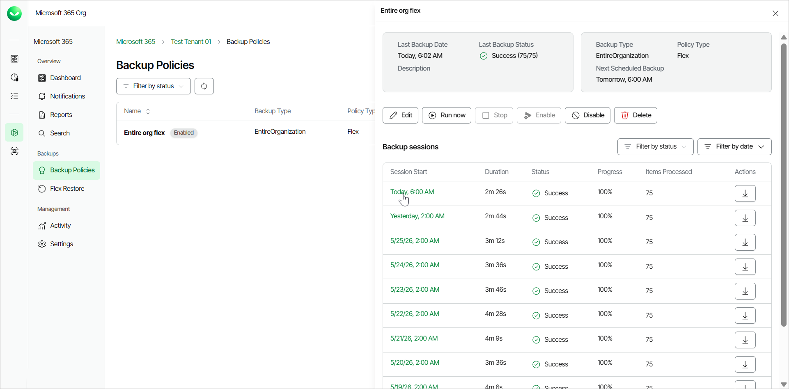
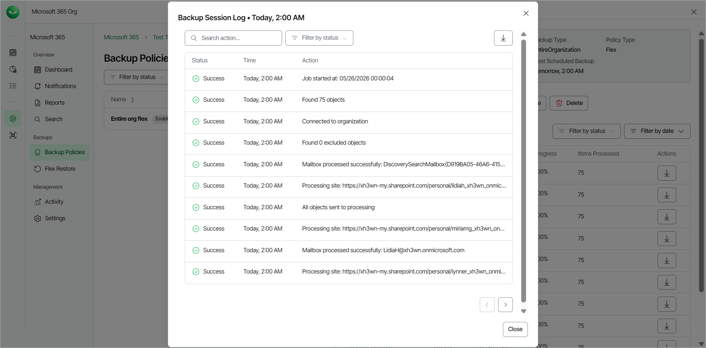
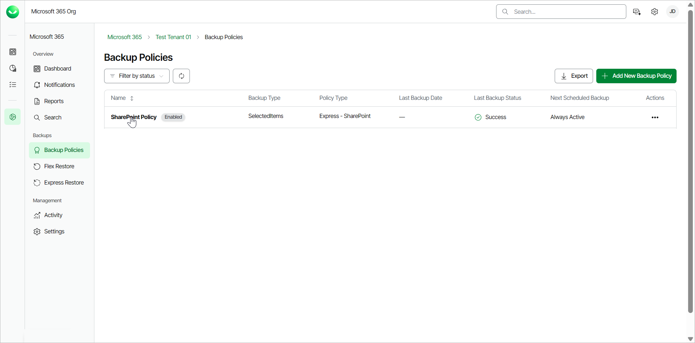
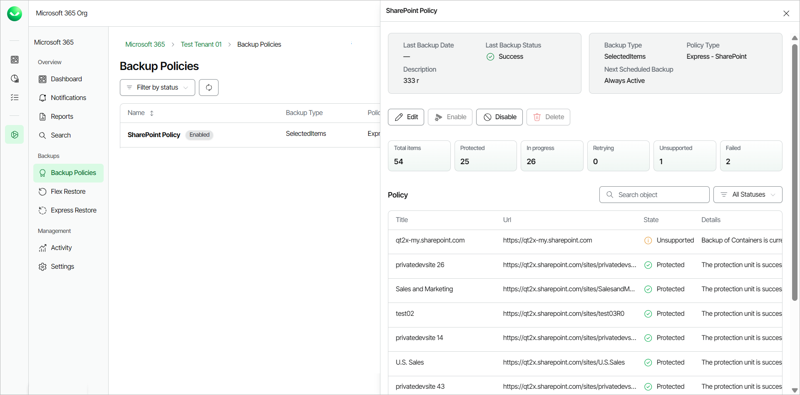

# Viewing Backup Logs

Veeam Data Cloud for Microsoft 365 allows you to view and download backup policy session logs with information about your Flex backup policies status, log messages and timestamps. For Express backup policies, you can view details of the protection status of objects within the backup policy.

Flex Backup Policy Logs

To view backup logs of Flex backup policies, do the following:

1. On the Microsoft 365 page, click the name of the tenant you want to manage.
2. Select Backup Policies.
3. In the list of backup policies, in the Name column, click the name of the policy.

1. In the backup policy window, you can view information about the backup policy status, the status and date of the last backup, the backup type and policy type and the date and time of the next scheduled backup.

You can also manage the backup policy. For more information, see [Managing Backup Policies](m365_backup_manage.md).

1. In the Backup sessions section, Veeam Data Cloud displays a list of backup sessions for the backup policy, in descending order from the most recent to the oldest.

|  |
| --- |
| tip |
| * You can select which backup policy statuses you want to see by clicking the Filter by status drop-down menu. For more information about the available statuses, see [Flex Backup Session Status](#status). * You can specify a date range for the backup policies you want to see by clicking Filter by date. * You can download session logs to your computer. To do this, click Download in CSV in the Actions column of the backup session. Veeam Data Cloud for Microsoft 365 will export the logs to a .CSV file.   In the .CSV file, you can filter the Status column to only view specific logs. For example, filter to the Warning status to only view log records with warning messages. |

1. Click on the date and time in the Session Start column to view the details of the backup session.

1. In the Backup Session Log window, you can select which statuses you want to see by clicking the Filter by status drop-down menu. You can select to see All Statuses, Success, Warning, or Error logs only.

You can also filter session log records based on the text of a session log message. To do this, in the search field, enter the text you want to find in the session log.

1. If you want to create a local copy of the logs, you can export the logs to a .CSV file. To do this, click Download in CSV.

Flex Backup Session Status

In the Backup sessions section, you can filter the backup sessions list of a Flex backup policy by date and status.

The available backup session statuses are the following:

* Success. The backup session was completed successfully.
* Partial Success. The backup session was completed successfully, but with warning messages.

* Some of the warning messages are there to provide information and can be safely ignored.

For example, see [OneDrive: OneDrive Was Not Found](m365_troubleshoot_onedrive_owner.md).

* Some of the warning messages may be related to other sources, such as Microsoft.

For example, this is a warning message related to Microsoft:

Processing site <Name> (<SharePoint Address>) finished with warning: Failed to backup item: <Item that could not be backed up>, Item may have a virus reported by the virus scanner plug-in.

Microsoft has its own virus scanner for files that are uploaded to SharePoint, OneDrive and Teams and has determined that the file in question contains a virus. To learn more about the Microsoft virus scanner, see this [Microsoft article](https://learn.microsoft.com/en-us/defender-office-365/anti-malware-protection-for-spo-odfb-teams-about?view=o365-worldwide).

* Some of the warning messages may require actions from your side.

For example, see [Outlook: Failed to Find Group Owner](m365_troubleshoot_outlook_group.md).

You can view the warning messages in the backup session logs.

* Failed. The backup session failed due to errors.

You can view the errors in the backup session logs.

* Stopped. The backup session was stopped.
* Running. The backup session is currently running.
* Disconnected. The backup session was disconnected due to a network issue, configuration error or service disruption.
* Not Configured. The backup session was not configured or set up properly (undefined backup targets, missing resources and so on).
* Queued. The backup session is currently queued.

Express Backup Policy Logs

To view the protection status of objects within Express backup policies, do the following:

1. On the Microsoft 365 page, click the name of the tenant you want to manage.
2. Select Backup Policies.
3. In the list of backup policies, in the Name column, click the name of the policy.

1. In the backup policy window, you can view information about the status and date of the last backup, the backup type and policy type and the date and time of the next scheduled backup.

You can also manage the backup policy. For more information, see [Managing Backup Policies](m365_backup_manage.md).

Veeam Data Cloud also displays a summary of protection within the backup policy. The summary includes the number of total items, protected items, in progress (for protection) items, retrying items, unsupported items and the number of items whose protection failed. For more information, see [Express Policy Protection Status](#prostatus).

1. In the Policy section, Veeam Data Cloud for Microsoft 365 displays a list of the objects within the backup policy. For each object, you can see the following details:

* Display Name / Title.

* For Outlook, the name of the Microsoft 365 account.
* For OneDrive, the name of the OneDrive account.
* For SharePoint, the title of the SharePoint site.

* [For SharePoint policies] Url. The Url of the SharePoint site.
* State. The protection status of the object within this backup policy run. For more information, see [Express Policy Protection Status](#prostatus).
* Details. Details about the protection status of the object.

|  |
| --- |
| tip |
| Consider the following:   * You can search for objects within the policy to view their protection status. To do this, in the search field, enter a keyword that matches the Display Name or Title of the object you want to find. * You can select which backup policy statuses you want to see by clicking the All Statuses drop-down list. |

Express Policy Protection Status

In the Policy section, from the All Statuses drop-down list, you can filter the objects list of an Express backup policy by status.

The available protection statuses are the following:

* Selected for protection. The item you requested for protection does not have a protection unit yet created on the Microsoft side.
* Retrying. The item is not eligible for protection yet.
* Unsupported. The item cannot be protected.
* Failed. Protection failed. See the displayed error message for details.
* In Progress. A protection change is currently being processed.
* Protected. The protection unit is successfully enabled.

|  |
| --- |
| note |
| If you need further details on Express backup policies, such as access to warning or error logs, [submit a support case](https://my.veeam.com/my-cases). Enhancements to improve Express backup policy logs are planned for future releases. |

