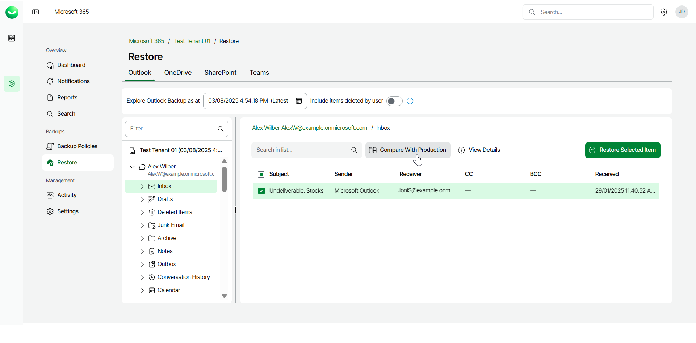
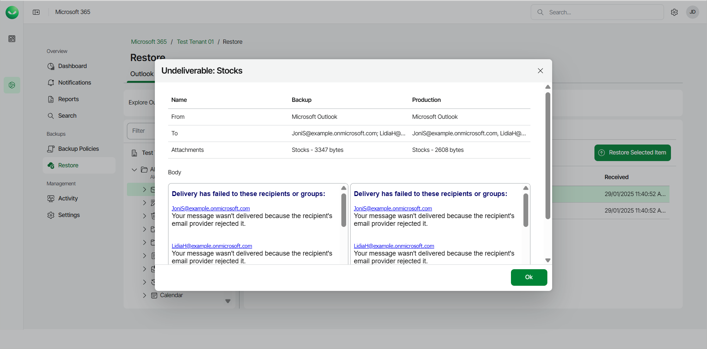

# Comparing Outlook Emails with Production

Veeam Data Cloud for Microsoft 365 lets you compare backed-up Microsoft Outlook emails to their versions in the production environment. This operation may help you identify the necessary email and decide whether to restore it from the backup.

To compare an email with the production environment:

1. On the Microsoft 365 page, click the name of the tenant you want to manage.
2. Select Restore.
3. On the Outlook tab, expand the mailbox that contains the folder with the email you want to compare.
4. Select the folder that contains the email you want to compare.
5. Select the check box next to the necessary email in the list of items.
6. Click Compare With Production.

1. In the displayed window, compare properties of the email between the backup and the production environment. Use the following table columns:

* Name — name of the email property.
* Backup — property value for the email in the backup.
* Production — property value for the email in the production environment.

1. If you want to compare the email message body, click View Body.

Once you have completed comparing the backed-up email with the production environment, click Ok in the compare window.

