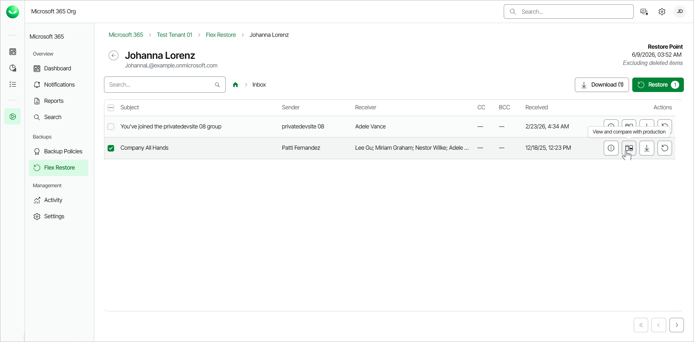
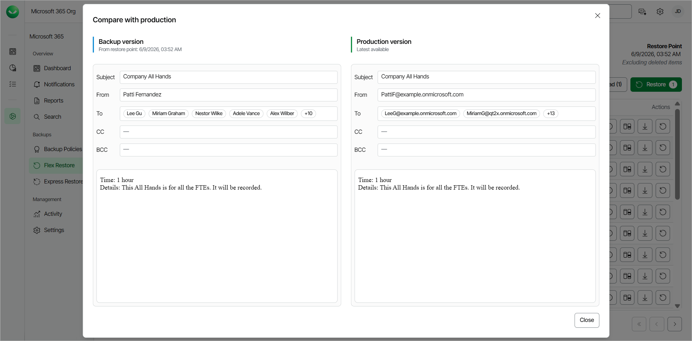

# Comparing Outlook Emails with Production

Veeam Data Cloud for Microsoft 365 lets you compare backed-up Microsoft Outlook emails to their versions in the production environment. This operation may help you identify the necessary email and decide whether to restore it from the backup.

To compare an email with the production environment:

1. On the Microsoft 365 page, click the name of the tenant you want to manage.
2. Select Flex Restore.
3. By default, Veeam Data Cloud uses the latest available restore point for data restore. If you want to select another restore point, click on the  Restore Point information box. On the calendar, select the date and time when the necessary restore point was created and click Apply.
4. Click the name of the mailbox that contains the email you want to compare.
5. Click on the folder that contains the email you want to compare.
6. Select the email you want to compare and, in the Actions column, click View and compare with production.

1. In the Compare with production window, compare properties of the email between the Backup version and the Production version. You can compare the following information:

* Subject — subject of the email.
* From — sender of the email.
* To — receiver of the email.
* CC — contacts to whom a copy of the email was sent.
* BCC — contacts to whom a blind copy of the email was sent.
* Body — the body of the email.

Once you have completed comparing the backed-up email with the production environment, click Close in the Compare with production window.

