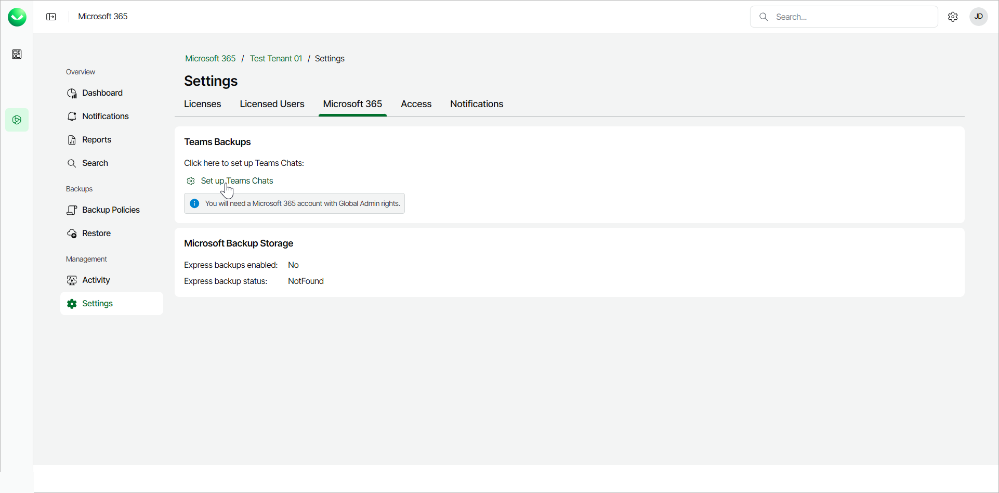
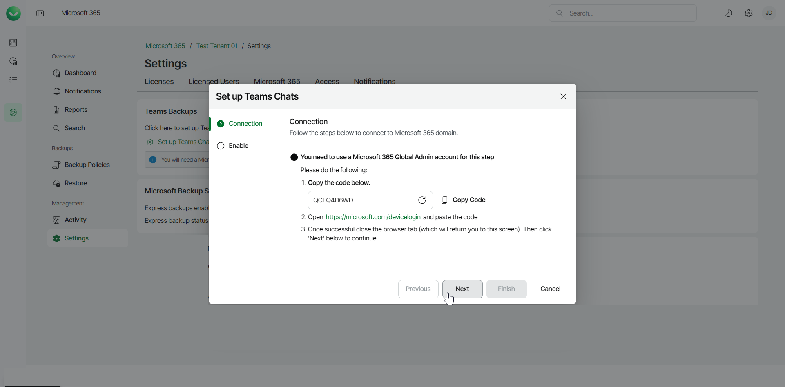

# Enabling Microsoft Team Chats Backup

To create team chats backups, Veeam Data Cloud for Microsoft 365 needs access to [Microsoft Teams Export APIs](https://docs.microsoft.com/en-us/microsoftteams/export-teams-content). Microsoft Teams Export APIs allow Veeam Data Cloud for Microsoft 365 to access sensitive data of team chats: private and shared channels and public channel messages. You must authorize Veeam Data Cloud for Microsoft 365 to use the required APIs. Microsoft Teams channels, tabs, files and metadata are protected regardless of whether you enable Microsoft team chats backup or not.

Before You Begin

Before you configure the Microsoft team chats backup, consider the following:

* When you perform backup of Microsoft Teams data, Veeam Data Cloud for Microsoft 365 does not back up the following objects:

* One-on-one and group chats.

For more information about chats in Microsoft Teams, see [this Microsoft article](https://support.microsoft.com/en-us/office/first-things-to-know-about-chat-in-microsoft-teams-88ed0a06-6b59-43a3-8cf7-40c01f2f92f2).

* Audio and video calls.
* Video recordings saved to Microsoft Stream.
* Contacts.
* Calendar: information about meetings and meeting chats.
* Code snippets, audio files and banner notifications in posts.
* Data of applications added as channel tabs (such as Website, Planner, Word, Excel, PowerPoint, Visio, PDF, Document Library, OneNote, SharePoint, Stream, Forms, Power BI, Power Automate and Azure DevOps) and other 3rd party applications if their data does not reside in the SharePoint document library of the team.
* The TeamsMessagesData folder of the group mailbox that belongs to the Microsoft 365 group associated with the backed-up team.

* Microsoft Teams service is not supported for organizations in Microsoft Entra China and legacy Microsoft Entra Germany regions. For more information about Microsoft Entra Germany, see [this Microsoft article](https://learn.microsoft.com/en-us/azure/germany/).
* Backup of team chats using Microsoft Teams Export APIs is not supported for Microsoft 365 organizations in Microsoft Entra China, legacy Germany, US Government DOD and US Government GCC High regions.
* During backup and restore of an archived team, Veeam Data Cloud for Microsoft 365 does not preserve the Make the SharePoint site read-only for team members property of the team on the Microsoft 365 side.

Authorizing Access to Microsoft Teams Export APIs

To allow Veeam Data Cloud for Microsoft 365 to access Microsoft Teams Export APIs, do the following:

1. On the Microsoft 365 page, click the name of the tenant you want to manage.
2. Select Settings.
3. Go to the Microsoft 365 tab.
4. In the Teams Backups section, click Set up Teams Chats.

You must do this with a Microsoft 365 account with Global Admin rights.

1. At the Connection step, authorize Veeam Data Cloud for Microsoft 365 to access requested APIs. Select a Microsoft 365 Global Admin account for this step.

1. Click Copy Code to copy the authorization code.
2. Follow the <https://microsoft.com/devicelogin> link.
3. Paste the authorization code in a new tab that opens in your browser.

1. Click Next.

1. At the Enable step, select whether you want to enable the Microsoft Teams chat backup option automatically or manually.

