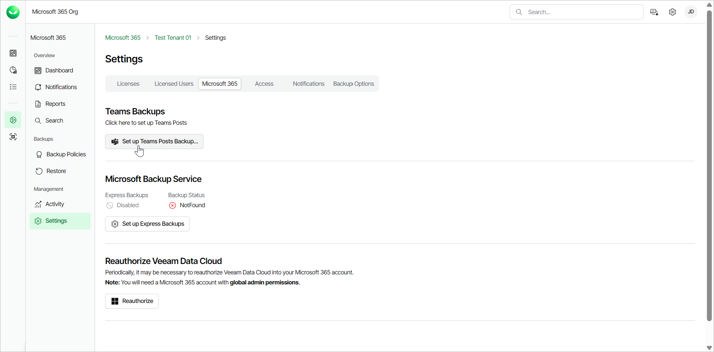
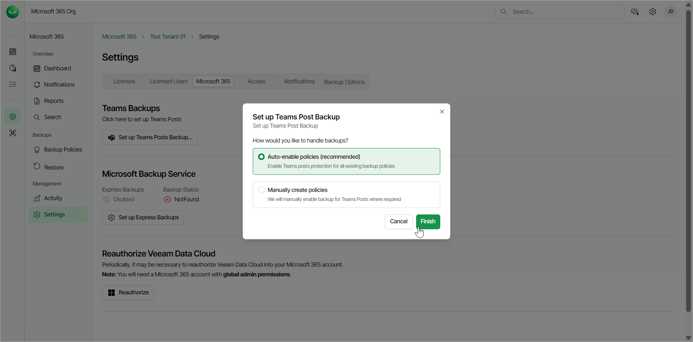

# Enabling Microsoft Team Posts Backup

To create Microsoft Teams backups that include private and shared channels and public channel messages, you must configure the team posts backup settings. Microsoft Teams channels, tabs, files and metadata are protected regardless of whether you enable Microsoft team posts backup or not.

Enabling Team Posts Backup

To enable Microsoft team posts backup, do the following:

1. On the Microsoft 365 page, click the name of the tenant you want to manage.
2. Select Settings.
3. Go to the Microsoft 365 tab.
4. In the Teams Backups section, click Set up Teams Posts Backup.

1. In the Set up Teams Post Backup window, select one of the following:

* Auto-enable policies (recommended). The team posts objects will be automatically included to all existing backup policies.
* Manually create policies. You must manually add the team posts objects to existing backup policies. For information on how to edit backup policies, see [Editing Flex Backup Policies](m365_backup_edit_flex.md).

1. Click Finish.

|  |
| --- |
| NOTE |
| If you receive the You cannot enable Teams Posts due to missing required permissions. Please reauthorize your app registration and try again. notification, you must reauthorize Veeam Data Cloud for Microsoft 365. For more information, see [Reauthorizing Veeam Data Cloud for Microsoft 365](m365_settings_reauthorize.md). |

