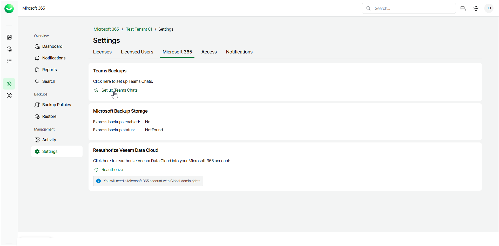
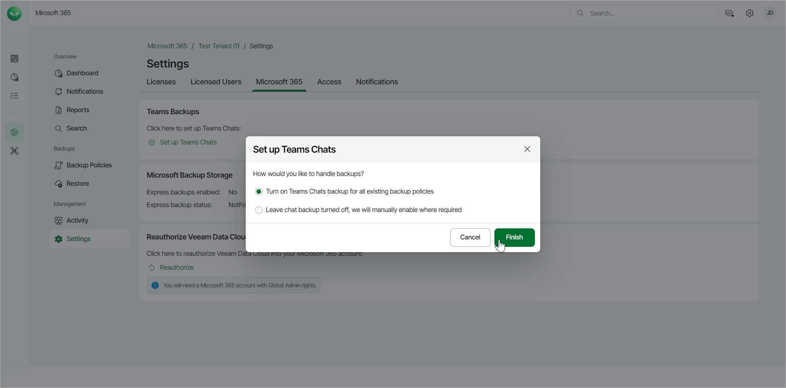

# Enabling Microsoft Team Chats Backup

To create Microsoft Teams backups that include private and shared channels and public channel messages, you must configure the team chats backup settings. Microsoft Teams channels, tabs, files and metadata are protected regardless of whether you enable Microsoft team chats backup or not.

Before You Begin

Before you configure the Microsoft team chats backup, consider the following:

* When you perform backup of Microsoft Teams data, Veeam Data Cloud for Microsoft 365 does not back up the following objects:

* One-on-one and group chats.

For more information about chats in Microsoft Teams, see [this Microsoft article](https://support.microsoft.com/en-us/office/first-things-to-know-about-chat-in-microsoft-teams-88ed0a06-6b59-43a3-8cf7-40c01f2f92f2).

* Audio and video calls.
* Video recordings saved to Microsoft Stream.
* Contacts.
* Calendar: information about meetings and meeting chats.
* Code snippets, audio files and banner notifications in posts.
* Data of applications added as channel tabs (such as Website, Planner, Word, Excel, PowerPoint, Visio, PDF, Document Library, OneNote, SharePoint, Stream, Forms, Power BI, Power Automate and Azure DevOps) and other 3rd party applications if their data does not reside in the SharePoint document library of the team.
* The TeamsMessagesData folder of the group mailbox that belongs to the Microsoft 365 group associated with the backed-up team.

* Microsoft Teams service is not supported for organizations in Microsoft Entra China and legacy Microsoft Entra Germany regions. For more information about Microsoft Entra Germany, see [this Microsoft article](https://learn.microsoft.com/en-us/azure/germany/).
* Team chats backup is not supported for Microsoft 365 organizations in Microsoft Entra China, legacy Germany, US Government DOD and US Government GCC High regions.
* During backup and restore of an archived team, Veeam Data Cloud for Microsoft 365 does not preserve the Make the SharePoint site read-only for team members property of the team on the Microsoft 365 side.

Enabling Team Chats Backup

To enable Microsoft team chats backup, do the following:

1. On the Microsoft 365 page, click the name of the tenant you want to manage.
2. Select Settings.
3. Go to the Microsoft 365 tab.
4. In the Teams Backups section, click Set up Teams Chats.

1. In the Set up Teams Chats window, select one of the following:

* Turn on Teams Chats backups for all existing backup policies. The team chats objects will be automatically included to all existing backup policies.
* Leave chat backup turned off, we will manually enable where required. You must manually add the team chats objects to existing backup policies. For information on how to edit backup policies, see [Editing Flex Backup Policies](m365_backup_edit_flex.md).

1. Click Finish.

|  |
| --- |
| NOTE |
| If you receive the You cannot enable Teams Posts due to missing required permissions. Please reauthorize your app registration and try again. notification, you must reauthorize Veeam Data Cloud for Microsoft 365. For more information, see [Reauthorizing Veeam Data Cloud for Microsoft 365](m365_settings_reauthorize.md). |

