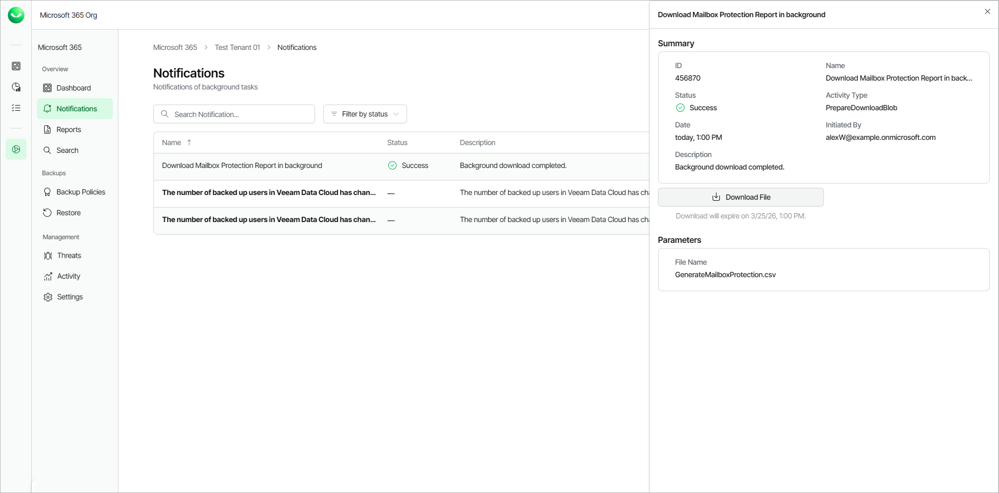
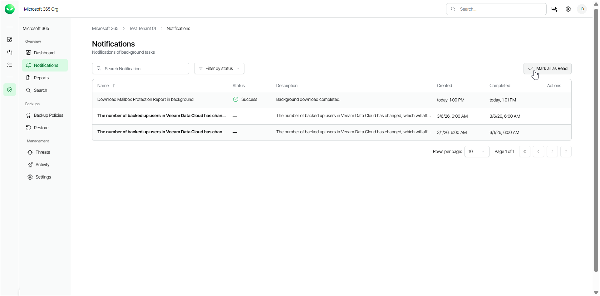

# Viewing Notifications

Veeam Data Cloud allows you to view the history of notifications and notification details.

To view the details of a notification, do the following:

1. On the Microsoft 365 page, click the name of the tenant you want to manage.
2. Select Notifications.
3. In the list of notifications, click the link in the Name column of the notification you want to display. Veeam Data Cloud will display a session log with detailed information.

New notifications are displayed in bold. To mark all unread notifications as read, click Mark all as Read.

