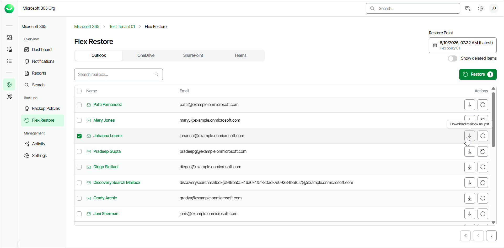
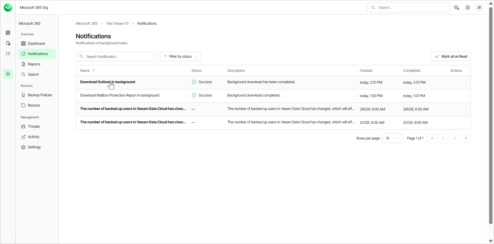
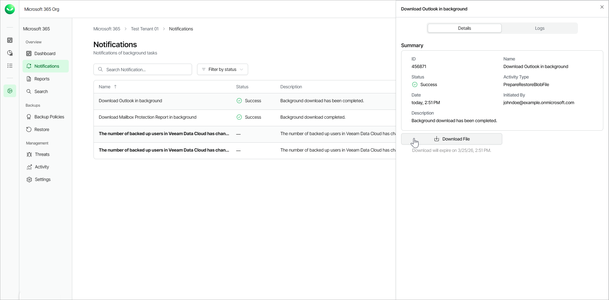

# Obtaining Downloaded Items

When restoring Microsoft Exchange Online, OneDrive, SharePoint Online and Teams data in Veeam Data Cloud for Microsoft 365, you can use the Download option if you want to download the data.

Consider that the maximum size for download of OneDrive and SharePoint Online data is 200 GB.

After you select what Microsoft Exchange Online, OneDrive, SharePoint Online or Teams items to restore, click Download. The restore process begins in the background.

When the download process is completed, Veeam Data Cloud for Microsoft 365 notifies you.

To obtain the downloaded items, do the following:

1. Select Notifications.
2. In the list of notifications, find the restore session and click the link in the Name column.

1. In the window with the details of the operation, click Download File.

1. The items are saved to your browser download location.

|  |
| --- |
| tip |
| If you download a large mailbox, Veeam Data Cloud for Microsoft 365 will split the data into smaller .PST files, with each file representing up to 10 GB of the total size. For example, if your mailbox is 36 GB, Veeam Data Cloud for Microsoft 365 will generate a .ZIP file containing 4 .PST files: 3 .PST files of the 10 GB size and another .PST file of the 6 GB size. |

