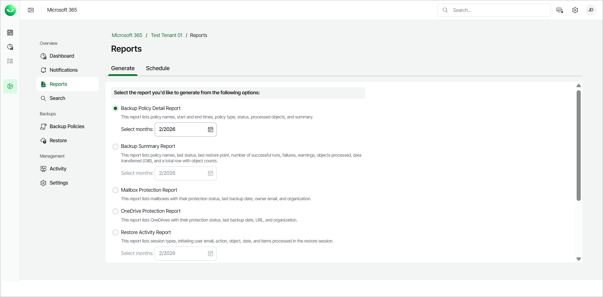
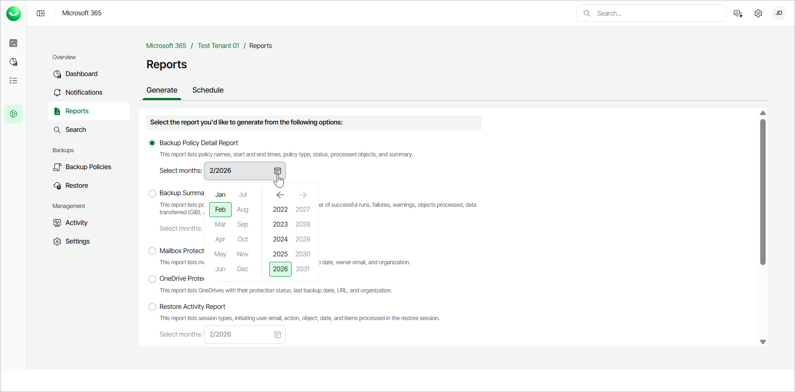
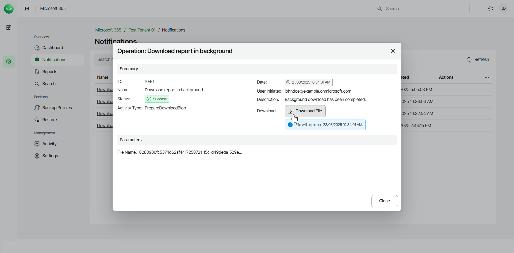

# Generating Reports

You can generate reports on Veeam Data Cloud for Microsoft 365 usage. To do this, perform the following steps:

1. On the Microsoft 365 page, click the name of the tenant you want to manage.
2. Select Reports.
3. In the Generate tab, select the report you want to generate from the following options:

* Backup Policy Detail Report. This report lists policy names, start and end times, policy type, status, processed objects and summary.
* Backup Summary Report. This report lists policy names, last status, last restore point, number of successful runs, failures, warnings, objects processed, data transferred (GiB) and a total row with object counts.

* Mailbox Protection Report. This report lists mailboxes with their protection status, last backup date, owner email and organization.
* OneDrive Protection Report. This reports lists OneDrives with their protection status, last backup date, URL and organization.

* Restore Activity Report. This report lists session types, initiating user email, action, object, date and items processed in the restore session.
* SharePoint Protection Report. This report lists sites with their protection status, last backup date, URL and organization.
* Teams Protection Report. This report lists teams with their protection status, last backup date and organization.

* User Protection Report. This report lists usernames with their protection status, last backup date, emails and organization.

[For Backup Summary Report, Restore Activity Report and Backup Policy Detail Report] Select the month for which you want the report to be generated.

1. Click Generate Report. Veeam Data Cloud for Microsoft 365 will generate the report in the .CSV format.

* For Mailbox Protection Report and User Protection Report, Veeam Data Cloud for Microsoft 365 will display the The report is being generated and you will be notified once it is complete message.

Click Notifications to view the status of the report. In the list of notifications, click the link in the Name column of the notification about the report. Veeam Data Cloud will display a session log with detailed information.

In the window with the details of the operation, click Download File.

* The report is saved to your browser download location.

Report Fields

Veeam Data Cloud for Microsoft 365 generates the following reports in the .CSV format.

Backup Policy Detail Report

The Backup Policy Detail Report includes the following fields:

* The Job Name field shows the name of the backup policy.
* The Start Time field shows the date and time when the backup policy was started.
* The End Time field shows the date and time when the backup policy was finished.
* The Job Type field shows whether the type of the backup policy is Backup or Copy.
* The Status field shows the session run status of a backup policy.
* The Objects Processed field shows the number of objects that were processed in the backup policy.
* The Summary field shows information in case of a failed backup policy.

For example:

|  |
| --- |
| Job Name,Start Time,End Time,Job Type,Status,Objects Processed,Summary  All Exchange objects - 2025-07-08\_14-39-09,08/07/2025 4:39:09 PM,08/07/2025 4:40:07 PM,Backup,Success,79,  All other objects - 2025-07-08\_14-39-09,08/07/2025 4:39:09 PM,08/07/2025 4:53:08 PM,Backup,Success,2712,  All other objects - 2025-07-08\_14-39-09,09/07/2025 4:39:09 PM,09/07/2025 4:40:26 PM,Backup,Success,0,  All Exchange objects - 2025-07-08\_14-39-09,09/07/2025 4:39:09 PM,09/07/2025 4:40:54 PM,Backup,Success,0, |

The Backup Policy Detail Report does not include information about Express backup policies.

Backup Summary Report

The Backup Summary Report includes the following fields:

* The Policy Name field shows the name of the backup policy.
* The Last status field shows the final status of the last run of the backup policy.
* The Last restore point field shows the date and time when the latest backup file was created. The field uses the following format: DD/MM/YYYY HH:MM:SS AM/PM, for example, 18/06/2024 08:03:40 AM.
* The Success Runs Count, Failure Runs Count and Warning Runs Count fields show how many backup sessions of a backup policy were processed with the Success, Failed and Warning statuses.
* The Objects Processed field shows the number of objects that were processed within the backup policy.
* The Data Transferred (GiB) field shows the amount of backed-up data within the backup policy.
* The TOTAL row shows the sum totals for each of the Number of successes, Number of failures, Number of warnings, Objects Processed and Data Transferred (GiB) columns.

For example:

|  |
| --- |
| Policy Name,Last status,Last restore point,Success Runs Count,Failure Runs Count,Warning Runs Count,Objects Processed,Data Transferred (GiB)  All Exchange objects - 2025-07-08\_14-39-09, Success, 03/08/2025 02:54:20 PM, 24, 0, 0, 83, 0.01  All other objects - 2025-07-08\_14-39-09, Success, 03/08/2025 02:57:06 PM, 24, 0, 0, 2712, 0.11  TOTAL,,,48,0,0, 2795,0.12 |

Mailbox Protection Report

The Mailbox Protection Report includes the following fields:

* The Mailbox field shows the mailbox name.
* The E-mail field shows the email address of the user.
* The Organization field shows the name of the company or organization in Veeam Data Cloud for Microsoft 365.
* The Protection Status field shows whether the mailbox is with the Protected or Unprotected status.
* The Last Backup Date field shows the date when the latest backup file was created by the user.

For example:

|  |
| --- |
| Mailbox,Email,Organization,Protection Status,Last Backup Date  Retail,Retail@example.onmicrosoft.com,example.onmicrosoft.com,Protected,8/4/2025  Megan Bowen,MeganB@example.onmicrosoft.com,example.onmicrosoft.com,Protected,8/4/2025  Alex Wilber,AlexW@example.onmicrosoft.com,example.onmicrosoft.com,Protected,8/4/2025 |

OneDrive Protection Report

The OneDrive Protection Report includes the following fields:

* The Name field shows the username of the OneDrive owner.
* The URL field shows the URL of the OneDrive.
* The Organization field shows the name of the company or organization in Veeam Data Cloud for Microsoft 365.
* The Protection Status field shows whether the OneDrive is with the Protected or Unprotected status.
* The Last Backup Date field shows the date when the latest backup file was created by the user.

For example:

|  |
| --- |
| Name,URL,Organization,Protection Status,Last Backup Date  Megan Bowen,https://example-my.sharepoint.com/personal/meganbowen,example.onmicrosoft.com,Protected,8/4/2025  Alex Wilber,https://example-my.sharepoint.com/personal/alexwilber,example.onmicrosoft.com,Protected,8/4/2025 |

Restore Activity Report

The Restore Activity Report includes the following fields:

* The Session Type field shows the type of the restore session.
* The Initiated By field shows the email of the Veeam Data Cloud for Microsoft 365 user who performed the restore activity.
* The Action field shows what kind of restore action was performed.
* The Object field shows the objects that were processed within the restore session.
* The Date field shows the date and time when the restore activity was performed.
* The Items field shows the items that were processed within the restore session.

For example:

|  |
| --- |
| Session Type,Initiated By,Action,Object,Date,Items  Teams,JOHN.DOE@EXAMPLE.COM,CreateRestoreSession,Teams,24/07/2025 10:09:26 AM,"{""SessionType"":""vet"",""DateTime"":""2025-07-23T14:40:23.425Z""}"  Outlook,JOHN.DOE@EXAMPLE.COM,CreateRestoreSession,Exchange,24/07/2025 10:02:19 AM,"{""SessionType"":""vex"",""DateTime"":""2025-07-23T14:40:14.277Z""}"  Teams,JOHN.DOE@EXAMPLE.COM,CreateRestoreSession,Teams,24/07/2025 09:59:33 AM,"{""SessionType"":""vet"",""DateTime"":""2025-07-23T14:40:23.425Z""}"  SharePoint,JOHN.DOE@EXAMPLE.COM,CreateRestoreSession,SharePoint,24/07/2025 09:57:27 AM,"{""SessionType"":""vesp"",""DateTime"":""2025-07-23T14:40:23.425Z""}" |

SharePoint Protection Report

The SharePoint Protection Report includes the following fields:

* The Title field shows the name of the SharePoint site.
* The Organization field shows the name of the company or organization in Veeam Data Cloud for Microsoft 365.
* The URL field shows the URL of the SharePoint site.
* The Protection Status field shows whether the SharePoint site is with the Protected or Unprotected status.

* The Last Backup Date field shows the date when the latest backup file was created by the user.

For example:

|  |
| --- |
| Title,Organization,URL,Protection Status,Last Backup Date  Communication Site,https://example.sharepoint.com/sites/communicationsite,example.onmicrosoft.com,Protected,8/4/2025  Test,https://example.sharepoint.com/sites/test,example.onmicrosoft.com,Protected,8/4/2025 |

Teams Protection Report

The Teams Protection Report includes the following fields:

* The Name field shows the name of the team.

* The Organization field shows the name of the company or organization in Veeam Data Cloud for Microsoft 365.
* The Protection Status field shows whether the team is with the Protected or Unprotected status.

* The Last Backup Date field shows the date when the latest backup file was created by the user.

For example:

|  |
| --- |
| Name,Organization,Protection Status,Last Backup Date  Team HQ,example.onmicrosoft.com,Protected,8/4/2025  HR team,example.onmicrosoft.com,Protected,8/4/2025 |

User Protection Report

The User Protection Report includes the following fields:

* The Username field shows the name of the Veeam Data Cloud for Microsoft 365 user.
* The E-mail field shows the email address of the Veeam Data Cloud for Microsoft 365 user.
* The Organization field shows the name of the company or organization in Veeam Data Cloud for Microsoft 365.
* The Protection Status field shows whether the user is with the Protected or Unprotected status.
* The Last Backup Date field shows the date when the latest backup file was created by the user.

For example:

|  |
| --- |
| Username,E-mail,Organization,Protection Status,Last Backup Date  Adele Vance,AdeleV@example.onmicrosoft.com,example.onmicrosoft.com,Protected,08/04/2025  Alex Wilber,AlexW@example.onmicrosoft.com,example.onmicrosoft.com,Protected,08/04/2025  Discovery Search Mailbox,DiscoverySearchMailbox{D919BA05-76A6-215f-40AD-7E09534BB852}@example.onmicrosoft.com,example.onmicrosoft.com,Protected,08/04/2025 |

