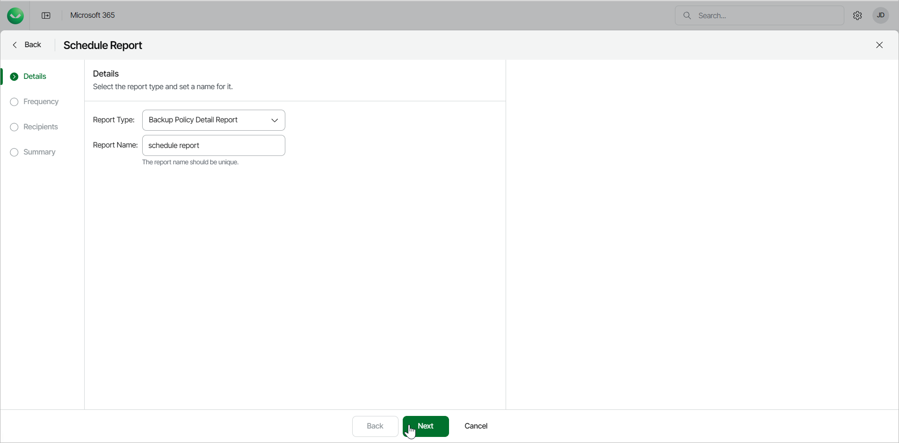

# Step 2. Specify Report Details

At the Details step of the wizard, select the type of report you want to schedule and specify a name for the report.

1. From the Report Type drop-down list, select the report you want to schedule. The available reports are the following:

* Backup Policy Detail Report. This report lists policy names, start and end times, policy type, status, processed objects and summary.
* Backup Summary Report. This report lists policy names, last status, last restore point, number of successful runs, failures, warnings, objects processed, data transferred (GiB) and a total row with object counts.
* Mailbox Protection Report. This report lists mailboxes with their protection status, last backup date, owner email and organization.
* OneDrive Protection Report. This reports lists OneDrives with their protection status, last backup date, URL and organization.
* Restore Activity Report. This report lists session types, initiating user email, action, object, date and items processed in the restore session.
* SharePoint Protection Report. This report lists sites with their protection status, last backup date, URL and organization.
* Teams Protection Report. This report lists teams with their protection status, last backup date and organization.
* User Protection Report. This report lists usernames with their protection status, last backup date, emails and organization.

1. In the Report Name field, type a name for the new scheduled report.

