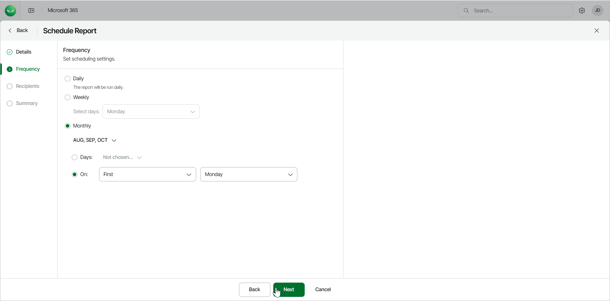

# Step 3. Select Schedule Frequency

At the Frequency step of the wizard, select whether to receive the scheduled report daily, weekly or monthly.

* Daily. The report will run every day.
* Weekly. The report will run every week. From the Select days drop-down, select which day of the week you want to receive the report.
* Monthly. The report will run every month. Select the months you want to receive the report from the drop-down list. Then you can either select the days from the 1st to the 31st from the drop-down list, or select on which day of the month you want to receive the report. For example, when you select First Monday, you will receive the report on the first Monday of the month you chose.

Once you select the frequency, click Next.

