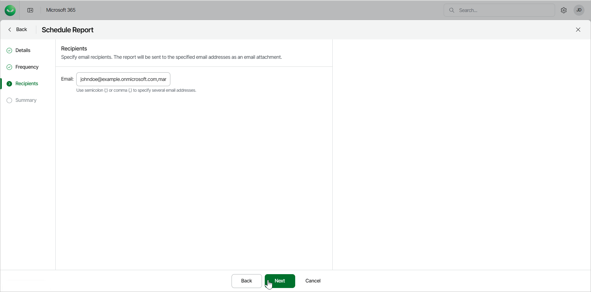

# Step 4. Specify Recipients

At the Recipients step of the wizard, specify the users who will receive the scheduled report as an email attachment.

In the Email field, specify the email addresses of the report recipients, separated by a semicolon (;) or a comma (,). Your own email address is added by default.

|  |
| --- |
| NOTE |
| You can also specify email addresses outside of your organization. The recipients must be able to log in to Veeam Data Cloud for Microsoft 365 to download the reports. |

|  |
| --- |
| Tip |
| To receive the scheduled report email, make sure to include no-reply@mail.cloud.veeam.com in your allowed, approved or safe senders list in your email client. |

