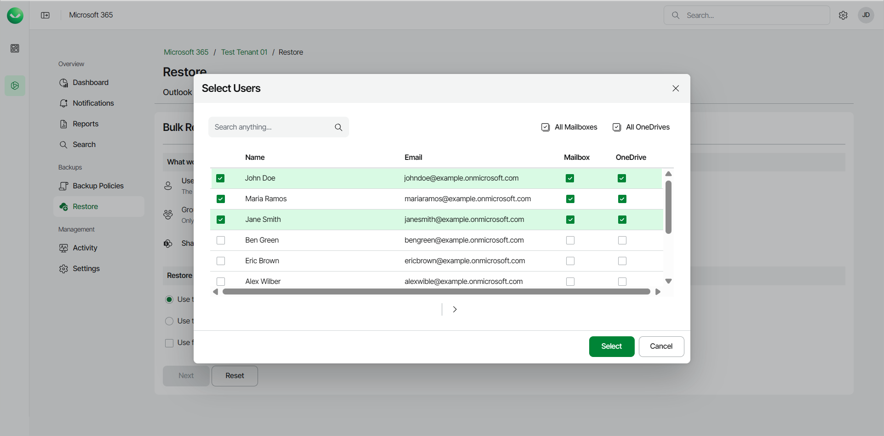
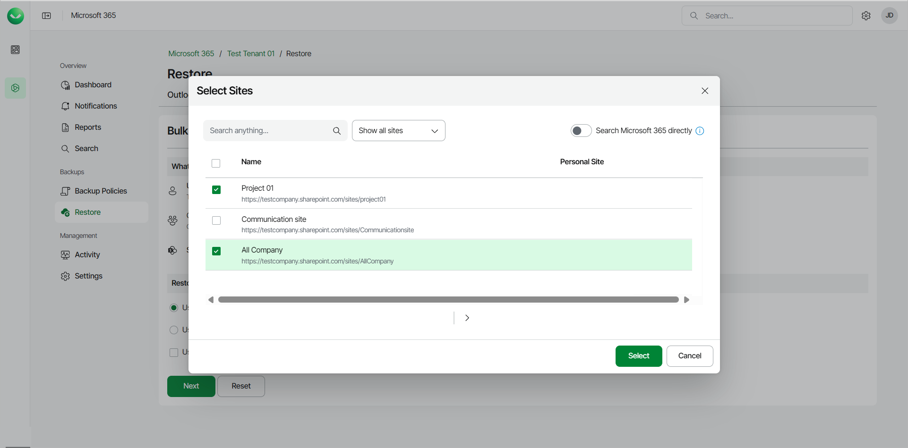
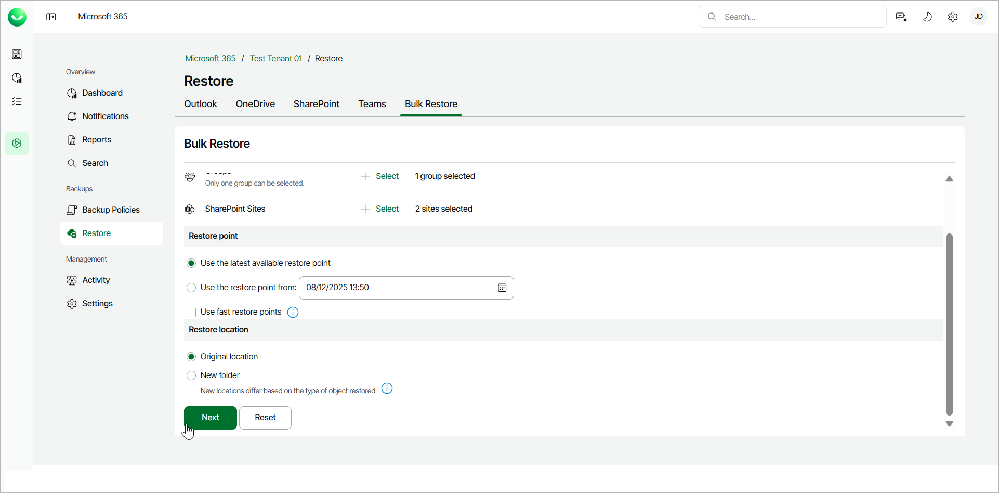
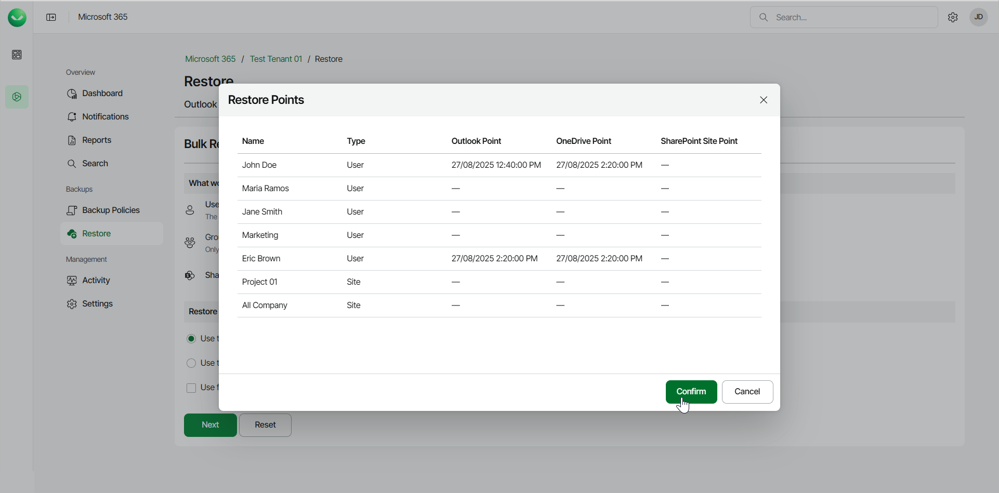

# Performing Bulk Restore

Veeam Data Cloud for Microsoft 365 offers bulk restore for users under the Express plan. When you perform bulk restore, Veeam Data Cloud for Microsoft 365 replaces the data in the original location with the data from the backup. Bulk restore is a quick way to restore data of multiple users, groups or sites at once in a disaster recovery scenario.

To bulk restore your items:

1. On the Microsoft 365 page, click the name of the tenant you want to manage.
2. Select Restore.
3. On the Bulk Restore tab, do the following:

|  |
| --- |
| NOTE |
| The Bulk Restore tab is only visible to users under the Express plan and with the M365:Express.BulkRestore permission assigned to their role. |

1. Click Select next to Users and choose the users to restore. For each selected user, specify whether to restore their mailbox and OneDrive. Then click Select.

You can also click Upload file to upload a text file with one email address per line.

1. Click Select next to Groups and choose a group to restore. For the selected group, specify whether to restore the group members mailbox and OneDrive. Then click Select.

1. Click Select next to SharePoint Sites and choose the sites to restore. Then click Select.

From the drop-down list, you can choose whether to show all sites, show only personal sites or exclude personal sites.

1. In the Restore point section, select the restore point from which you want to bulk restore the items. You can select one of the following options:

* Use the latest available restore point. If you select this option, Veeam Data Cloud for Microsoft 365 will restore data from the latest restore point of the backup.

* Use the restore point from. If you select this option, you can select the date and time when the necessary restore point was created. Veeam Data Cloud for Microsoft 365 will restore data from this restore point.

Select the Use fast restore points check box if you want to select from the fastest available restore points created by Express backup policies.

1. In the Restore location section, select where you want to restore the data. You can select one of the following options:

* Original location. Select this option if you want to restore the data to the original location.

* New folder. Select this option if you want to restore the data to a new location.

For Outlook, Veeam Data Cloud restores the data to a newly created folder, called Recovered Items YYYY-MM-DD, HH:MM.

For OneDrive, Veeam Data Cloud restores the data to a newly created OneDrive with an R and a number added to the end of the URL. For example, https://contoso-my.sharepoint.com/personal/user1\_contoso\_comR0.

For SharePoint, Veeam Data Cloud restores the data to a newly created site with an R and a number added to the end of the URL. For example, https://contoso.sharepoint.com/sites/originalSiteR0.

1. Click Next to continue with the bulk restore process.

|  |
| --- |
| TIP |
| You can click Reset if you want to clear the selection and specify the bulk restore settings once again. |

1. Review the list of the items you selected to restore and their restore points. Click Confirm to start the bulk restore process.

1. Veeam Data Cloud for Microsoft 365 will display the Your Express restore has started notification. Select Notifications in the main menu to view the progress of the restore process.

