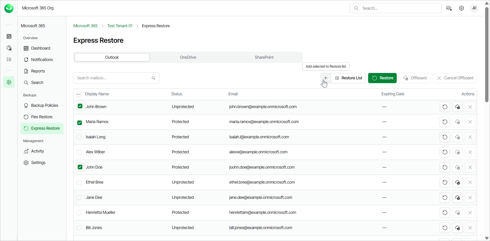
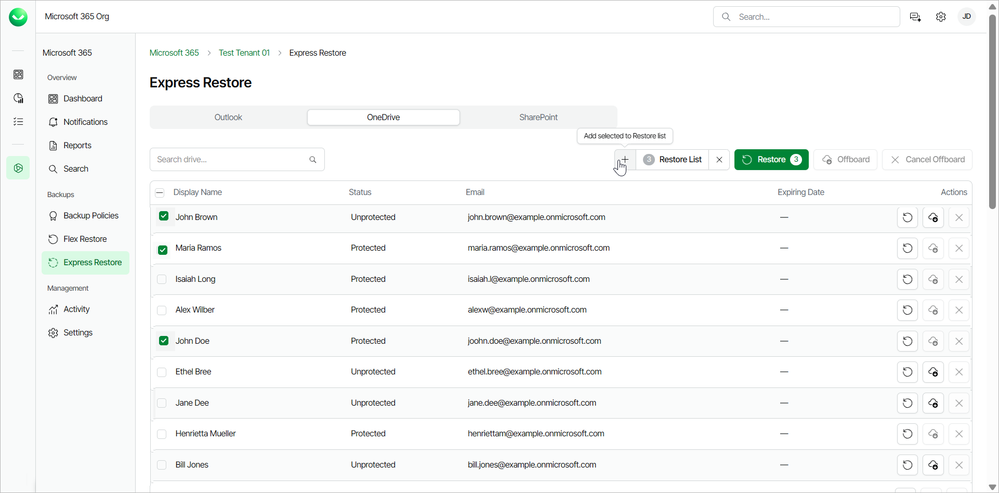
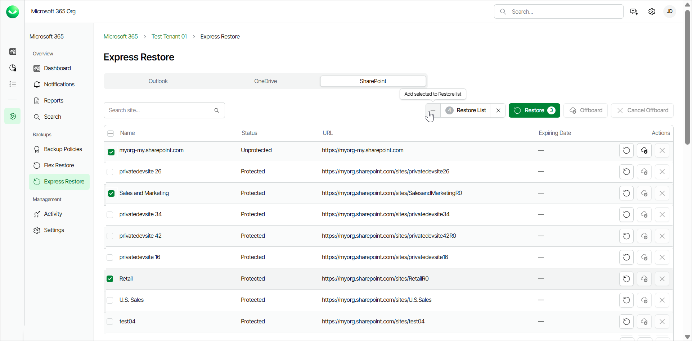
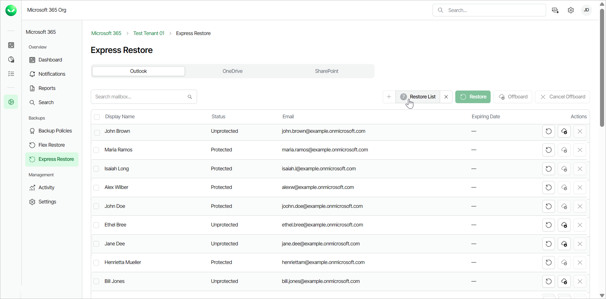
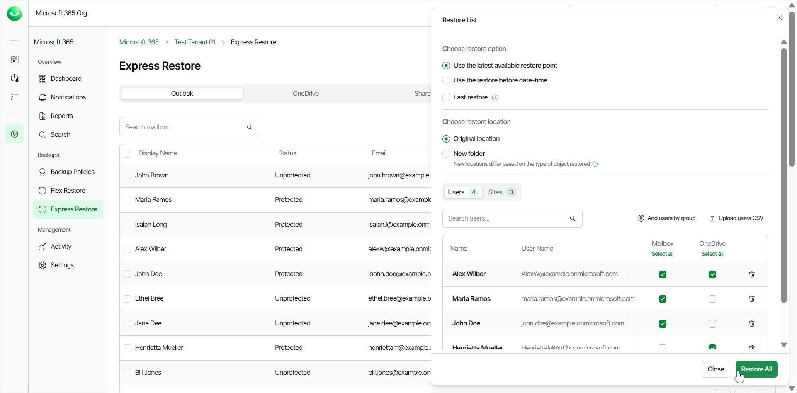

# Performing Bulk Restore

Veeam Data Cloud for Microsoft 365 offers bulk restore for users under the Express, Premium and Premium Plus plans. When you perform bulk restore, Veeam Data Cloud for Microsoft 365 replaces the data in the original location with the data from the backup. Bulk restore is a quick way to restore data of multiple users, groups or sites at once in a disaster recovery scenario.

To bulk restore your items:

1. On the Microsoft 365 page, click the name of the tenant you want to manage.
2. Select Express Restore.
3. On the Outlook tab, select the check boxes of the mailboxes you want to restore.
4. Click Add selected to Restore list.

1. Go to the OneDrive tab and select the check boxes of the drives you want to restore.
2. Click Add selected to Restore list.

1. Go to the SharePoint tab and select the check boxes of the sites you want to restore.
2. Click Add selected to Restore list.

1. Click Restore List.

1. In the Restore list window, do the following:

1. In the Choose restore option section, select the restore point from which you want to bulk restore the items. You can select one of the following options:

* Use the latest available restore point. If you select this option, Veeam Data Cloud for Microsoft 365 will restore data from the latest restore point of the backup.
* Use the restore before date-time. If you select this option, you can select the date and time when the necessary restore point was created. Veeam Data Cloud for Microsoft 365 will restore data from this restore point.

Select the Fast restore check box if you want to select from the fastest available restore points created by Express backup policies.

1. In the Choose restore location section, select where you want to restore the data. You can select one of the following options:

* Original location. Select this option if you want to restore the data to the original location.
* New folder. Select this option if you want to restore the data to a new location.

For Outlook, Veeam Data Cloud restores the data to a newly created folder, called Recovered Items YYYY-MM-DD, HH:MM.

For OneDrive, Veeam Data Cloud restores the data to a newly created OneDrive with an R and a number added to the end of the URL. For example, https://contoso-my.sharepoint.com/personal/user1\_contoso\_comR0.

For SharePoint, Veeam Data Cloud restores the data to a newly created site with an R and a number added to the end of the URL. For example, https://contoso.sharepoint.com/sites/originalSiteR0.

1. In the Users tab, Veeam Data Cloud displays a list of the users whose mailboxes and OneDrive you added to the restore list. You can also perform the following actions:

* Click Add users by group and select a group from the list if you want to add a group of users for restore.
* Click Upload users CSV to upload a .CSV or text file that contains a list of users for restore. The .CSV or text file must contain one email address per line.
* In the Mailbox column, select the check box if you want to include the mailbox in the restore.
* In the OneDrive column, select the check box if you want to include the OneDrive in the restore.
* Click the delete button next to a user to remove the user from the restore list.

1. In the Sites tab, Veeam Data Cloud displays a list of the SharePoint sites you added to the restore list. You can also perform the following actions:

* Click Upload from CSV to upload a .CSV file that contains a list of SharePoint sites for restore. The .CSV file must contain one SharePoint URL per line.
* Click the delete button next to a SharePoint site to remove the site from the restore list.

1. Click Restore All.

1. Veeam Data Cloud for Microsoft 365 will display the Your Express restore has started notification. Select Notifications in the main menu to view the progress of the restore process.

