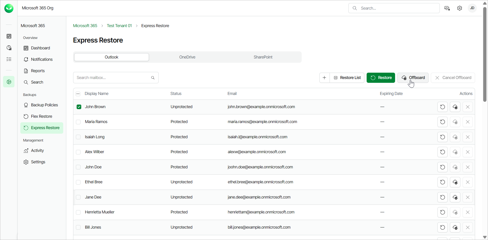
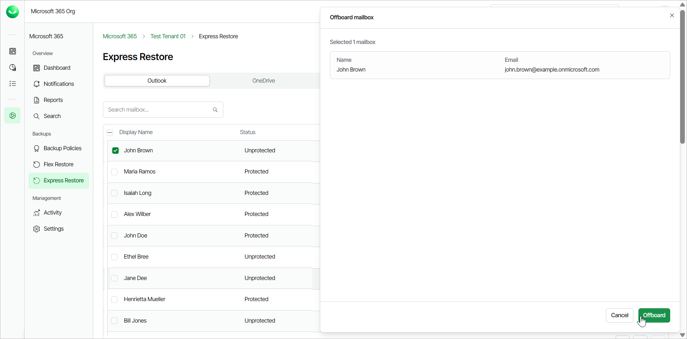
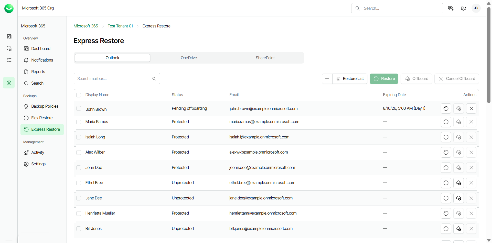

# Offboarding Protection Units

For Express backup policies, Veeam Data Cloud retains backups for 1 year. If you need to delete specific mailboxes, OneDrives or SharePoint sites from a backup for regulatory, cost or operational reasons, Veeam Data Cloud for Microsoft 365 offers offboarding of protection units for users under the Express, Premium and Premium Plus plans.

In Express backup policies, a protection unit refers to an object that you can back up, such as a Microsoft Exchange Online mailbox, OneDrive, or SharePoint site. Each service is treated as a separate protection unit. For example, if the user john.doe@example.onmicrosoft.com has backups for Outlook and OneDrive, there will be 2 protection units, one for each service. To remove the backup for this user, you must offboard all associated protection units.

To offboard a protection unit, you must first remove it from Express backup policies. Once removed, the status of the protection unit will change to Unprotected and there will be no new backups for this object. You can then initiate the offboarding process. Once started, a 90-day grace period begins where you can perform specific actions or cancel the offboarding process. Offboarding finishes when the grace period ends (day 91) and all backups of the protection unit are permanently deleted.

Offboarding Process

To offboard protection units, do the following:

1. On the Microsoft 365 page, click the name of the tenant you want to manage.
2. Select Backup Policies.
3. On the Backup Policies page, in the Actions column of the Express backup policy that includes the items you want to offboard, click Edit.

1. In the Included in backup section, click View/Remove.
2. In the Selected Objects window, select check boxes next to objects to specify what to remove from the backup.
3. Click Delete to remove the selected objects from the backup policy.
4. Click Update Policy to complete the operation.

If the object you want to offboard is included in the backup policy as part of a group, you must either remove the user from the group in Microsoft Entra ID or remove the user from Microsoft Entra ID, as backing up groups with Express backup policies is dynamic. For more information, see [this Microsoft article](https://learn.microsoft.com/en-us/entra/fundamentals/how-to-manage-groups#remove-members-or-owners-of-a-group).

1. Select Express Restore in the main menu.
2. Go to the tab of the service of the objects you want to offboard.
3. Select the check boxes next to the Unprotected objects and click Offboard.

1. In the Offboard mailbox window, review the objects you selected and click Offboard.

1. In the Microsoft authentication window, select the Microsoft account under which you want to authenticate against Microsoft 365.
2. Accept the required permissions.
3. The Status of the object changes to Pending offboarding and the grace period begins. The Expiring Date column displays the date when the backup of the object will be deleted.

Offboarding Grace Period

Once you initiate the offboarding process, a 90-day grace period starts. The following table displays the actions you can perform on the offboarded protection units during this grace period:

Offboarding Grace Period

|  | Backup Active | Offboarding | | |
| Days 0-30 | Days 31-90 | Day 91+ |
| New Backups | Yes | No | No | No |
| Backups Billed | Yes | Yes | No | No |
| Restores Allowed | Yes | Yes | No | No |
| Backups visible if re-enabled | Yes | Yes | Yes | No |
| Backups still exist | Yes | Yes | Yes | No |

|  |
| --- |
| tip |
| You can cancel the offboarding of a protection unit during the 90-day grace period. If you cancel offboarding, the retention period for the protection unit is 1 year. |

