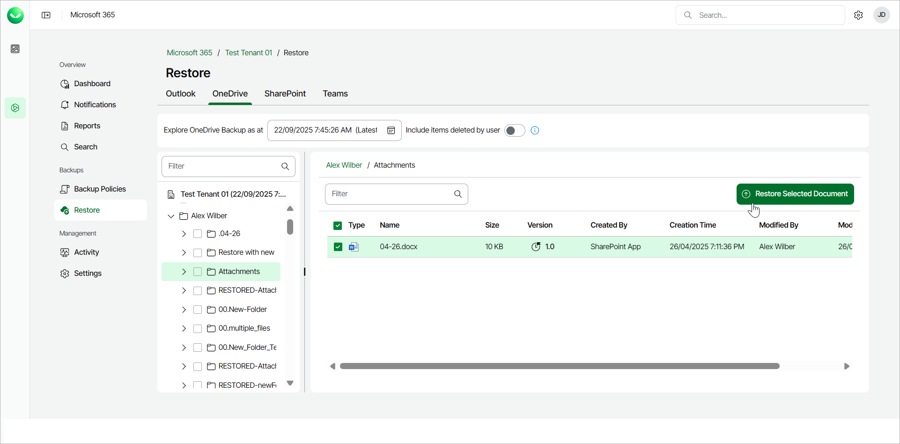
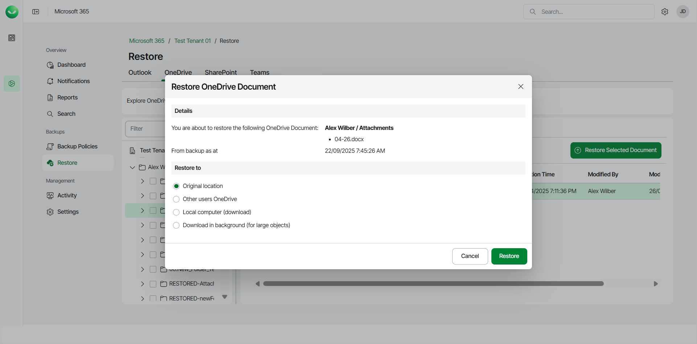
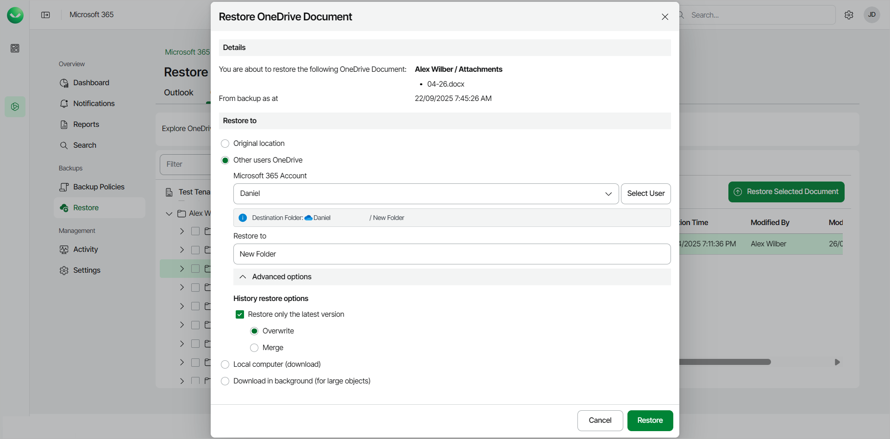

# Restoring OneDrive Documents

Before you start performing restore, check [Considerations and Limitations](m365_considerations_limitations.md#restore).

To restore a specific OneDrive document from the backup:

1. On the Microsoft 365 page, click the name of the tenant you want to manage.
2. Select Restore.
3. On the OneDrive tab, expand the user whose document you want to restore.
4. Select the folder that contains the document you want to restore.
5. Select the check box next to the necessary document in the list of items. You can select multiple documents.
6. Click Restore Selected Document.

1. In the Restore OneDrive Document window, check the name of the user account, folder and document you want to restore, and the time when the backup that contains the document was created.
2. In the Restore to section, select where to restore the OneDrive document. You can select one of the following options:

* Original location. Select this option if you want to restore the OneDrive document to its original location.
* Other users OneDrive. Select this option if you want to restore the OneDrive document to OneDrive of another Microsoft 365 user.

If you select this option, do the following:

1. In the Microsoft 365 Account field, click Select User and select the necessary user account in the User selection window.
2. In the Restore to field, type the name of the folder where to restore the OneDrive document. Veeam Data Cloud for Microsoft 365 will display the resulting path to the restore destination.

You can also use the Advanced options toggle to display more options. For details, see the next step of the procedure.

* Local computer. Select this option if you want to download the OneDrive document to your computer. Use this option for OneDrive documents whose size does not exceed 1 GB. Veeam Data Cloud for Microsoft 365 will save the OneDrive document to a .ZIP file.

* Download in background. Select this option if you want to download the OneDrive document to your computer. Use this option for OneDrive documents whose size exceeds 1 GB or if the download process takes more than 3.5 minutes. Veeam Data Cloud will save the OneDrive document to a .ZIP file. For more information on how to get the downloaded data, see [Obtaining Downloaded Items](m365_obtain_downloaded_items.md).

1. [For restore to OneDrive of another user account] If you want to specify advanced restore options, do the following:

1. Click Advanced options.
2. In the History restore options section, select the Restore only the latest version check box if you want to restore only the latest version of items. If you select this check box, you can select one of the following options:

* Overwrite. Select this option to overwrite items in the production environment with the latest version of items in the backup.
* Merge. Select this option to merge the latest version of items in the backup into items in the production environment.

1. Start the restore process:

* Click Restore if you selected to restore data to the original location or another user account.
* Click Download if you selected to download data to the local computer or download data in the background.

