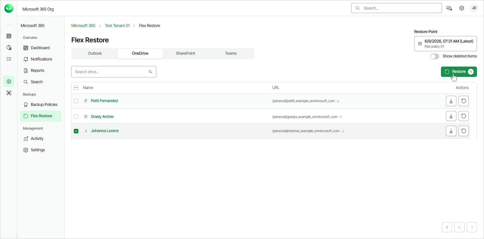
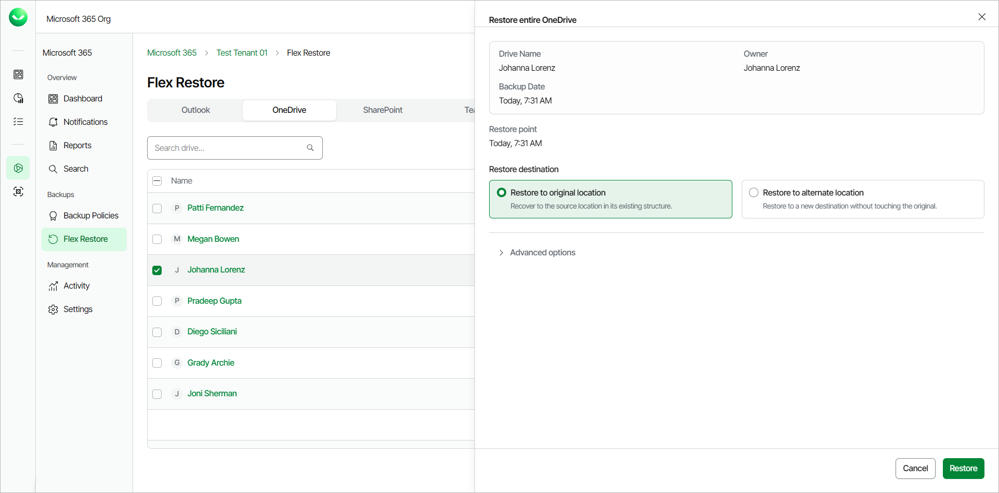
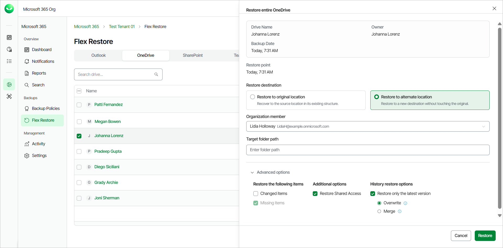
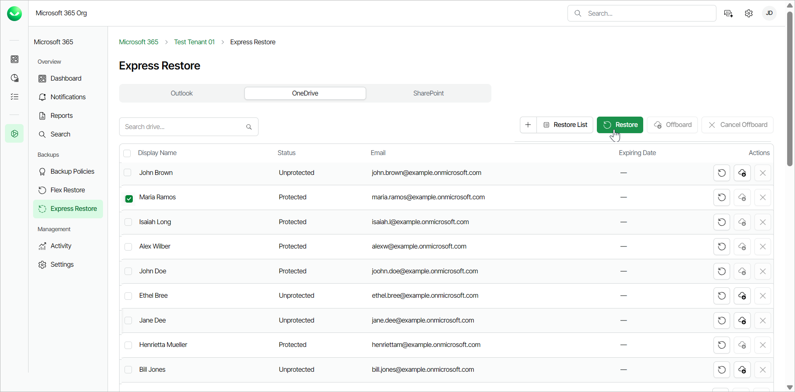
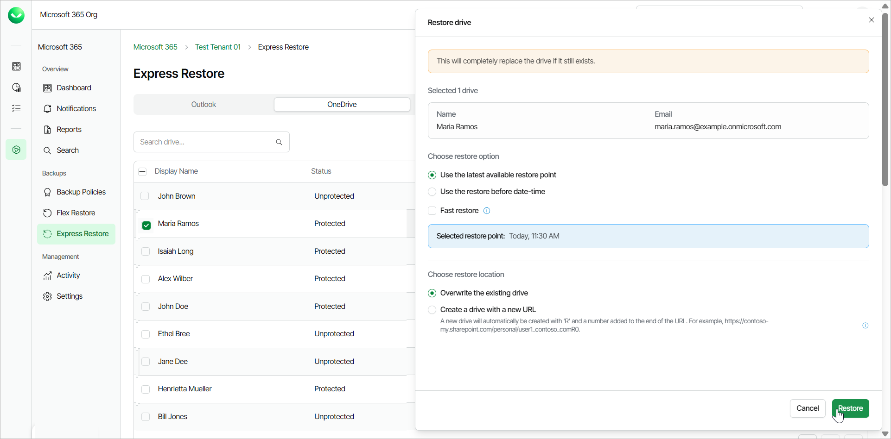

# Restoring Entire OneDrive

Veeam Data Cloud for Microsoft 365 offers 2 restore methods for restore of entire OneDrive: Flex Restore and Express Restore.

The restore method options available to you depend on what backup policy type covers the Microsoft 365 user whose data you restore. The backup policy type defines the plan of the backed-up user. To learn more about plans in Veeam Data Cloud for Microsoft 365, see [Plans](m365_licensing.md#plans).

Before you start performing restore, check [Considerations and Limitations](m365_considerations_limitations.md#restore).

Flex Restore

To restore an entire OneDrive from the backup:

1. On the Microsoft 365 page, click the name of the tenant you want to manage.
2. Select Flex Restore.
3. Go to the OneDrive tab.
4. By default, Veeam Data Cloud uses the latest available restore point for data restore. If you want to select another restore point, click on the  Restore Point information box. On the calendar, select the date and time when the necessary restore point was created and click Apply.
5. Select the check box next to the user whose OneDrive you want to restore.

To restore multiple OneDrives, select the check boxes next to the users whose OneDrives you want to restore. You can restore multiple OneDrives only to the original location.

1. Click Restore.

1. In the Restore entire OneDrive window, in the Restore destination section, select where to restore OneDrive. You can select one of the following options:

* Restore to original location. Select this option if you want to restore OneDrive to its original location.
* Restore to alternate location. Select this option if you want to restore OneDrive to the OneDrive of another Microsoft 365 user.

If you select this option, do the following:

1. In the Organization member field, specify the target user account.
2. In the Target folder path field, specify the name of the folder where to restore OneDrive.

1. [For restore to the original location] If you want to specify advanced restore options, do the following:

1. Click the Advanced options toggle.
2. In the History restore options section, select one of the following options:

* Overwrite. Select this option to overwrite items in the production environment with the latest version of items in the backup.
* Keep. Select this option if you want to preserve the existing data in the production environment and restore missing items from the backup. Any overlapping items are also recovered with the RESTORED prefix in the file name.

1. [For restore to OneDrive of another user account] If you want to specify advanced restore options, do the following:

1. Click the Advanced options toggle.
2. In the Restore the following items section, do the following:

1. Select the Changed items check box if you want to restore items that were modified in the production environment.
2. Select the Missing items check box if you want to restore items that are missing in your target location. For example, some of the items were removed and you want to restore them from the backup.

1. In the Additional options section, select the Restore Shared Access check box if you want to restore shared access permissions of the restored OneDrive content.
2. In the History restore options section, select the Restore only the latest version check box if you want to restore only the latest version of items. If you select this check box, you can select one of the following options:

* Overwrite. Select this option to overwrite items in the production environment with the latest version of items in the backup.
* Merge. Select this option to merge the latest version of items in the backup into items in the production environment. Only the latest file versions from the backup are restored and they are added (merged) to the existing file version history (if any).

1. Click Restore to start the restore process.

|  |
| --- |
| tip |
| You can download the entire OneDrive content to your computer. To do that, select the check box next to the OneDrive and, in the Actions column, click Download as .zip. Veeam Data Cloud will save the OneDrive content to a .ZIP file. For more information on how to get the downloaded data, see [Obtaining Downloaded Items](m365_obtain_downloaded_items.md). |

Express Restore

To restore an entire OneDrive from the backup:

1. On the Microsoft 365 page, click the name of the tenant you want to manage.
2. Select Express Restore.
3. On the OneDrive tab, select the check box of the user whose OneDrive you want to restore.

To restore multiple OneDrives, select the check boxes next to the users whose OneDrives you want to restore. You can restore multiple OneDrives only to the original location.

1. Click Restore.

1. In the Restore drive window, in the Choose restore option section, select the restore point from which you want to restore OneDrive. You can select one of the following options:

* Use the latest available restore point. If you select this option, Veeam Data Cloud for Microsoft 365 will restore data from the latest restore point of the backup.

* Use the restore before date-time. If you select this option, you can select the date and time when the necessary restore point was created. Veeam Data Cloud for Microsoft 365 will restore data from this restore point.

Select the Fast restore check box if you want to select from the fastest available restore points created by Express backup policies.

1. In the Choose restore location section, select where you want to restore the data. You can select one of the following options:

* Overwrite the existing drive. Select this option to replace data in the original location with the data from the backup.
* Create a drive with a new URL. Select this option to restore the data to a new location. Veeam Data Cloud restores the data to a newly created OneDrive with an R and a number added to the end of the URL. For example, https://contoso-my.sharepoint.com/personal/user1\_contoso\_comR0.

1. Click Restore to start the restore process.

