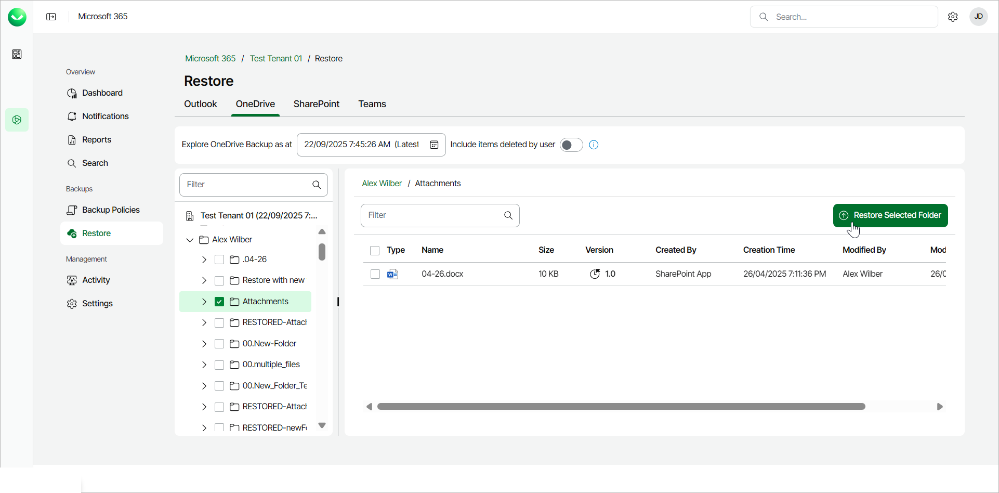
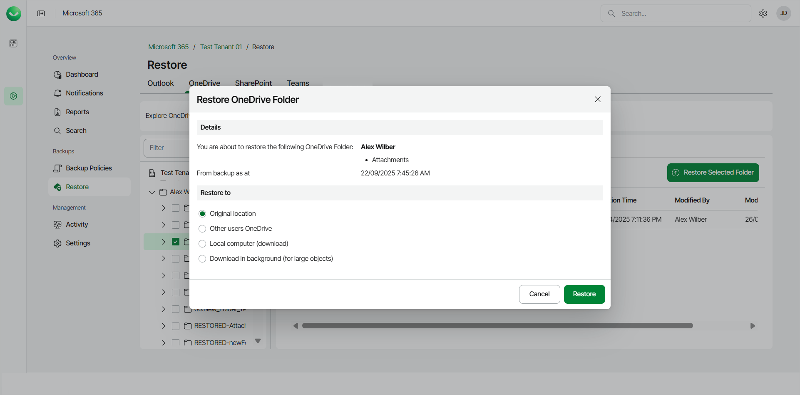
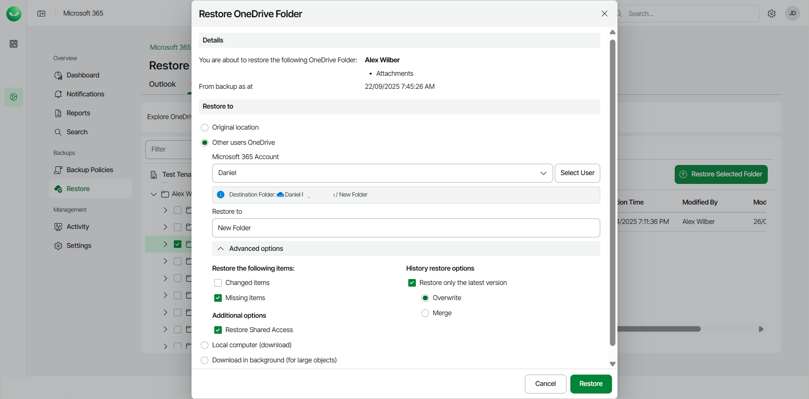

# Restoring OneDrive Folders

Before you start performing restore, check [Considerations and Limitations](m365_considerations_limitations.md#restore).

To restore a specific OneDrive folder from the backup:

1. On the Microsoft 365 page, click the name of the tenant you want to manage.
2. Select Restore.
3. On the OneDrive tab, expand the user whose OneDrive folder want to restore.
4. Select the check box next to the OneDrive folder you want to restore. You can select multiple folders.
5. Click Restore Selected Folder.

1. In the Restore OneDrive Folder window, check the name of the user account and OneDrive folder you want to restore, and the time when the backup that contains the folder was created.
2. In the Restore to section, select where to restore the OneDrive folder. You can select one of the following options:

* Original location. Select this option if you want to restore the OneDrive folder to its original location.
* Other users OneDrive. Select this option if you want to restore the OneDrive folder to OneDrive of another Microsoft 365 user.

If you select this option, do the following:

1. In the Microsoft 365 Account field, click Select User and select the necessary user account in the User selection window.
2. In the Restore to field, type the name of the folder where to restore the OneDrive folder. Veeam Data Cloud for Microsoft 365 will display the resulting path to the restore destination.

You can also use the Advanced options toggle to display more options. For details, see the next step of the procedure.

* Local computer. Select this option if you want to download the OneDrive folder to your computer. Use this option for OneDrive folders whose size does not exceed 1 GB. Veeam Data Cloud for Microsoft 365 will save the OneDrive folder to a .ZIP file.

* Download in background. Select this option if you want to download the OneDrive folder to your computer. Use this option for OneDrive folders whose size exceeds 1 GB or if the download process takes more than 3.5 minutes. Veeam Data Cloud for Microsoft 365 will save the OneDrive folder to a .ZIP file. For more information on how to get the downloaded data, see [Obtaining Downloaded Items](m365_obtain_downloaded_items.md).

1. [For restore to OneDrive of another user account] If you want to specify advanced restore options, do the following:

1. Click Advanced options.
2. In the Restore the following items section, do the following:

1. Select the Changed items check box if you want to restore items that have been modified in the production environment.
2. Select the Missing items check box if you want to restore items that are missing in your target location. For example, some of the items were removed and you want to restore them from the backup.

1. In the History restore options section, select the Restore only the latest version check box if you want to restore only the latest version of items. If you select this check box, you can select one of the following options:

* Overwrite. Select this option to overwrite items in the production environment with the latest version of items in the backup.
* Merge. Select this option to merge the latest version of items in the backup into items in the production environment.

1. In the Additional options section, select the Restore Shared Access check box if you want to restore shared access permissions of the restored OneDrive content.

1. Start the restore process:

* Click Restore if you selected to restore data to the original location or another user account.
* Click Download if you selected to download data to the local computer or download data in the background.

