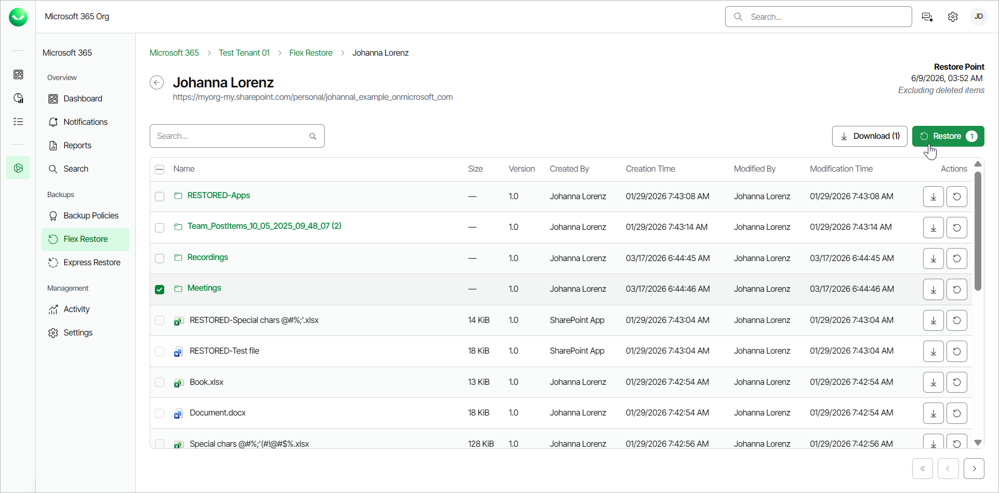
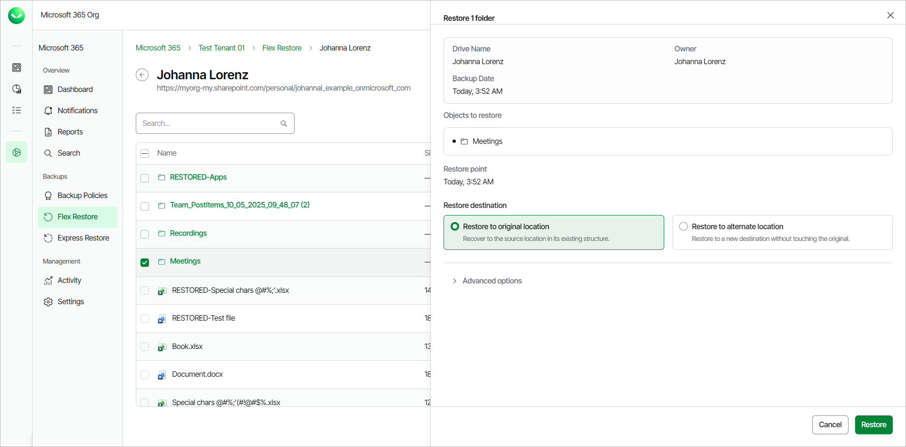
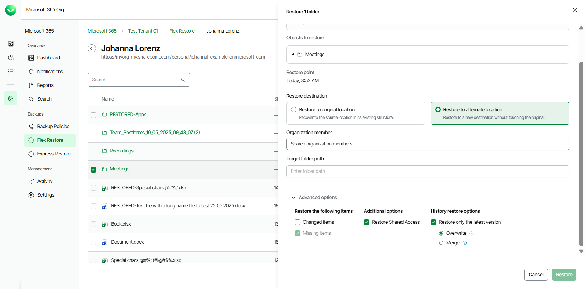

# Restoring OneDrive Folders

Before you start performing restore, check [Considerations and Limitations](m365_considerations_limitations.md#restore).

To restore a specific OneDrive folder from the backup:

1. On the Microsoft 365 page, click the name of the tenant you want to manage.
2. Select Flex Restore.
3. Go to the OneDrive tab.
4. By default, Veeam Data Cloud uses the latest available restore point for data restore. If you want to select another restore point, click on the  Restore Point information box. On the calendar, select the date and time when the necessary restore point was created and click Apply.
5. Click the name of the OneDrive that contains the folder you want to restore.
6. Select the check box next to the OneDrive folder you want to restore. You can select multiple folders.
7. Click Restore.

1. In the Restore OneDrive folder window, you can check the name of the user account and OneDrive folder you want to restore, the time when the backup that contains the folder was created and the selected restore point.
2. In the Restore destination section, select where to restore the OneDrive folder. You can select one of the following options:

* Restore to original location. Select this option if you want to restore the OneDrive folder to its original location.
* Restore to alternate location. Select this option if you want to restore the OneDrive folder to OneDrive of another Microsoft 365 user.

If you select this option, do the following:

1. In the Organization member field, specify the target user account.
2. In the Target folder path field, specify the name of the folder where to restore the OneDrive folder.

1. [Optional] In the Restore reason section, specify a reason for the restore.
2. [For restore to the original location] If you want to specify advanced restore options, do the following:

1. Click the Advanced options toggle.
2. In the Restore options section, select one of the following options:

* Overwrite. Select this option to overwrite items in the production environment with the latest version of items in the backup.
* Keep. Select this option if you want to preserve the existing data in the production environment and restore missing items from the backup. Any overlapping items are also recovered with the RESTORED prefix in the file name.

1. [For restore to OneDrive of another user account] If you want to specify advanced restore options, do the following:

1. Click the Advanced options toggle.
2. In the Restore the following items section, do the following:

1. Select the Changed items check box if you want to restore items that were modified in the production environment.
2. Select the Missing items check box if you want to restore items that are missing in your target location. For example, some of the items were removed and you want to restore them from the backup.

1. In the Additional options section, select the Restore Shared Access check box if you want to restore shared access permissions of the restored OneDrive content.
2. In the History restore options section, select the Restore only the latest version check box if you want to restore only the latest version of items. If you select this check box, you can select one of the following options:

* Overwrite. Select this option to overwrite items in the production environment with the latest version of items in the backup.
* Merge. Select this option to merge the latest version of items in the backup into items in the production environment. Only the latest file versions from the backup are restored and they are added (merged) to the existing file version history (if any).

1. Click Restore to start the restore process.

|  |
| --- |
| tip |
| You can download OneDrive folders to your computer. To do that, select the check box next to the OneDrive folder and click Download. Veeam Data Cloud will save the OneDrive folder to a .ZIP file. For more information on how to get the downloaded data, see [Obtaining Downloaded Items](m365_obtain_downloaded_items.md). |

