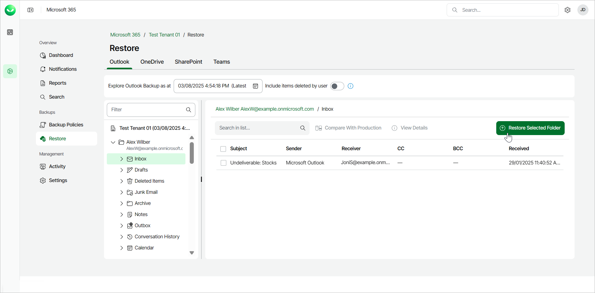
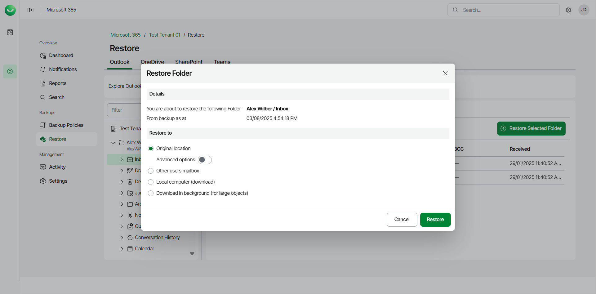
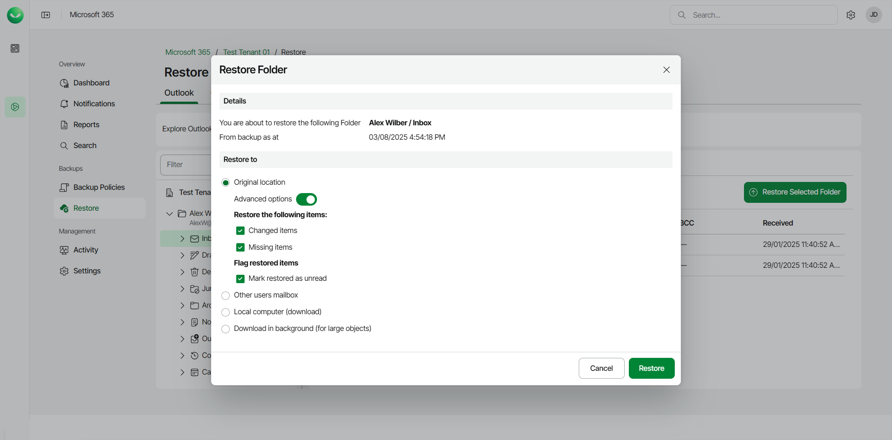

# Restoring Outlook Folders

Before you start performing restore, check [Considerations and Limitations](m365_considerations_limitations.md#restore).

To restore a specific folder within a mailbox:

1. On the Microsoft 365 page, click the name of the tenant you want to manage.
2. Select Restore.
3. On the Outlook tab, expand the mailbox and select the folder you want to restore.
4. Click Restore Selected Folder.

1. In the Restore Folder window, check the name of the mailbox and folder you want to restore, and the time when the backup that contains the folder was created.
2. In the Restore to section, select where to restore the folder. You can select one of the following options:

* Original location. Select this option if you want to restore the folder to its original location.

If you select this option, you can use the Advanced options toggle to display more options. For details, see the next step of the procedure.

* Other users mailbox. Select this option if you want to restore the folder to another mailbox.

If you select this option, in the Mailbox and Folder fields specify the address of the target mailbox and the target mailbox folder. You can also click Advanced options to display more options. For details, see the next step of the procedure.

* Local computer. Select this option if you want to download the folder content to your computer. Use this option for folders whose size does not exceed 1 GB. Veeam Data Cloud for Microsoft 365 will save the folder content to a .PST file.
* Download in background. Select this option if you want to download the folder content to your computer. Use this option for folders whose size exceeds 1 GB or if the download process takes more than 3.5 minutes. Veeam Data Cloud for Microsoft 365 will save the folder content to a .PST file. For more information on how to get the downloaded data, see [Obtaining Downloaded Items](m365_obtain_downloaded_items.md).

1. [For restore to the original location or another mailbox] If you want to specify advanced restore options, do the following:

1. Click the Advanced options toggle.
2. In the Restore the following items section, do the following:

1. Select the Changed items check box if you want to restore items that have been changed.
2. Select the Missing items check box if you want to restore items that are missing in your target location. For example, some of the items were removed and you want to restore them from the backup.

1. In the Flag restored items section, select the Mark restored as unread check box if you want to mark each restored item as unread.

1. Start the restore process:

* Click Restore if you selected to restore data to the original location or another mailbox.
* Click Download if you selected to download data to the local computer or download data in the background.

