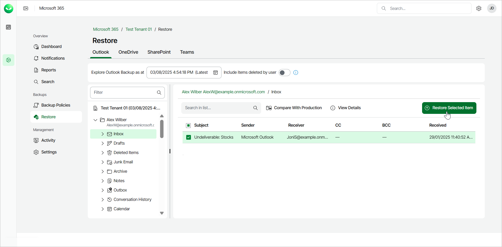
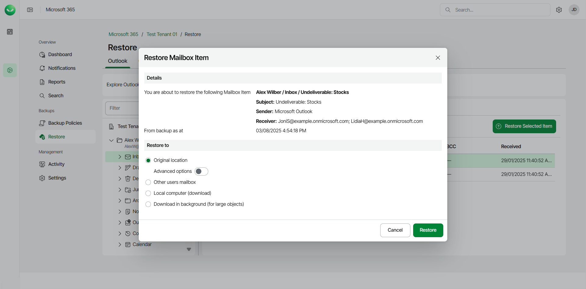
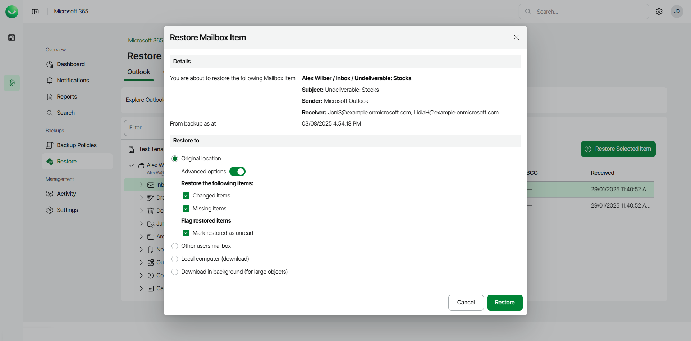

# Restoring Outlook Items

Before you start performing restore, check [Considerations and Limitations](m365_considerations_limitations.md#restore).

To restore a specific item within a folder of a mailbox:

1. On the Microsoft 365 page, click the name of the tenant you want to manage.
2. Select Restore.
3. On the Outlook tab, expand the mailbox that contains the folder with the item you want to restore.
4. Select the folder that contains the item you want to restore.
5. Select the check box next to the necessary email in the list of items. You can select multiple emails.
6. Click Restore Selected Item.

1. In the Restore Mailbox Item window, check the name of the item you want to restore and the time when the backup that contains the item was created.
2. In the Restore to section, select where to restore the item. You can select one of the following options:

* Original location. Select this option if you want to restore the item to its original location.

If you select this option, you can use the Advanced options toggle to display more options. For details, see the next step of the procedure.

* Other users mailbox. Select this option if you want to restore the item to another mailbox.

If you select this option, in the Mailbox and Folder fields specify the address of the target mailbox and the target mailbox folder. You can also click Advanced options to display more options. For details, see the next step of the procedure.

* Download in background. Select this option if you want to download the item to your computer. Veeam Data Cloud for Microsoft 365 will save the item to an .MSG file. If you selected multiple items, Veeam Data Cloud for Microsoft 365 will save them to a .PST file. For more information on how to get the downloaded data, see [Obtaining Downloaded Items](m365_obtain_downloaded_items.md).

1. If you want to specify advanced restore options, do the following:

1. Click the Advanced options toggle.
2. In the Restore the following items section, do the following:

1. Select the Changed items check box if you want to restore items that have been changed.
2. Select the Missing items check box if you want to restore items that are missing in your target location. For example, some of the items were removed and you want to restore them from the backup.

1. In the Flag restored items section, select the Mark restored as unread check box if you want to mark each restored item as unread.

1. Start the restore process:

* Click Restore if you selected to restore data to the original location or another mailbox.
* Click Download if you selected to download data in the background.

|  |
| --- |
| TIP |
| Restored items appear in an Outlook mailbox based on the received date, not the restore date. |

