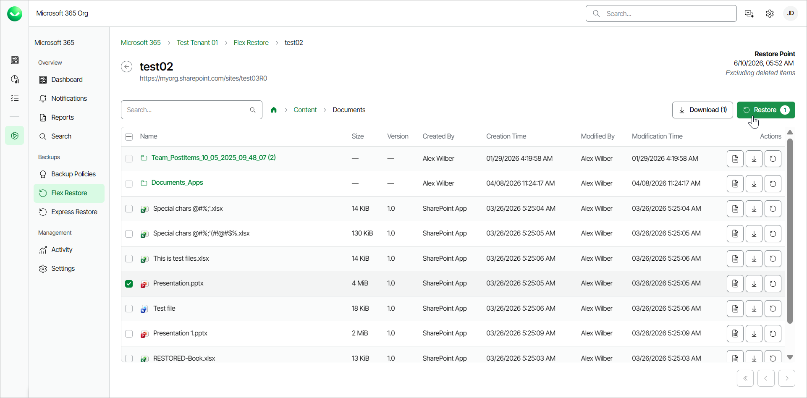
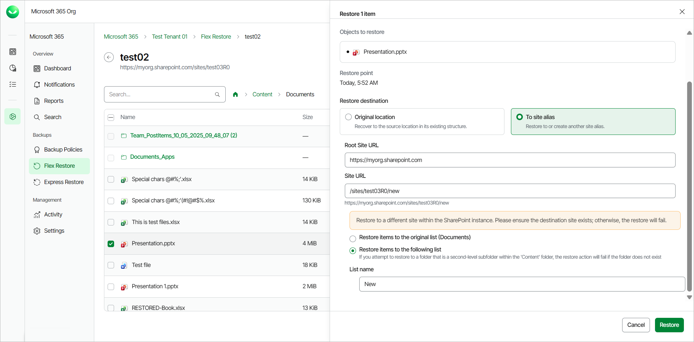

# Restoring SharePoint Documents

Before you start performing restore, check [Considerations and Limitations](m365_considerations_limitations.md#restore).

To restore a SharePoint document from the backup:

1. On the Microsoft 365 page, click the name of the tenant you want to manage.
2. Select Flex Restore.
3. Go to the SharePoint tab.
4. By default, Veeam Data Cloud uses the latest available restore point for data restore. If you want to select another restore point, click on the  Restore Point information box. On the calendar, select the date and time when the necessary restore point was created and click Apply.
5. Click the name of the SharePoint site that contains the document you want to restore.
6. Click on the Content folder.
7. Click the name of the library that contains the document you want to restore.
8. Select the check box next to the necessary document in the list of documents. You can select multiple documents.
9. Click Restore.

1. In the Restore item window, you can check the name of the document you want to restore, the site name and URL, the time when the backup that contains the document was created and the selected restore point.
2. In the Restore destination section, select where to restore the SharePoint document. You can select one of the following options:

* Original location. Select this option if you want to restore the document to its original location.

1. Restore items to the original list. If you select this option, the document will be restored to the original list of the original site.
2. Restore items to the following list. If you select this option, in the List name field, type the name of the list. The document will be restored to the original site, to the list you specified. If the target list does not exist, the restore process will fail.

* To site alias. Select this option if you want to restore the document to another site within the same SharePoint instance. Type the Root Site URL and the Site URL. Veeam Data Cloud for Microsoft 365 will display the resulting URL of the target site. If the target site does not exist, the restore process will fail.

1. Restore items to the original list. If you select this option, the document will be restored to the original list of the site you specified.
2. Restore items to the following list. If you select this option, in the List name field, type the name of the list. The document will be restored to the site and list you specified. If the target list does not exist, the restore process will fail.

1. [Optional] In the Restore reason section, specify a reason for the restore.

1. Click Restore to start the restore process.

|  |
| --- |
| tip |
| You can download SharePoint documents to your computer. To do that, in the Actions column of the SharePoint document, click Download. Veeam Data Cloud will save SharePoint document to a .ZIP file. For more information on how to get the downloaded data, see [Obtaining Downloaded Items](m365_obtain_downloaded_items.md). |

