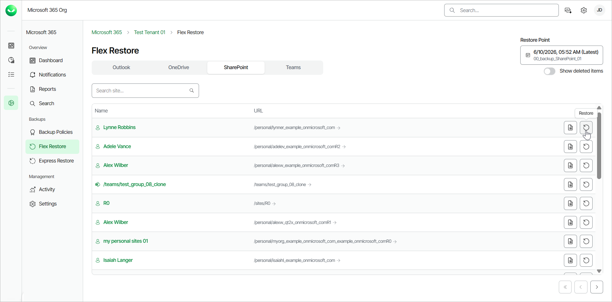
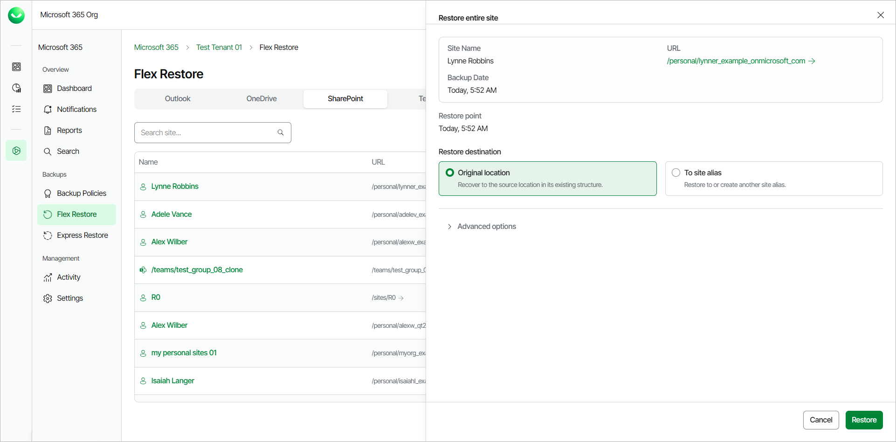
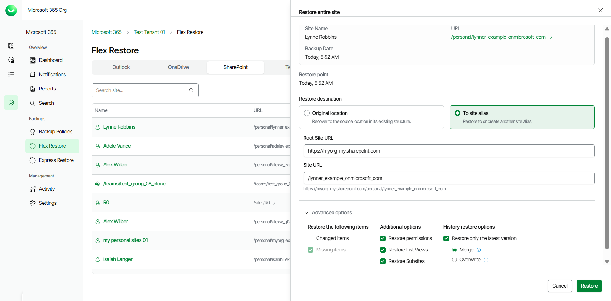
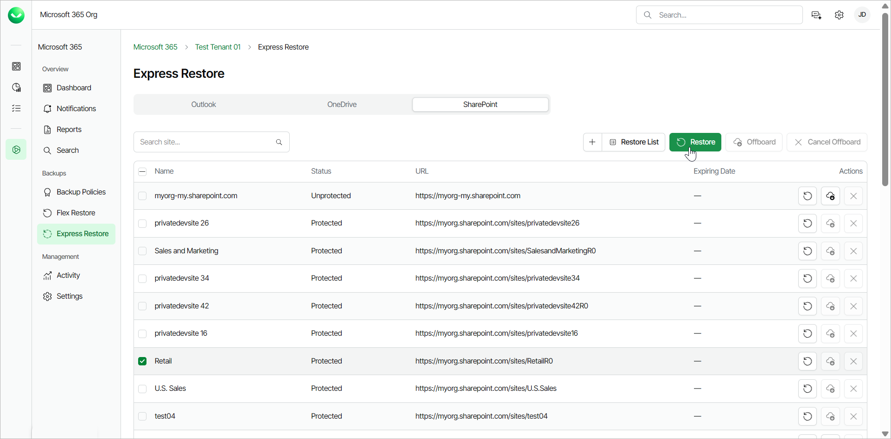
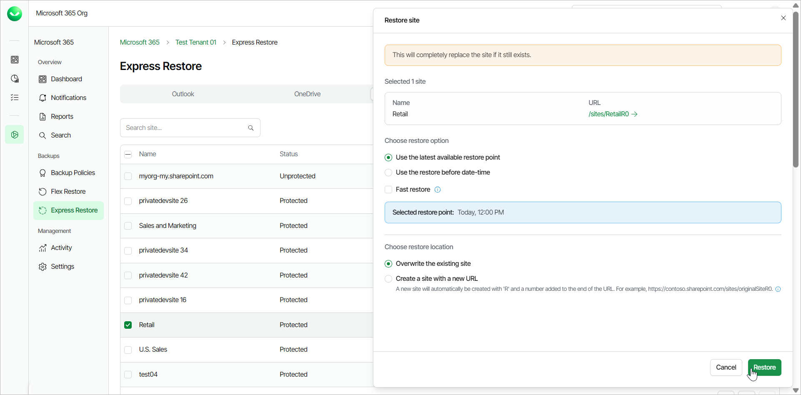

# Restoring SharePoint Sites

Veeam Data Cloud for Microsoft 365 offers 2 restore methods for restore of SharePoint sites: Flex Restore and Express Restore.

The restore method options available to you depend on what backup policy type covers the Microsoft 365 user whose data you restore. The backup policy type defines the plan of the backed-up user. To learn more about plans in Veeam Data Cloud for Microsoft 365, see [Plans](m365_licensing.md#plans).

Before you start performing restore, check [Considerations and Limitations](m365_considerations_limitations.md#restore).

Flex Restore

To restore an entire SharePoint site from the backup:

1. On the Microsoft 365 page, click the name of the tenant you want to manage.
2. Select Flex Restore.
3. Go to the SharePoint tab.
4. By default, Veeam Data Cloud uses the latest available restore point for data restore. If you want to select another restore point, click on the Restore Point information box. On the calendar, select the date and time when the necessary restore point was created and click Apply.
5. If you want to view all the available restore points for a SharePoint site, in the Actions column of the site, click View all restore points of this object. In the Restore Points window, you can view all the restore points for the site, from newest to oldest.
6. In the Actions column of the site that you want to restore, click Restore.

1. In the Restore entire site window, in the Restore destination section, select where to restore the site. You can select one of the following options:

* Original location. Select this option if you want to restore the site to its original location. Veeam Data Cloud restores the site or recreates it if it was deleted.
* To site alias. Select this option if you want to restore the site content to another site within the same SharePoint instance.

If you select this option, type the Root Site URL and the Site URL. Veeam Data Cloud for Microsoft 365 will display the resulting URL of the target site and create the site.

|  |
| --- |
| NOTE |
| Options to download SharePoint sites are unavailable. |

1. [Optional] In the Restore reason section, specify a reason for the restore.
2. If you want to specify advanced restore options, do the following:

1. Click the Advanced options toggle.
2. In the Restore the following items section, do the following:

1. Select the Changed items check box if you want to restore items that were modified in the production environment.
2. Select the Missing items check box if you want to restore items that are missing in your target location. For example, some of the items were removed and you want to restore them from the backup.

1. In the Additional options section, do the following:

1. Select the Restore permissions check box (selected by default) if you want to restore permissions for the restored site and its content. If target objects already exist, permissions are restored based on the backup. If target objects are created during restore, permissions are restored from the backup.

If you do not select to restore permissions, existing permissions are kept and newly created objects inherit permissions from their parent objects.

1. Select the Restore List Views check box if you want to restore list views of the restored site.
2. Select the Restore Subsites check box if you want to restore subsites of the restored site.

1. In the History restore options section, select the Restore only the latest version check box if you want to restore only the latest version of items. If you select this check box, you can select one of the following options:

* Merge. Select this option to merge the latest version of items in the backup into items in the production environment. Only the latest file versions from the backup are restored and they are added (merged) to the existing file version history (if any).
* Overwrite. Select this option to overwrite items in the production environment with the latest version of items in the backup.

1. Click Restore to start the restore process.

|  |
| --- |
| tip |
| You can view basic and access properties of a site. To do that, in the Actions column of the site, click Properties. |

Express Restore

Before you start performing restore, check [Considerations and Limitations](m365_considerations_limitations.md#exrestore).

To restore an entire SharePoint site from the backup:

1. On the Microsoft 365 page, click the name of the tenant you want to manage.
2. Select Express Restore.
3. On the SharePoint tab, select the check box of the site that you want to restore.

To restore multiple SharePoint sites, select the check boxes next to the SharePoint sites you want to restore. You can restore multiple SharePoint sites only to the original location.

1. Click Restore.

1. In the Restore site window, in the Choose restore option section, select the restore point from which you want to restore the site. You can select one of the following options:

* Use the latest available restore point. If you select this option, Veeam Data Cloud for Microsoft 365 will restore data from the latest restore point of the backup.

* Use the restore before date-time. If you select this option, you can select the date and time when the necessary restore point was created. Veeam Data Cloud for Microsoft 365 will restore data from this restore point.

Select the Fast restore check box if you want to select from the fastest available restore points created by Express backup policies.

1. In the Choose restore location option, select where you want to restore the data. You can select one of the following options:

* Overwrite the existing site. Select this option to replace the whole site in the original location with the data from the backup.
* Create a site with a new URL. Select this option to restore the data to a new location. Veeam Data Cloud restores the data to a newly created site with an R and a number added to the end of the URL.

For example, https://contoso.sharepoint.com/sites/originalSiteR0.

The restored SharePoint site on the new URL will have a read-only lock.

1. [Optional] In the Restore reason section, specify a reason for the restore.
2. Click Restore to start the restore process.

Page updated 2026-07-24
