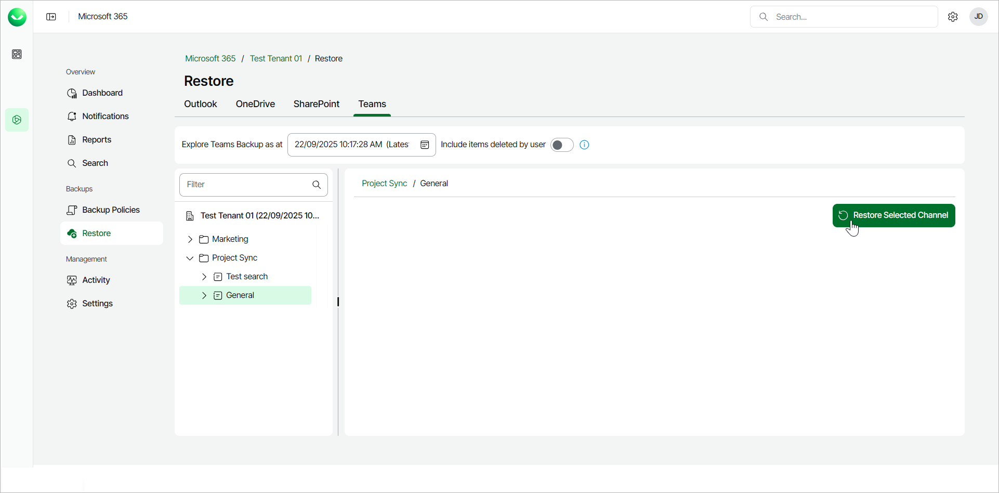
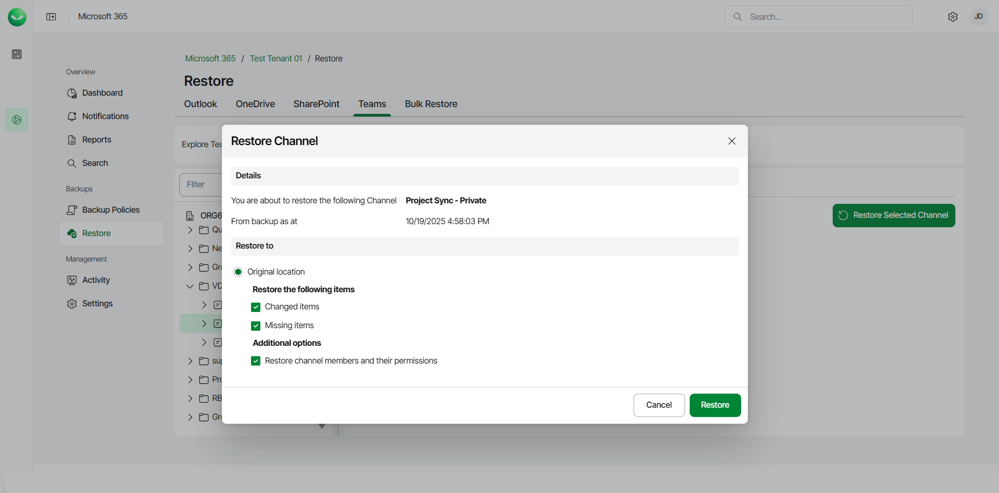

# Restoring Channels

To restore a Microsoft Teams channel:

1. On the Microsoft 365 page, click the name of the tenant you want to manage.

|  |
| --- |
| Note |
| Consider the following:   * If the organization does not have any backups, the Teams Restore tab will be empty. * Backup and restore of Microsoft Teams data is available to users of the Foundation and Premium plans only. Users can restore Teams data flexibly and do not need to select the restore method. * Before you start performing restore, check [Considerations and Limitations](m365_considerations_limitations.md#restore). |

1. Select Restore.
2. On the Teams tab, expand the team whose channel you want to restore and select the necessary channel.
3. Click Restore Selected Channel.

1. In the Restore Channel window, check the name of the team and channel you want to restore, and the time when the backup was created.
2. In the Restore to section, check that the Original location option is selected. You can restore channels to the original location only. Other restore options are unavailable.
3. If you want to specify advanced restore options, in the Restore the following items section, do the following:

1. Select the Changed items check box if you want to restore items that have changed since the time when the backup was created. When you select this option, Veeam Data Cloud for Microsoft 365 overwrites existing items in the original team.
2. Select the Missing items check box if you want to restore items that are missing in the original team. For example, some items were removed, and you want to restore them from the backup.

1. [Only available for private channels] In the Additional options section, select the Restore channel members and their permissions if you want to include the private channel members and member permissions when restoring the private channel.
2. Click Restore to restore the channel according to the specified restore options.

