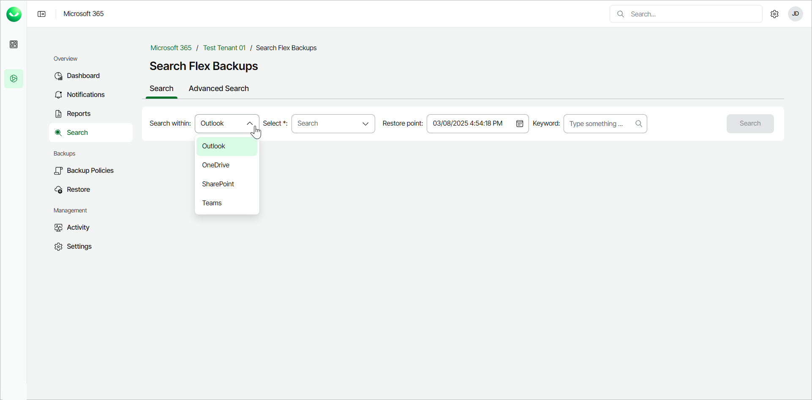
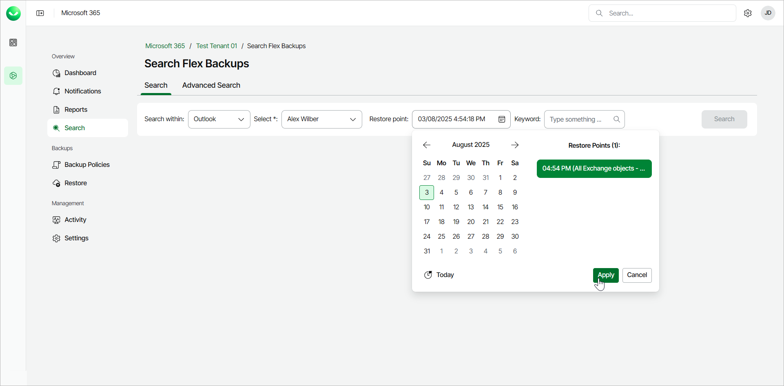
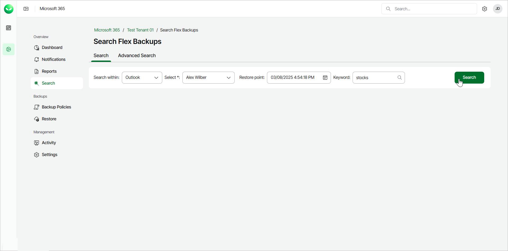
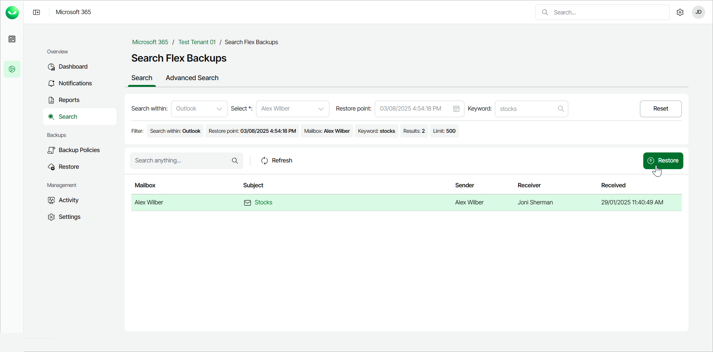
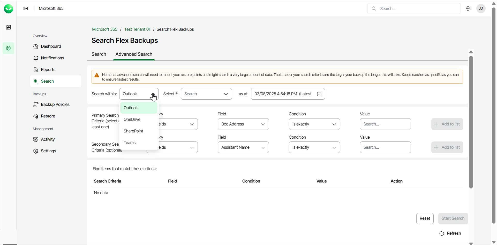
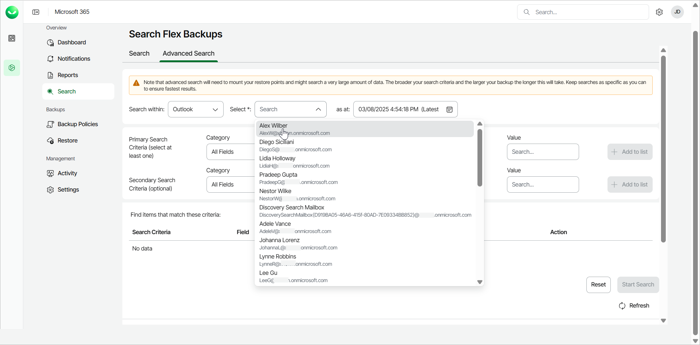
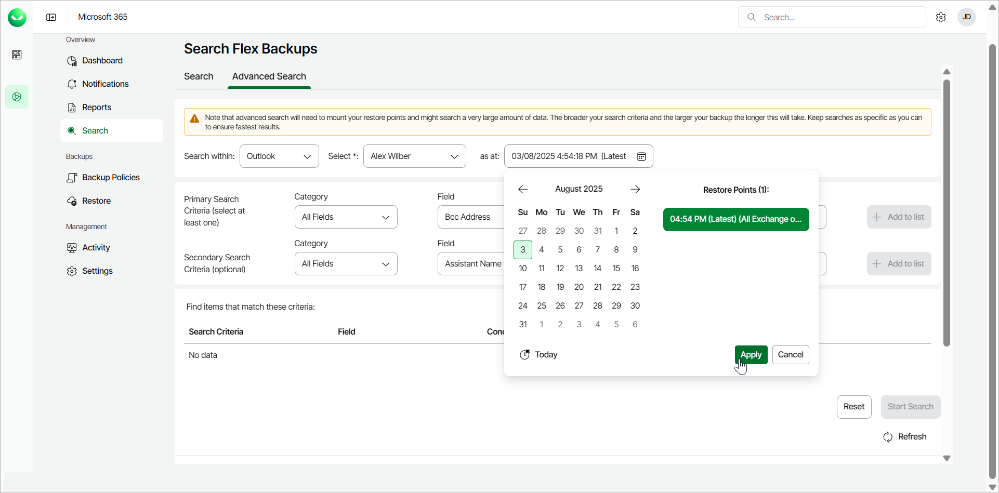
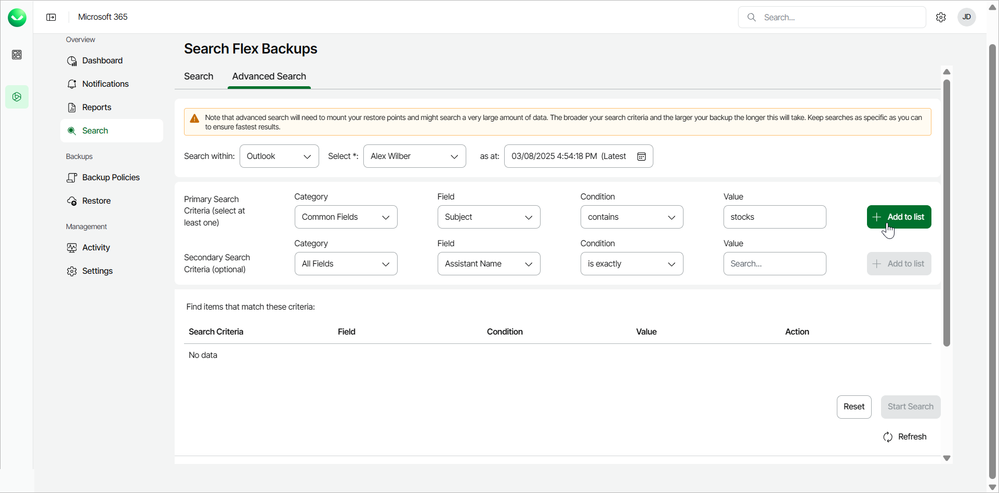
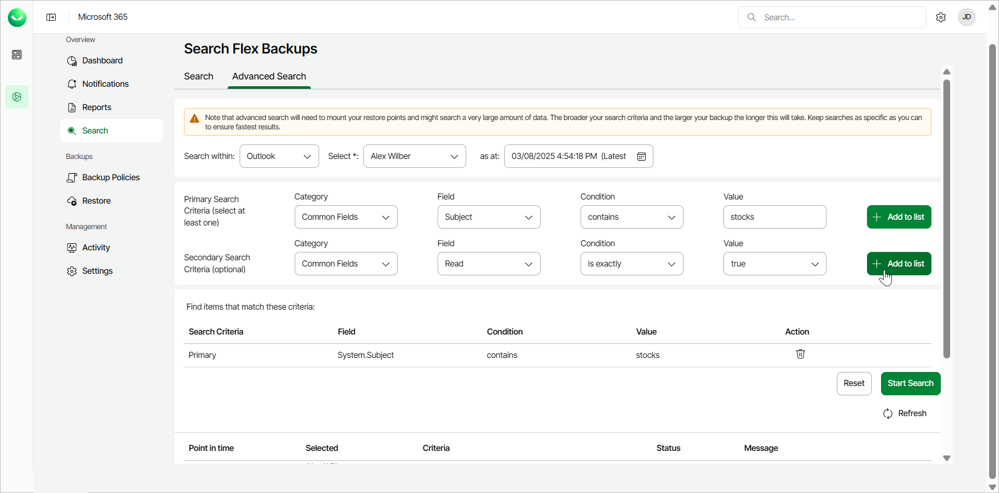
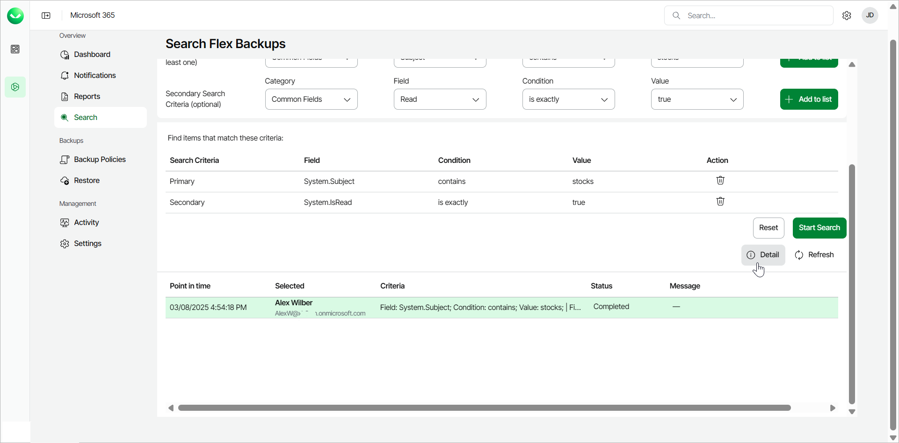

# Searching for Objects in Backup

You can use Veeam Data Cloud for Microsoft 365 to search for objects in your Flex backups. The product offers 2 search mechanisms:

* Search. This is basic search, available for Microsoft Exchange Online, SharePoint Online documents, OneDrive for Business documents and Teams posts backups. You can select a restore point, specify a search word and get results fast.
* Advanced Search. This is advanced search, available for Microsoft Exchange Online, OneDrive for Business, SharePoint Online and Teams backups. You can select a restore point and specify multiple search criteria. It may take a long time to display results.

|  |
| --- |
| tip |
| If you are looking for a specific item to restore, to save time, you can directly browse your backups for the specific item and time range and then restore it. For example, to restore a specific SharePoint site, click Restore on the left menu, go to the SharePoint tab and select the specific SharePoint site from the tree list or locate it using filtering. Then select the restore options and restore the item. For more information, see [Microsoft 365 Restore](m365_restore.md). |

Performing Basic Search

To search for required items, do the following:

1. On the Microsoft 365 page, click the name of the tenant you want to manage.
2. Select Search.
3. In the Search tab, from the Search Within drop-down list, select Outlook, SharePoint, OneDrive or Teams.

1. From the Select drop-down list, select the Outlook mailbox, SharePoint site, OneDrive or Team where you want to search for backed-up items.
2. In the Restore Point field, select a restore point where you want to search for backed-up items and click Apply. The restore point defines the date and time when the backup was created.

1. In the Keyword field, specify a keyword for the search.

1. For Outlook, the keyword matches the email subject.
2. For SharePoint, the keyword matches the site name or the documents within the site.
3. For OneDrive, the keyword matches the file name.
4. For Teams, the keyword matches the post subject.

1. Click Search to start the search for required items.

1. There is a loading spinner during the search. Once Veeam Data Cloud finds the first 500 matched items, the loading spinner disappears. You can view found items or click Continue to find the next 500 matched items.
2. In the search results, click the item you want to select for restore and click Restore.

Performing Advanced Search

|  |
| --- |
| note |
| Advanced search will need to mount your restore points and may search a very large amount of data. The broader your search criteria and the larger your backup, the longer this will take. Keep searches as specific as you can to ensure fastest results. |

To search for required items with advanced search, do the following:

1. On the Microsoft 365 page, click the name of the tenant you want to manage.
2. Select Search.
3. In the Advanced Search tab, from the Search within drop-down list, select the application whose items you want to find: Outlook, OneDrive, SharePoint, or Teams.

If the option to search within a specific application is enabled for your account, you can see it in the Veeam Data Cloud for Microsoft 365 environment. If you cannot see the application whose items you want to find, contact [Veeam Customer Support](https://www.veeam.com/support.html#Data_Cloud_Support).

1. From the Select drop-down list, select the Outlook mailbox, OneDrive, SharePoint site or Team where you want to search for application items.

1. In the as at field, select a restore point where you want to search for application items and click Apply. The restore point defines the date and time when the backup was created.

1. In the Primary Search Criteria section, specify search criteria:

1. From the Category, Field and Condition drop-down lists, select values to form your search criteria.
2. In the Value field, specify your search criteria or select a value from a drop-down list.

1. Click Add to list. The selected criteria will be listed in the Find items that match these criteria section.

1. [For Outlook, OneDrive or Sharepoint] [Optional] In the Secondary Search Criteria section, you can specify more search criteria:

1. From the Category, Field and Condition drop-down lists, select values to form your search criteria.
2. In the Value field, specify your search criteria or select a value from a drop-down list.

1. Click Add to list. The selected criteria will be listed in the Find items that match these criteria section.

|  |
| --- |
| Note |
| Primary search criteria are common fields for the specified object type. Secondary search criteria are less commonly used fields for the specified object type. You can specify multiple primary and multiple secondary criteria for each search. Veeam Data Cloud for Microsoft 365 links them as with the OR logical operator. For more information, see [Advanced Search Criteria](m365_search_criteria.md). |

|  |
| --- |
| Tip |
| You can adjust your search criteria at any time.   * To remove a single criterion, click the Delete icon. * To clear all the search criteria, click Reset. |

1. Click Start Search to search for required items.

The search will display the In queue status, then the Processing status, and then the Completed status.

1. When the Status changes to Completed, click Detail to view found items.

1. In the search results view, click items you want to select for restore.

1. Click Restore Selected Items to restore selected items.

