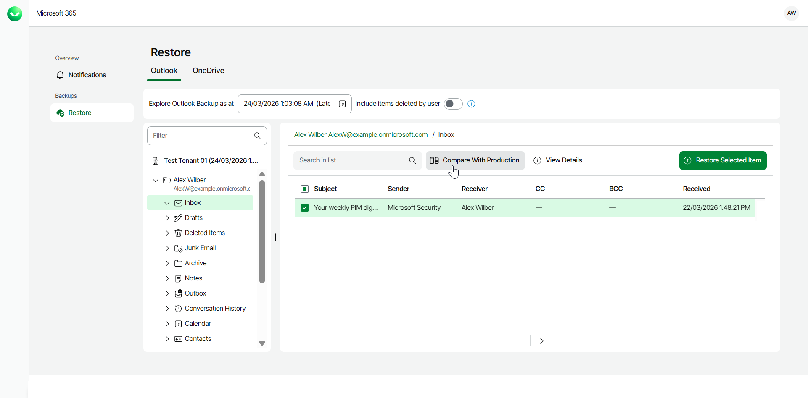
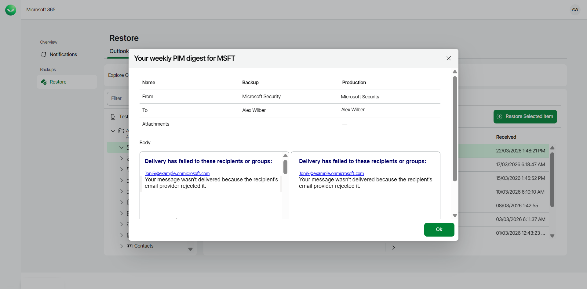

# Comparing Outlook Email with Production

Veeam Data Cloud for Microsoft 365 allows self-service users to compare their backed-up Outlook emails with their versions in the production environment before performing restore.

To compare an email with the production environment:

1. Log in to Veeam Data Cloud for Microsoft 365.
2. In Veeam Data Cloud for Microsoft 365, in the Outlook tab, you can view your Outlook data from the latest backup.
3. Select the folder that contains the email you want to view.
4. Locate the email you are looking for and select it. Selected items are highlighted in green.
5. Click Compare With Production.

1. In the displayed window, compare properties of the email between the backup and the production environment. Use the following table columns:

* Name — name of the email property.
* Backup — property value for the email in the backup.
* Production — property value for the email in the production environment.

1. If you want to compare the email message body, click View Body.

|  |
| --- |
| TIP |
| The administrator of the organization can specify whether the self-service users can compare their backed-up emails with the production versions. For more information, see [Enabling Self-Service Restore](m365_self_restore.md#enable). |

