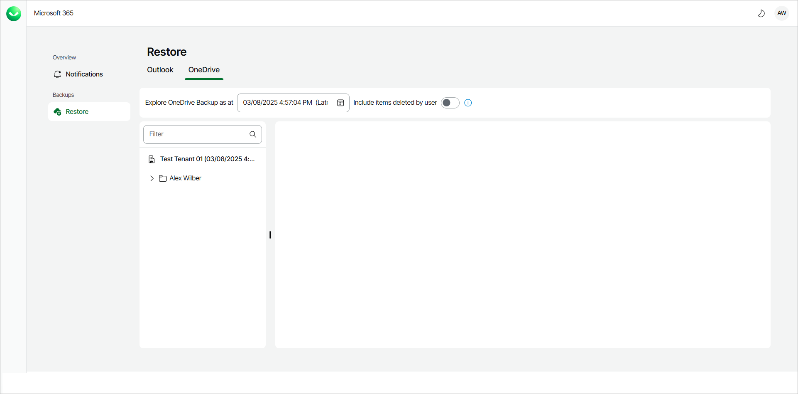
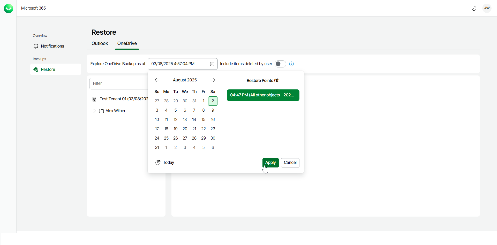
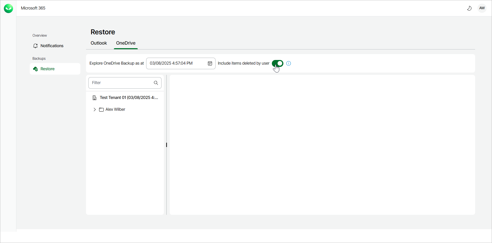
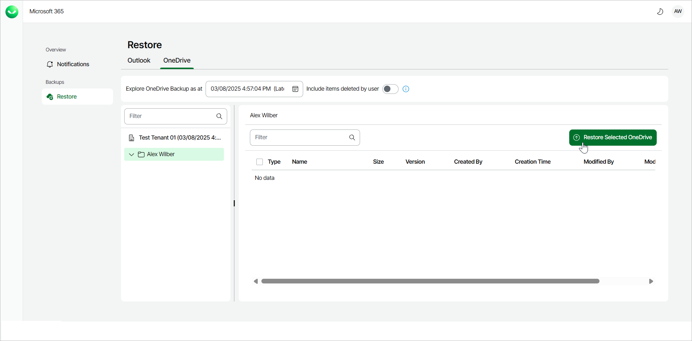
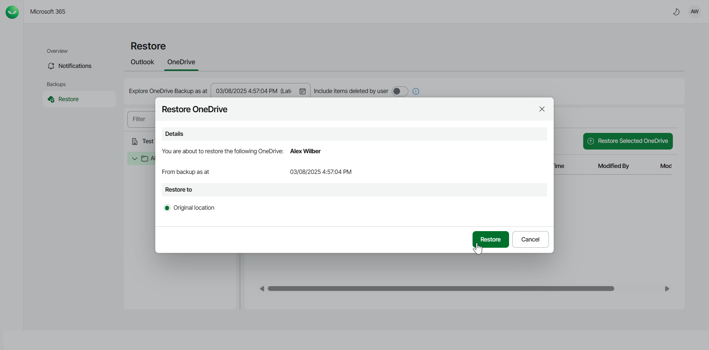
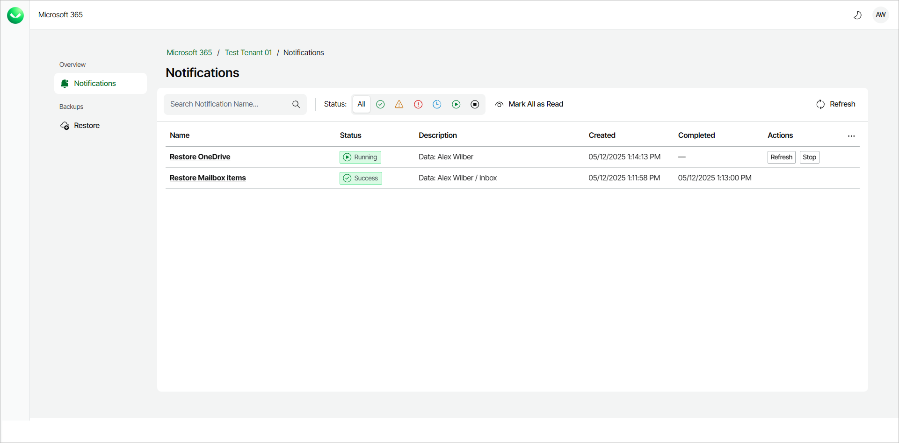

# Restoring OneDrive Data

Veeam Data Cloud for Microsoft 365 allows self-service users to restore their Microsoft OneDrive data.

To restore OneDrive data:

1. Log in to Veeam Data Cloud for Microsoft 365.
2. In Veeam Data Cloud for Microsoft 365, go to the OneDrive tab to view your OneDrive data from the latest backup.

1. By default, Veeam Data Cloud uses the latest available restore point for data restore. If you want to select another restore point, in the Explore OneDrive Backup as at field, click the calendar and select the date and time when the necessary restore point was created.

1. If you want to see items that may have been deleted, use the Include items deleted by user toggle switch.

1. Select the entire OneDrive or a folder that contains the data you want to restore.
2. Locate the data you are looking for and select it. Selected items are highlighted in green.
3. With the required item selected, click Restore Selected OneDrive.

1. The Restore OneDrive window will appear, providing you with the details of the data you are going to restore.

Click Restore to start the restore process.

The data will be restored to the same location in the original OneDrive as it was found in the backup.

1. Veeam Data Cloud for Microsoft 365 will display a notification that the restore process has started.

You will also be able to view the progress of the restore process by clicking Notifications.

1. Once the restore process is completed, you will be able to navigate back to your OneDrive and see that the OneDrive data has been restored.

