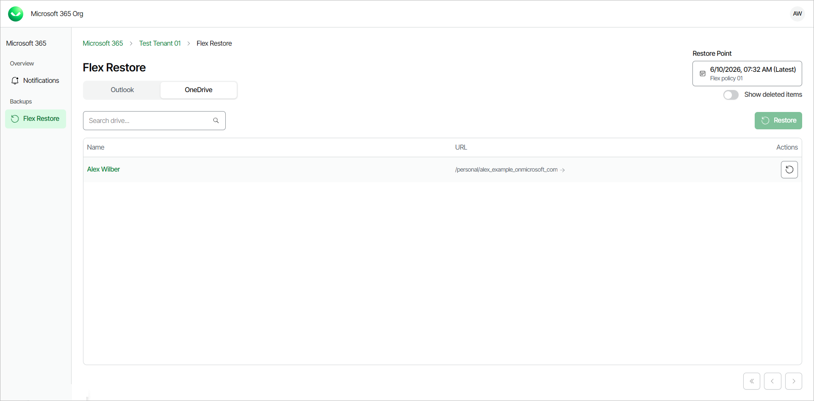
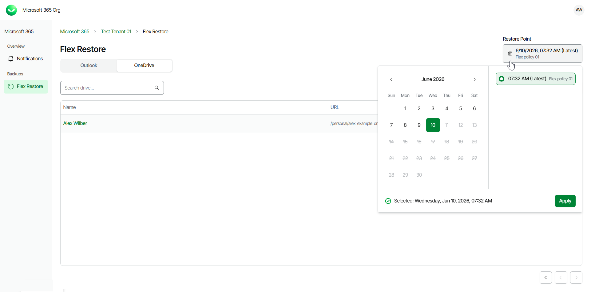
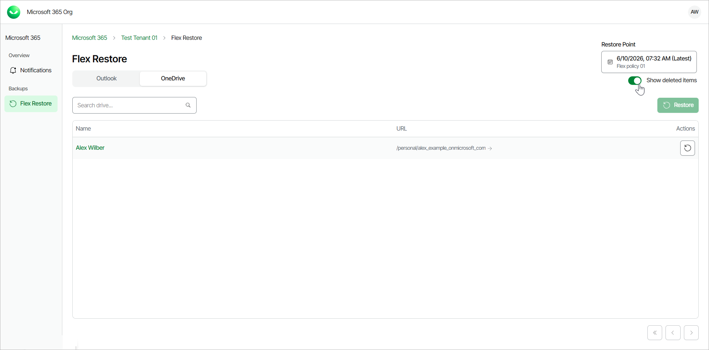
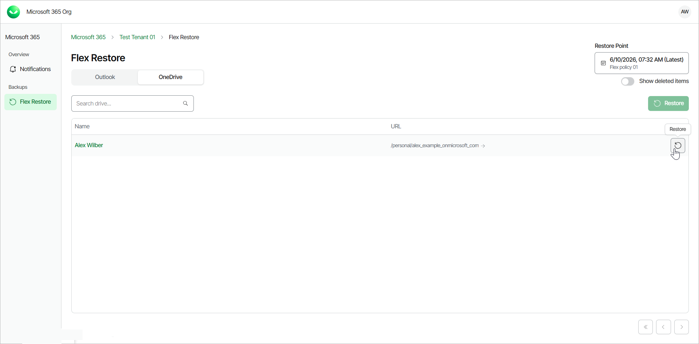
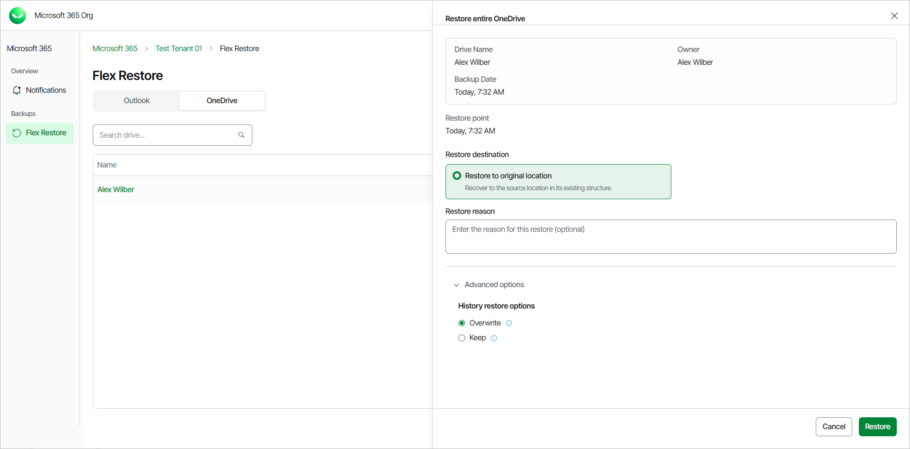
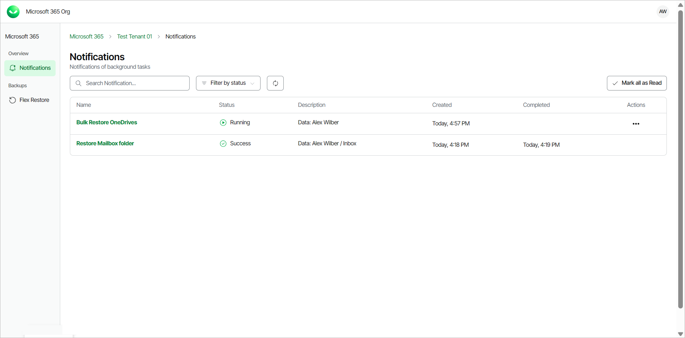

# Restoring OneDrive Data

Veeam Data Cloud for Microsoft 365 allows self-service users to restore their Microsoft OneDrive data that are backed up within Flex backup policies.

To restore OneDrive data:

1. Log in to Veeam Data Cloud for Microsoft 365.
2. In Veeam Data Cloud for Microsoft 365, go to the OneDrive tab to view your OneDrive data from the latest backup.

1. By default, Veeam Data Cloud uses the latest available restore point for data restore. If you want to select another restore point, click on the  Restore Point information box. On the calendar, select the date and time when the necessary restore point was created and click Apply.

1. If you want to see items that may have been deleted, use the Show deleted items toggle switch.

1. To restore the entire OneDrive, in the Actions column, click Restore.

To restore other OneDrive data, click on the OneDrive, locate the data you are looking for and select the check box next to it. Then click Restore.

1. The Restore entire OneDrive window will appear, providing you with the details of the data you are going to restore. If needed, you can also use the Advanced options toggle to display more options.

In the Restore reason field, you can optionally provide a reason for the restore.

Click Restore to start the restore process.

The data will be restored to the same location in the original OneDrive as it was found in the backup.

1. Veeam Data Cloud for Microsoft 365 will display a notification that the restore process has started.

You will also be able to view the progress of the restore process by clicking Notifications.

1. Once the restore process is completed, you will be able to navigate back to your OneDrive and see that the OneDrive data has been restored.

|  |
| --- |
| TIP |
| The administrator of the organization can specify whether the self-service users can restore and overwrite their entire OneDrive or only restore specific OneDrive items. For more information, see [Enabling Self-Service Restore](m365_settings_enable_self_service.md#selfenable). |

