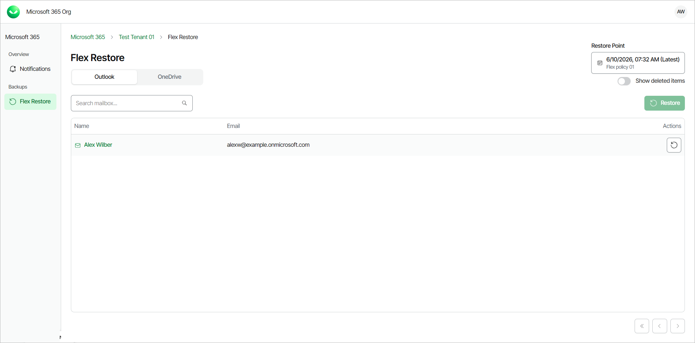
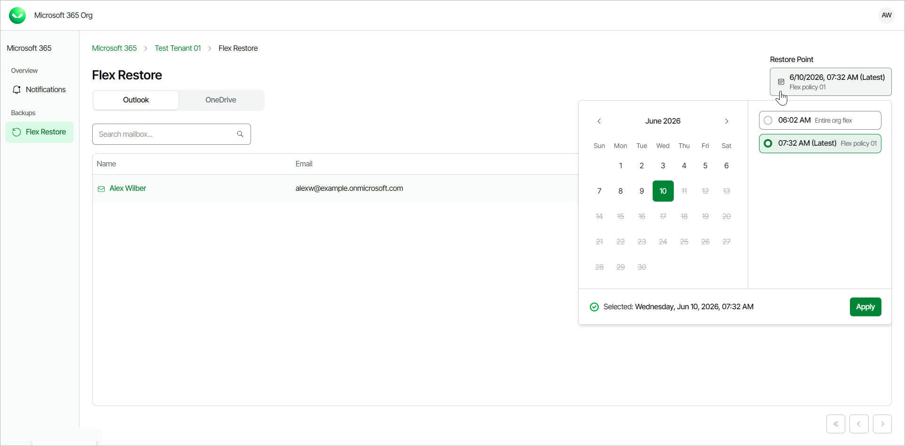
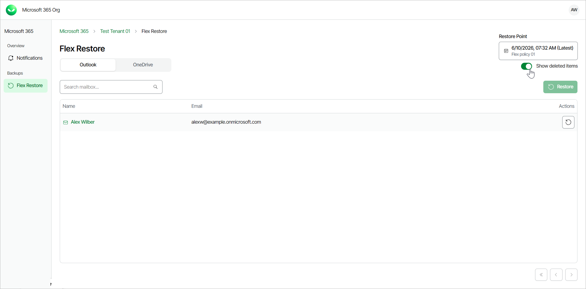
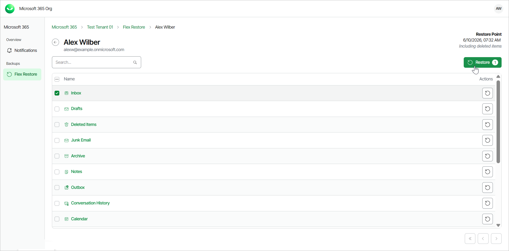
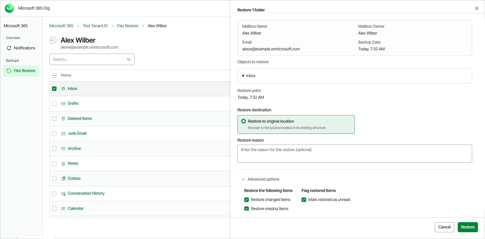
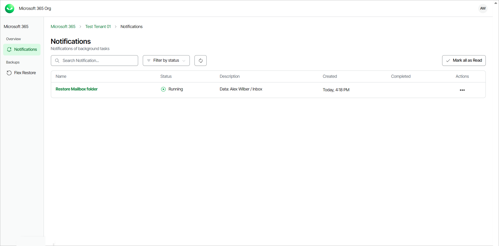

# Restoring Outlook Data

Veeam Data Cloud for Microsoft 365 allows self-service users to restore their Microsoft Outlook data that are backed up within Flex backup policies.

To restore Outlook data:

1. Log in to Veeam Data Cloud for Microsoft 365.
2. In Veeam Data Cloud for Microsoft 365, in the Outlook tab, you can view your Outlook data from the latest backup.

1. By default, Veeam Data Cloud uses the latest available restore point for data restore. If you want to select another restore point, click on the  Restore Point information box. On the calendar, select the date and time when the necessary restore point was created and click Apply.

1. If you want to see items that may have been deleted, click the Show deleted items toggle.

1. Select the mailbox or a folder that contains the item you want to restore.
2. Locate the item you are looking for and select the check box next to it.
3. Click Restore.

1. The Restore window will appear, providing you with the details of the item you are going to restore. If needed, you can also use the Advanced options toggle to display more options.

In the Restore reason field, you can optionally provide a reason for the restore.

Click Restore to start the restore process.

The item will be restored to the same location in the original Outlook mailbox as it was found in the backup.

1. Veeam Data Cloud for Microsoft 365 will display a notification that the restore process has started.

You can also view the progress of the restore process. To do that, click Notifications.

1. Once the restore process is completed, you will be able to navigate back to your mailbox and check that the Outlook data has been restored.

|  |
| --- |
| TIP |
| The administrator of the organization can specify whether the self-service users can restore and overwrite their entire mailbox or only restore specific mailbox items. For more information, see [Enabling Self-Service Restore](m365_settings_enable_self_service.md#selfenable). |

