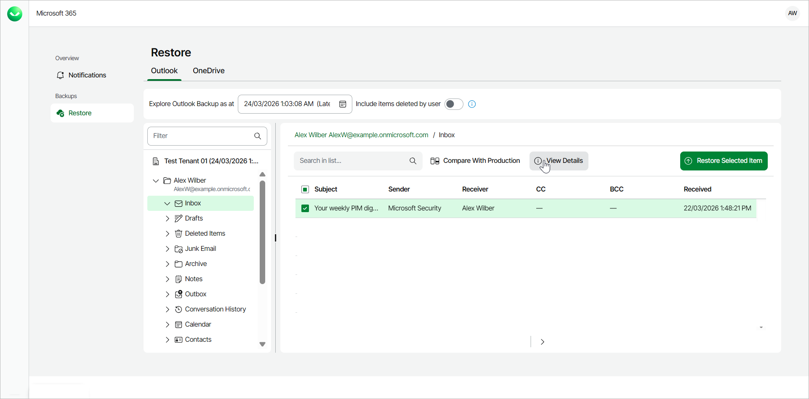
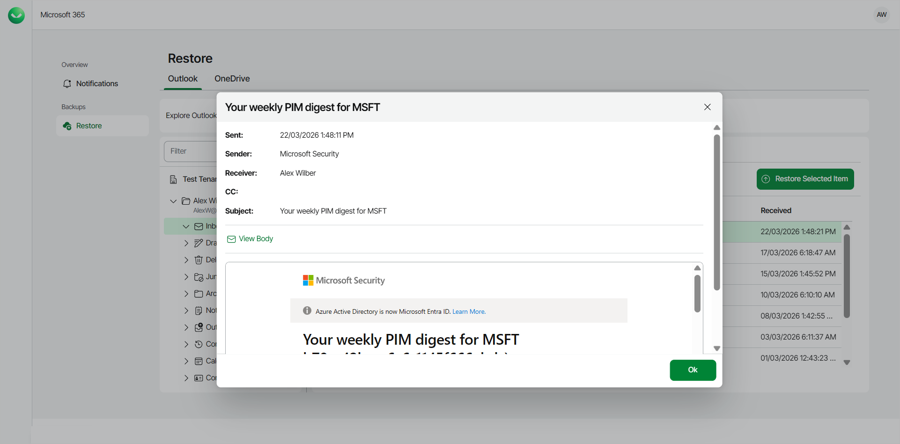

# Previewing Outlook Emails

Veeam Data Cloud for Microsoft 365 allows self-service users to preview their backed-up Outlook emails before performing restore.

To preview your Outlook emails:

1. Log in to Veeam Data Cloud for Microsoft 365.
2. In Veeam Data Cloud for Microsoft 365, in the Outlook tab, you can view your Outlook data from the latest backup.
3. Select the folder that contains the email you want to view.
4. Locate the email you are looking for and select it. Selected items are highlighted in green.
5. Click View Details.

1. The email contents will open in a new window. Veeam Data Cloud displays the following information:

* Sent — date and time when the email was sent.
* Sender — sender of the email.
* Receiver — receiver of the email.
* CC — contacts to whom a copy of the email was sent.
* Subject — subject of the email.
* View Body — click to view the body of the email.

|  |
| --- |
| TIP |
| The administrator of the organization can specify whether the self-service users can preview their backed-up Outlook emails. For more information, see [Enabling Self-Service Restore](m365_settings_enable_self_service.md#selfenable). |

