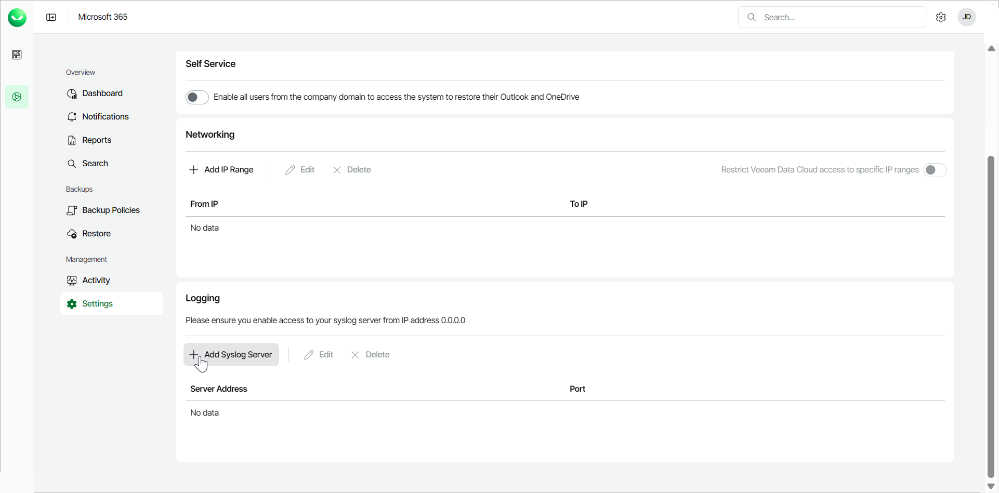
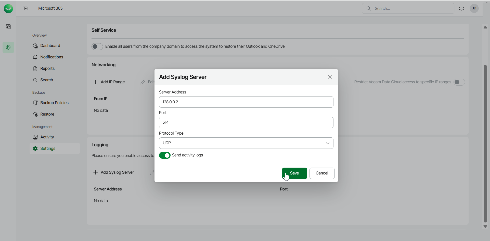
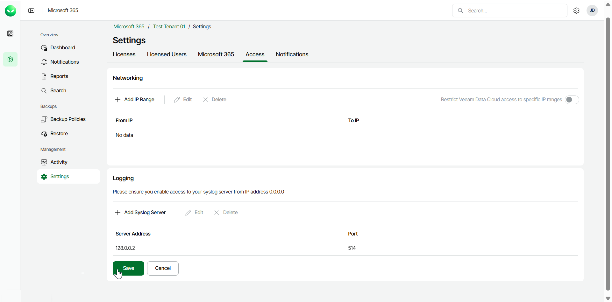

# Adding Syslog Server

Veeam Data Cloud for Microsoft 365 allows you to define a syslog server where you can receive Veeam Data Cloud for Microsoft 365 user activity logs.

To add your syslog server, do the following:

1. On the Microsoft 365 page, click the name of the tenant you want to manage.
2. Select Settings.
3. Select the Access tab.
4. In the Logging section, click Add Syslog Server.

|  |
| --- |
| Note |
| To accept communications from Veeam Data Cloud for Microsoft 365, you must enable access to your syslog server from the 0.0.0.0 IP address. If you want to restrict access to your syslog server, contact [Veeam Customer Support](https://www.veeam.com/support.html#Data_Cloud_Support) to receive the list of public IP addresses related to your tenant. |

1. In Add Syslog Server, specify your syslog server address, port, protocol type, and whether you want to receive logs:

1. In the Server Address field, type the IP address of the syslog server.
2. In the Port field, type the port for the syslog server requests.
3. From the Protocol Type drop-down list, select the protocol [over which Veeam Data Cloud for Microsoft 365 will send logs] UDP or TCP.
4. To receive the logs, toggle the Send activity logs switch (enabled by default).
5. Click Save to apply the specified settings.

1. Click Save to add the syslog server.

Log Data Details

The log records you receive in your syslog server contain information about all Veeam Data Cloud for Microsoft 365 user activities.

The log record format is specified by the RFC3164 protocol and the data is presented in the following way:

* IP address
* Date Time
* Format
* Severity
* Type
* Message

+ Action ID. For more information, see [Log Record Action IDs](m365_settings_syslog_action_ids.md).
+ User:email
+ Session Type
+ Related Object
+ Date Time
+ Object Details

The following example shows a log record for the creation of a restore session:

|  |
| --- |
| 20.213.0.149    Jun 18 09:02:25        syslog    info    Action    RestoreOutlookItemsToLocal, User: Mary.Jones@COMPANY.ONMICROSOFT.COM, Session Type: vex, Object: Jack Smith / Inbox, Date: 6/18/2024 9:02:25 AM +00:00, Items:{"SessionDate":"2023-11-23T02:43:25.429Z","Option":{"Items":[{"Id":"LgAAAEYAAAAWAAAAAAAAAJWlMDRVs-1Om8ReIEAHypABAGyua\_AmugtHrGBbcMwomlsAAAAAAQwAAAAAAACVpTA0VbPtTpvEXiBAB8qQBwBsrmvwJroLR6xgW3DMKJpbAAAAAAEMAABsrmvwJroLR6xgW3DMKJpbAAIYDZuFAABsrmvwJroLR6xgW3DMKJpbAAIXZHpB"}]},"SessionType":"vet"} |

